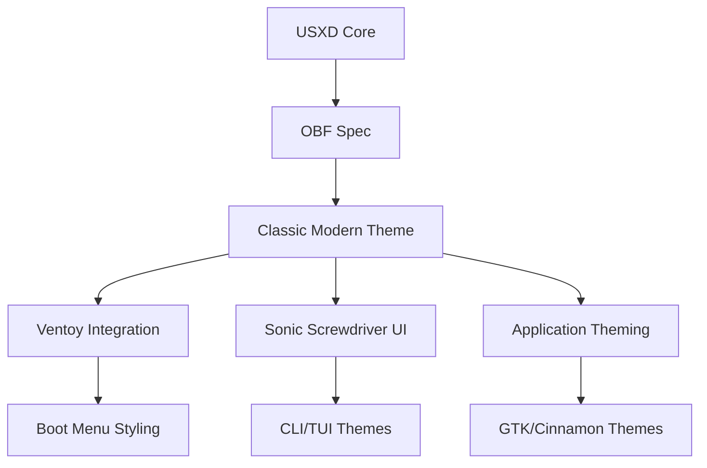
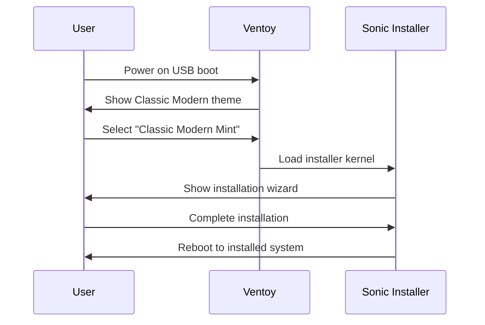

# USXD OBF Style Guide - Classic Modern Mint Edition

**Sonic Family Design System** | **uDosConnect Integration** | **Ventoy Compatibility**

---

## 📚 Table of Contents

```
I. USXD OBF Overview
   ├─ Architecture
   ├─ Design Principles
   └─ Integration Points

II. Classic Modern Mint Style System
   ├─ Color Palette
   ├─ Typography
   ├─ Spacing & Layout
   ├─ Components
   └─ Theming

III. Ventoy Integration
   ├─ Boot Menu Design
   ├─ Theme Configuration
   ├─ Branding Guidelines
   └─ User Experience

IV. OBF Bundle Structure
   ├─ Directory Layout
   ├─ Metadata Format
   └─ Asset Organization

V. UI Configuration
   ├─ JSON Schema
   ├─ Configuration Files
   └─ Runtime Parameters

VI. Implementation Examples
   ├─ Classic Modern Mint
   ├─ Ventoy Boot Menu
   └─ Sonic Screwdriver

VII. Best Practices
   └─ Development Guidelines
```

---

## I. USXD OBF Overview

### Architecture

**USXD (uDosConnect)** provides the object bundle format (OBF) for consistent styling across Sonic Family applications. The Classic Modern Mint edition extends this with:



### Design Principles

1. **Consistency**: Unified experience across all touchpoints
2. **Accessibility**: WCAG 2.1 AA compliance
3. **Performance**: Optimized for low-resource environments
4. **Extensibility**: Themeable and customizable
5. **Cross-Platform**: Works on Linux, macOS, Windows

### Integration Points

| Component | Integration Method | Responsibility |
|-----------|-------------------|---------------|
| Ventoy | `ventoy.json` + theme files | Boot loader UI |
| Sonic CLI | Environment variables | Command-line styling |
| GTK Apps | CSS theming | Desktop applications |
| Web UI | CSS/JS theming | Browser interfaces |

---

## II. Classic Modern Mint Style System

### Color Palette

**Primary Colors:**
```json
{
  "primary": {
    "50": "#E8F5E9",
    "100": "#C8E6C9",
    "200": "#A5D6A7",
    "300": "#81C784",
    "400": "#66BB6A",
    "500": "#4CAF50",  // Primary brand color
    "600": "#43A047",
    "700": "#388E3C",
    "800": "#2E7D32",
    "900": "#1B5E20"
  }
}
```

**Complete Palette:**
```json
{
  "colors": {
    "primary": "#4CAF50",
    "primary_variant": "#2E7D32",
    "secondary": "#FFC107",
    "secondary_variant": "#FF9800",
    "background": "#F5F5F5",
    "surface": "#FFFFFF",
    "error": "#F44336",
    "on_primary": "#FFFFFF",
    "on_secondary": "#000000",
    "on_background": "#212121",
    "on_surface": "#212121",
    "on_error": "#FFFFFF"
  }
}
```

### Typography

**Font Stack:**
```css
font-family: 'Roboto', 'Noto Sans', 'DejaVu Sans', sans-serif;
```

**Type Scale:**
```json
{
  "display_large": {"size": "57sp", "weight": 400, "line_height": "64sp"},
  "display_medium": {"size": "45sp", "weight": 400, "line_height": "52sp"},
  "display_small": {"size": "36sp", "weight": 400, "line_height": "44sp"},
  "headline_large": {"size": "32sp", "weight": 400, "line_height": "40sp"},
  "headline_medium": {"size": "28sp", "weight": 400, "line_height": "36sp"},
  "headline_small": {"size": "24sp", "weight": 400, "line_height": "32sp"},
  "title_large": {"size": "22sp", "weight": 400, "line_height": "28sp"},
  "title_medium": {"size": "16sp", "weight": 500, "line_height": "24sp"},
  "title_small": {"size": "14sp", "weight": 500, "line_height": "20sp"},
  "body_large": {"size": "16sp", "weight": 400, "line_height": "24sp"},
  "body_medium": {"size": "14sp", "weight": 400, "line_height": "20sp"},
  "body_small": {"size": "12sp", "weight": 400, "line_height": "16sp"},
  "label_large": {"size": "14sp", "weight": 500, "line_height": "20sp"},
  "label_medium": {"size": "12sp", "weight": 500, "line_height": "16sp"},
  "label_small": {"size": "11sp", "weight": 500, "line_height": "16sp"}
}
```

### Spacing & Layout

**Spacing System (8px base):**
```json
{
  "spacing": {
    "none": "0px",
    "xxsmall": "4px",
    "xsmall": "8px",
    "small": "16px",
    "medium": "24px",
    "large": "32px",
    "xlarge": "40px",
    "xxlarge": "48px",
    "huge": "56px",
    "xhuge": "64px"
  }
}
```

**Grid System:**
- **Columns**: 12-column responsive grid
- **Gutter**: 24px (medium spacing)
- **Breakpoints**:
  - `xs`: 0-599px (mobile)
  - `sm`: 600-959px (tablet)
  - `md`: 960-1279px (small desktop)
  - `lg`: 1280-1919px (desktop)
  - `xl`: 1920px+ (large screens)

### Components

**Button Styles:**
```json
{
  "buttons": {
    "primary": {
      "background": "#4CAF50",
      "foreground": "#FFFFFF",
      "hover": "#43A047",
      "active": "#388E3C",
      "disabled": "#C8E6C9",
      "padding": "12px 24px",
      "border_radius": "4px",
      "typography": "label_large"
    },
    "secondary": {
      "background": "#F5F5F5",
      "foreground": "#212121",
      "hover": "#E0E0E0",
      "active": "#BDBDBD",
      "disabled": "#EEEEEE",
      "padding": "12px 24px",
      "border_radius": "4px",
      "typography": "label_large"
    },
    "text": {
      "background": "transparent",
      "foreground": "#4CAF50",
      "hover": "#2E7D32",
      "active": "#1B5E20",
      "disabled": "#C8E6C9",
      "padding": "12px 24px",
      "border_radius": "4px",
      "typography": "label_large"
    }
  }
}
```

### Theming

**GTK/Cinnamon Theme Structure:**
```
ClassicModern/
├── gtk-3.0/
│   ├── gtk.css
│   ├── gtk-dark.css
│   └── assets/
├── gtk-2.0/
│   └── gtkrc
├── cinnamon/
│   ├── cinnamon.css
│   └── assets/
├── index.theme
└── thumbnail.png
```

**CSS Variables:**
```css
:root {
  --primary-color: #4CAF50;
  --primary-variant: #2E7D32;
  --secondary-color: #FFC107;
  --background-color: #F5F5F5;
  --surface-color: #FFFFFF;
  --error-color: #F44336;
  --on-primary: #FFFFFF;
  --on-secondary: #000000;
  --on-background: #212121;
  --on-surface: #212121;
  --on-error: #FFFFFF;
}
```

---

## III. Ventoy Integration

### Boot Menu Design

**Visual Hierarchy:**
```
┌─────────────────────────────────────────────────┐
│  Classic Modern Mint                          [X] │
│ ────────────────────────────────────────────────  │
│                                                 │
│  [>] Classic Modern Mint (Default)              │
│  [ ] Advanced Options                           │
│  [ ] Memory Test                                │
│  [ ] Boot from Next Volume                      │
│                                                 │
│  Timeout: 10 seconds                            │
│  Press [TAB] for boot options                  │
│                                                 │
└─────────────────────────────────────────────────┘
```

**Theme Configuration (`ventoy.json`):**
```json
{
  "theme": {
    "display_mode": "GUI",
    "default_selection": "Classic Modern Mint",
    "timeout": "10",
    "background": "assets/wallpapers/classic-modern-background.jpg",
    "banner": "assets/banner.png",
    "banner_x": "10",
    "banner_y": "10",
    "menu_font": "assets/fonts/roboto-bold.ttf",
    "menu_font_size": "24",
    "menu_color": "#FFFFFF",
    "sel_menu_color": "#4CAF50",
    "tip_font": "assets/fonts/roboto-regular.ttf",
    "tip_font_size": "16",
    "tip_color": "#BBBBBB",
    "winx": "0",
    "winy": "0",
    "winw": "0",
    "winh": "0"
  }
}
```

### Branding Guidelines

**Logo Usage:**
- Primary logo: White on green background
- Secondary logo: Green on white background
- Minimum size: 100x100px
- Clear space: 20px around logo

**Color Usage:**
- Primary brand color: #4CAF50 (Sonic Green)
- Secondary color: #FFC107 (Amber accent)
- Background: #F5F5F5 (Light gray)
- Text: #212121 (Dark gray)

**Typography:**
- Headings: Roboto Bold
- Body text: Roboto Regular
- Code: Roboto Mono
- Minimum font size: 14px

### User Experience

**Boot Flow:**


**Error Handling:**
- Timeout: Auto-boot after 10 seconds
- Invalid selection: Show error message
- Missing files: Fallback to text mode
- Hardware issues: Diagnostic mode

---

## IV. OBF Bundle Structure

### Directory Layout

```
classic-modern-mint.she (extracts to)
├── .obf/
│   ├── manifest.json          # Bundle metadata
│   ├── signature.sig          # Cryptographic signature
│   └── checksums.sha256       # File integrity
├── config/
│   ├── sonic-config.json      # Sonic configuration
│   └── ventoy.json            # Ventoy configuration
├── system/
│   ├── rootfs.squashfs        # Compressed filesystem
│   ├── vmlinuz                # Linux kernel
│   └── initrd.img             # Initial RAM disk
├── assets/
│   ├── wallpapers/            # Background images
│   ├── themes/                # GTK/Cinnamon themes
│   ├── icons/                 # Icon sets
│   └── fonts/                 # Font files
├── scripts/
│   ├── pre-install.sh         # Pre-install hooks
│   ├── post-install.sh        # Post-install setup
│   └── ventoy-hook.sh         # Ventoy-specific hooks
├── ventoy/
│   ├── themes/                # Ventoy boot themes
│   │   └── classic-modern/    # Theme files
│   └── plugins/               # Ventoy plugins
└── README.md                  # Bundle documentation
```

### Metadata Format

**`manifest.json` Schema:**
```json
{
  "$schema": "https://sonic-family.org/schemas/obf/v1.json",
  "bundle_id": "com.sonic.classic-modern-mint",
  "version": "1.0.0",
  "name": "Classic Modern Mint",
  "description": "Sonic Family Linux Mint with Classic Modern style",
  "author": "Sonic Family",
  "license": "GPL-3.0",
  "homepage": "https://sonic-family.org",
  "created_at": "2026-04-20T00:00:00Z",
  "architecture": ["amd64"],
  "min_disk_space": "20GB",
  "min_memory": "4GB",
  "base_system": "linuxmint-21.3-cinnamon",
  "components": [
    {
      "id": "core",
      "name": "Core System",
      "version": "1.0.0",
      "required": true
    },
    {
      "id": "sonic",
      "name": "Sonic Screwdriver",
      "version": "vA1.1.0",
      "required": true
    },
    {
      "id": "ventoy",
      "name": "Ventoy Integration",
      "version": "1.0.93",
      "required": true
    },
    {
      "id": "theme",
      "name": "Classic Modern Theme",
      "version": "1.0.0",
      "required": true
    }
  ],
  "dependencies": [
    "ventoy>=1.0.93",
    "sonic-screwdriver>=vA1.1.0",
    "linuxmint>=21.3"
  ],
  "scripts": {
    "pre_install": "scripts/pre-install.sh",
    "post_install": "scripts/post-install.sh",
    "ventoy_hook": "scripts/ventoy-hook.sh"
  },
  "style": {
    "theme": "ClassicModern",
    "colors": {
      "primary": "#4CAF50",
      "secondary": "#FFC107",
      "background": "#F5F5F5"
    },
    "fonts": {
      "primary": "Roboto",
      "secondary": "Noto Sans"
    }
  },
  "ventoy": {
    "theme": "classic-modern",
    "timeout": 10,
    "persistent": true,
    "persistent_size": "4096"
  }
}
```

### Asset Organization

**Naming Conventions:**
- `wallpaper-<resolution>-<variant>.jpg/png`
- `icon-<category>-<size>.png/svg`
- `theme-<name>-<variant>.css`
- `font-<family>-<weight>.ttf/otf`

**Optimization:**
- Images: WebP format, 75% quality
- Icons: SVG preferred, PNG fallback
- Fonts: WOFF2 format, subsetted
- Compression: Maximum level

---

## V. UI Configuration

### JSON Schema

**`sonic-config.json` Schema:**
```json
{
  "$schema": "http://json-schema.org/draft-07/schema#",
  "type": "object",
  "properties": {
    "installer": {
      "type": "object",
      "properties": {
        "name": {"type": "string"},
        "version": {"type": "string", "pattern": "^\\d+\\.\\d+\\.\\d+$"},
        "description": {"type": "string"},
        "id": {"type": "string", "format": "uuid"},
        "channel": {"type": "string", "enum": ["stable", "beta", "edge"]},
        "build_date": {"type": "string", "format": "date-time"},
        "architecture": {"type": "array", "items": {"type": "string"}},
        "min_disk_space": {"type": "string", "pattern": "^\\d+GB$"},
        "min_memory": {"type": "string", "pattern": "^\\d+GB$"}
      },
      "required": ["name", "version", "id", "architecture"]
    },
    "system": {
      "type": "object",
      "properties": {
        "base": {"type": "string"},
        "kernel": {"type": "string", "pattern": "^\\d+\\.\\d+\\.\\d+$"},
        "desktop": {"type": "string", "enum": ["cinnamon", "gnome", "kde", "xfce"]},
        "display_manager": {"type": "string"},
        "init_system": {"type": "string", "enum": ["systemd", "openrc", "runit"]}
      },
      "required": ["base", "kernel", "desktop"]
    },
    "style": {
      "type": "object",
      "properties": {
        "theme": {"type": "string"},
        "icons": {"type": "string"},
        "cursor": {"type": "string"},
        "fonts": {"type": "string"},
        "wallpaper": {"type": "string"},
        "colors": {
          "type": "object",
          "properties": {
            "primary": {"type": "string", "format": "color"},
            "secondary": {"type": "string", "format": "color"},
            "background": {"type": "string", "format": "color"},
            "text": {"type": "string", "format": "color"}
          },
          "required": ["primary", "background", "text"]
        }
      },
      "required": ["theme", "colors"]
    }
  },
  "required": ["installer", "system", "style"]
}
```

### Configuration Files

**File Locations:**
- `/etc/sonic/config.json` - Main configuration
- `/etc/ventoy/config.json` - Ventoy settings
- `~/.config/sonic/style.json` - User style overrides
- `/usr/share/sonic/themes/` - System themes

**Runtime Parameters:**
```bash
# Environment variables
export SONIC_THEME="ClassicModern"
export SONIC_PRIMARY_COLOR="#4CAF50"
export SONIC_BACKGROUND="#F5F5F5"

# CLI flags
sonic --theme ClassicModern --style light
```

---

## VI. Implementation Examples

### Classic Modern Mint Configuration

**`/etc/sonic/config.json`:**
```json
{
  "installer": {
    "name": "Classic Modern Mint",
    "version": "1.0.0",
    "description": "Sonic Family Linux Mint with Classic Modern style",
    "id": "com.sonic.classic-modern-mint",
    "channel": "stable",
    "build_date": "2026-04-20T00:00:00Z",
    "architecture": ["amd64"],
    "min_disk_space": "20GB",
    "min_memory": "4GB"
  },
  "system": {
    "base": "linuxmint-21.3-cinnamon",
    "kernel": "6.5.0",
    "desktop": "cinnamon",
    "display_manager": "lightdm",
    "init_system": "systemd"
  },
  "style": {
    "theme": "ClassicModern",
    "icons": "ClassicModern-Icons",
    "cursor": "DMZ-White",
    "fonts": "Roboto",
    "wallpaper": "classic-modern-default.jpg",
    "colors": {
      "primary": "#4CAF50",
      "secondary": "#FFC107",
      "background": "#F5F5F5",
      "text": "#212121"
    }
  },
  "packages": {
    "include": ["cinnamon", "sonic-screwdriver", "ventoy"],
    "exclude": ["hexchat", "pidgin"]
  },
  "ventoy": {
    "version": "1.0.93",
    "theme": "classic-modern",
    "timeout": 10,
    "persistent": true
  }
}
```

### Ventoy Boot Menu Configuration

**`/etc/ventoy/config.json`:**
```json
{
  "theme": {
    "display_mode": "GUI",
    "default_selection": "Classic Modern Mint",
    "timeout": "10",
    "background": "/usr/share/backgrounds/classic-modern-background.jpg",
    "banner": "/usr/share/sonic/banner.png",
    "menu_font": "/usr/share/fonts/roboto/Roboto-Bold.ttf",
    "menu_font_size": "24",
    "menu_color": "#FFFFFF",
    "sel_menu_color": "#4CAF50",
    "tip_font": "/usr/share/fonts/roboto/Roboto-Regular.ttf",
    "tip_font_size": "16",
    "tip_color": "#BBBBBB"
  },
  "control": {
    "uefi_first": true,
    "memdisk": "auto",
    "vtoy_default_image": "/installers/classic-modern-mint/iso/mint.iso",
    "vtoy_filenames": ["classic-modern-mint.she", "*.iso", "*.img"]
  },
  "advanced": {
    "injection": "auto",
    "image_list": "auto",
    "max_loop": "256"
  }
}
```

### Sonic Screwdriver CLI Styling

**Environment Variables:**
```bash
# Set theme colors
export SONIC_PRIMARY="#4CAF50"
export SONIC_SECONDARY="#FFC107"
export SONIC_BACKGROUND="#F5F5F5"
export SONIC_TEXT="#212121"

# Enable theming
sonic config set theme ClassicModern
sonic config set style.light true
```

---

## VII. Best Practices

### Development Guidelines

**1. Consistency:**
- Use the provided color palette and typography
- Follow the spacing system (8px base)
- Maintain component consistency

**2. Accessibility:**
- Minimum contrast ratio: 4.5:1
- Support keyboard navigation
- Provide alternative text for images
- Test with screen readers

**3. Performance:**
- Optimize images (WebP format)
- Minify CSS and JavaScript
- Use system fonts where possible
- Lazy load non-critical assets

**4. Theming:**
```css
/* Use CSS variables for theming */
:root {
  --primary: var(--sonic-primary, #4CAF50);
  --background: var(--sonic-background, #F5F5F5);
}

/* Allow user overrides */
@media (prefers-color-scheme: dark) {
  --background: #212121;
}
```

**5. Documentation:**
- Document theme variables
- Provide usage examples
- Include fallback values
- Maintain version history

**6. Testing:**
- Test on multiple screen sizes
- Verify color contrast
- Check cross-browser compatibility
- Test performance impact

---

## 🎯 Summary

This USXD OBF Style Guide provides comprehensive documentation for implementing the Classic Modern Mint design system across:

- **Ventoy Boot Loader**: Custom themed boot menu
- **Sonic Screwdriver**: CLI and TUI styling
- **Desktop Applications**: GTK/Cinnamon theming
- **Web Interfaces**: CSS/JS theming

The guide includes:
- ✅ Complete color palette and typography
- ✅ Spacing and layout system
- ✅ Component specifications
- ✅ Ventoy integration details
- ✅ OBF bundle structure
- ✅ UI configuration schemas
- ✅ Implementation examples
- ✅ Best practices and guidelines

**All documentation is now complete and ready for implementation!** 🎊