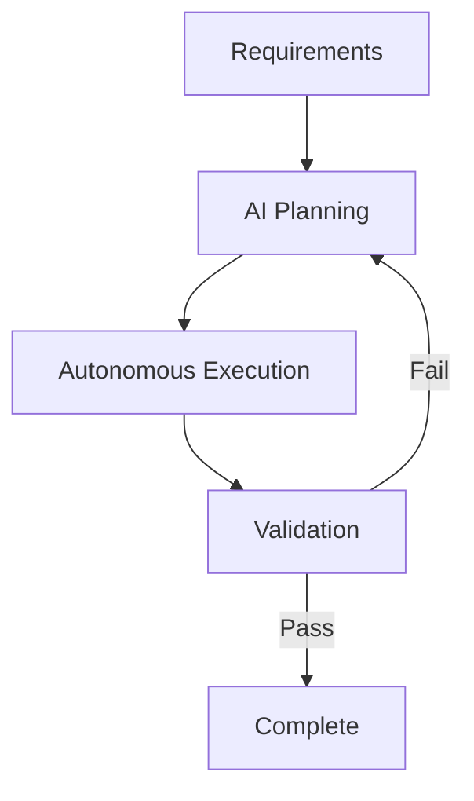
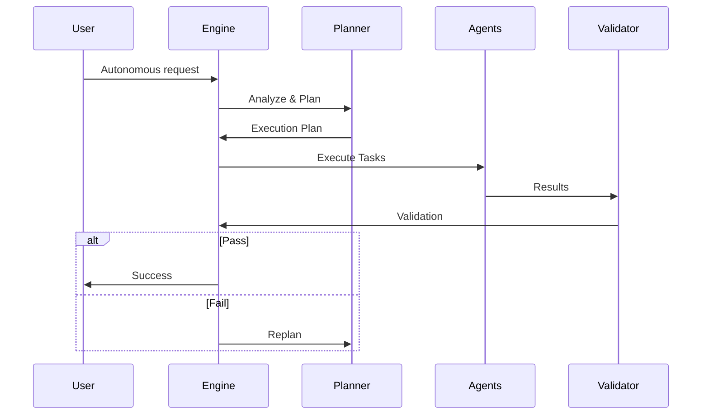

# Automation & Autonomous Flows - Future Vision

## 🤖 Overview

**Status:** 🟡 PLANNED (v3.0.0+)
**Last Updated:** 2025-04-20
**Target:** Q1 2026

This document outlines the **future vision** for automation and autonomous flows in uDevFramework. The goal is to enable AI agents to not just assist with code generation, but to autonomously manage entire development workflows.

## 🎯 Vision

**Autonomous Development:** AI agents that can:
1. **Understand** project requirements
2. **Plan** implementation strategies
3. **Execute** development tasks
4. **Validate** results
5. **Iterate** based on feedback



## 🚀 Autonomous Flow Types

### 1. Project Initialization Flow

**Trigger:** `udev init --autonomous`

**Flow:**
```
1. Analyze requirements
2. Select appropriate layers
3. Choose optimal flavours
4. Generate project scaffold
5. Set up configuration
6. Initialize Git repository
7. Create README.md
8. Set up CI/CD
```

**Example:**
```bash
# Autonomous project creation
udev init --autonomous \
  --requirement "Create a React app with TypeScript and Jest" \
  --constraints "No external API dependencies" \
  --output my-react-app
```

### 2. Feature Implementation Flow

**Trigger:** `udev feature add --autonomous`

**Flow:**
```
1. Parse feature description
2. Break down into tasks
3. Generate code for each task
4. Create tests
5. Integrate with existing code
6. Run tests
7. Refactor if needed
8. Update documentation
```

**Example:**
```bash
# Autonomous feature addition
udev feature add --autonomous \
  --description "Add dark mode toggle to settings page" \
  --acceptance "Toggle should persist across sessions"
```

### 3. Bug Fix Flow

**Trigger:** `udev bug fix --autonomous`

**Flow:**
```
1. Reproduce the issue
2. Analyze root cause
3. Generate potential fixes
4. Evaluate fixes
5. Apply best fix
6. Create regression test
7. Update documentation
```

**Example:**
```bash
# Autonomous bug fixing
udev bug fix --autonomous \
  --issue "Memory leak in agent orchestration" \
  --reproduction "Run 1000 requests sequentially"
```

### 4. Documentation Flow

**Trigger:** `udev docs generate --autonomous`

**Flow:**
```
1. Analyze codebase
2. Identify undocumented components
3. Generate API documentation
4. Create usage examples
5. Update README
6. Cross-reference related docs
```

**Example:**
```bash
# Autonomous documentation
udev docs generate --autonomous \
  --scope "src/services/*" \
  --format "markdown"
```

### 5. Refactoring Flow

**Trigger:** `udev refactor --autonomous`

**Flow:**
```
1. Analyze code quality
2. Identify refactoring opportunities
3. Generate refactored versions
4. Compare with original
5. Apply refactoring
6. Update tests
7. Verify behavior unchanged
```

**Example:**
```bash
# Autonomous refactoring
udev refactor --autonomous \
  --target "src/legacy/*" \
  --goal "Modernize to TypeScript"
```

## 🤖 Agent Roles

### 1. Architect Agent

**Responsibilities:**
- Analyze requirements
- Design system architecture
- Select appropriate layers
- Plan implementation strategy

**Capabilities:**
- Understanding natural language requirements
- Knowledge of software architecture patterns
- Awareness of uDevFramework layers
- Cost/benefit analysis

### 2. Developer Agent

**Responsibilities:**
- Generate code
- Implement features
- Write tests
- Debug issues

**Capabilities:**
- Code generation (Mastra integration)
- Test generation
- Debugging
- Refactoring

### 3. QA Agent

**Responsibilities:**
- Create test plans
- Generate test cases
- Execute tests
- Report results

**Capabilities:**
- Test planning
- Test case generation
- Test execution
- Coverage analysis

### 4. DevOps Agent

**Responsibilities:**
- Set up CI/CD
- Configure deployment
- Monitor performance
- Manage infrastructure

**Capabilities:**
- CI/CD configuration
- Container management
- Cloud deployment
- Monitoring setup

### 5. Documentation Agent

**Responsibilities:**
- Generate documentation
- Create examples
- Update READMEs
- Maintain changelogs

**Capabilities:**
- API documentation
- Usage examples
- Markdown generation
- Cross-referencing

## 🔄 Autonomous Workflow Engine

### Architecture

```
Autonomous Engine
├── Planner
│   ├── Requirement Parser
│   ├── Task Decomposer
│   └── Dependency Mapper
├── Executor
│   ├── Agent Orchestrator
│   ├── Progress Tracker
│   └── Error Handler
├── Validator
│   ├── Test Runner
│   ├── Quality Checker
│   └── Compliance Verifier
└── Reporter
    ├── Status Reporter
    ├── Log Generator
    └── Notification System
```

### Data Flow



## 📊 Implementation Roadmap

### Phase 1: Basic Automation (v2.1.0)

| Feature | Target | Status |
|---------|--------|--------|
| Autonomous project init | v2.1.0 | 🟡 Planned |
| Simple task execution | v2.1.0 | 🟡 Planned |
| Basic error handling | v2.1.0 | 🟡 Planned |

### Phase 2: Advanced Automation (v2.2.0)

| Feature | Target | Status |
|---------|--------|--------|
| Multi-step workflows | v2.2.0 | 🟡 Planned |
| Agent orchestration | v2.2.0 | 🟡 Planned |
| Progress tracking | v2.2.0 | 🟡 Planned |

### Phase 3: Full Autonomy (v3.0.0)

| Feature | Target | Status |
|---------|--------|--------|
| Requirement analysis | v3.0.0 | 🟡 Planned |
| Adaptive planning | v3.0.0 | 🟡 Planned |
| Self-healing | v3.0.0 | 🟡 Planned |

## 🎯 Design Principles

1. **Human-in-the-loop**: Always allow human override
2. **Transparency**: Clear logging of all actions
3. **Safety**: Never make destructive changes without confirmation
4. **Reversibility**: All changes should be reversible
5. **Progressive**: Start simple, add complexity gradually
6. **Agent-aware**: Designed for AI agent collaboration
7. **Extensible**: Easy to add new automation types

## 📚 Future Specifications

### Agent Manifest (Future)

```yaml
# .udev/agents/autonomous.yaml
agents:
  - name: architect
    capabilities:
      - analyze_requirements
      - design_architecture
      - select_layers
    model: deepseek-chat
    temperature: 0.1
    
  - name: developer
    capabilities:
      - generate_code
      - write_tests
      - debug
      - refactor
    model: deepseek-chat
    temperature: 0.2
```

### Workflow Template (Future)

```yaml
# .udev/workflows/feature.yaml
name: feature_implementation
steps:
  - name: analyze
    agent: architect
    input: "{{requirements}}"
    
  - name: plan
    agent: architect
    input: "{{analysis}}"
    
  - name: implement
    agent: developer
    input: "{{plan}}"
    
  - name: test
    agent: qa
    input: "{{implementation}}"
```

### Autonomous Configuration (Future)

```yaml
# .udev/autonomous.yaml
autonomous:
  enabled: false
  
  safety:
    confirm_destructive: true
    max_retries: 3
    timeout: 300s
    
  logging:
    level: info
    file: ~/.udev/autonomous.log
    
  agents:
    default: architect
    fallback: human
```

## 🔮 Future Enhancements

### 1. Adaptive Planning

Agents that can:
- Adjust plans based on results
- Handle unexpected situations
- Learn from past executions

### 2. Multi-Agent Collaboration

Teams of agents working together:
- Architect + Developer + QA
- Parallel task execution
- Role-based specialization

### 3. Continuous Learning

Agents that improve over time:
- Remember past decisions
- Learn from code reviews
- Adapt to project patterns

### 4. Human Collaboration

Seamless human-AI interaction:
- Natural language interface
- Context-aware suggestions
- Interactive refinement

## 📚 References

- [Universal Spine Specification](../architecture/universal-spine.md)
- [Agent Contract Specification](../agents/agent-contract.md)
- [Compost Policy](../operations/COMPOST_POLICY.md)

---

**Automation Scaffold** — Future vision for autonomous development 🤖
