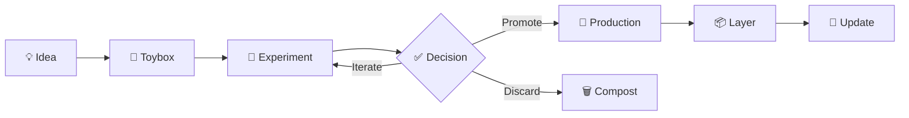

# uDevFramework Compost Policy

## 🌱 Overview

**Status:** ✅ IMPLEMENTED (v1.4.0)
**Last Updated:** 2025-04-20

The **Compost Policy** defines how temporary, experimental, and deprecated code is managed within the uDevFramework ecosystem. This ensures a clean, maintainable codebase while allowing for innovation and experimentation.

## 🗑️ Compost Categories

### 1. Temporary Files (🟡 Short-term)

**Location:** `dev/scratch/`

**Lifetime:** Hours to days

**Purpose:** Quick experiments, throwaway code, temporary tests

**Policy:**
- Automatically deleted after 7 days of inactivity
- Not committed to Git
- No documentation required
- Prefix with `temp_` or `scratch_`

**Example:**
```bash
# Create temporary script
touch dev/scratch/temp_test_agent.py

# Will be auto-deleted after 7 days of no activity
```

### 2. Experimental Code (🟨 Medium-term)

**Location:** `dev/experiments/`

**Lifetime:** Weeks to months

**Purpose:** Prototypes, proofs of concept, research spikes

**Policy:**
- Reviewed every 30 days
- Must have README.md explaining purpose
- Can be committed to Git with `--dev` tag
- Prefix with `exp_` or `proto_`

**Example:**
```bash
# Create experiment
mkdir -p dev/experiments/hivemind-proto
cat > dev/experiments/hivemind-proto/README.md << 'EOF'
# Hivemind Prototype
Purpose: Test agent orchestration patterns
Status: Active
Owner: @fredporter
EOF

# Experiment code
touch dev/experiments/hivemind-proto/exp_agent_orchestrator.ts
```

### 3. Deprecated Code (❌ Long-term)

**Location:** `compost/`

**Lifetime:** Until explicitly removed

**Purpose:** Old implementations, replaced components, legacy code

**Policy:**
- Moved to `compost/` when replaced
- Kept for 1 release cycle
- Removed in next major version
- Document replacement in COMPOST_LOG.md

**Example:**
```bash
# Deprecate old agent system
mkdir -p compost/old-agents
mv src/agents/legacy/* compost/old-agents/
echo "2025-04-20: Moved legacy agents to compost, replaced by Mastra" >> COMPOST_LOG.md
```

## 🧹 Clean/Tidy Operations

### `udev clean` - Remove Temporary Files

```bash
# Dry run - show what would be deleted
udev clean --dry-run

# Actually clean
udev clean

# Clean specific category
udev clean --scratch      # dev/scratch/
udev clean --experiments  # dev/experiments/ (older than 30 days)
```

**What it does:**
1. Delete files in `dev/scratch/` older than 7 days
2. Archive experiments older than 30 days to `compost/`
3. Log actions to `compost/COMPOST_LOG.md`

### `udev tidy` - Organize Codebase

```bash
# Tidy everything
udev tidy

# Tidy specific area
udev tidy --experiments
udev tidy --docs
```

**What it does:**
1. Sort files alphabetically
2. Ensure proper directory structure
3. Fix file permissions
4. Update indexes

### `udev ping` - Health Check

```bash
# Check system health
udev ping

# Check specific component
udev ping --agents
udev ping --registry
```

**What it does:**
1. Verify CLI is working
2. Check agent availability
3. Test registry connectivity (if configured)
4. Report system status

### `udev pong` - Response Test

```bash
# Test response time
udev pong

# Test specific agent
udev pong --agent codegen
```

**What it does:**
1. Send test request
2. Measure response time
3. Report latency statistics

## ⚙️ Destroy/Repair/Reboot Operations

### `udev destroy` - Safe Removal

```bash
# Destroy experiment
udev destroy dev/experiments/old-proto/

# Destroy with confirmation
udev destroy dev/experiments/old-proto/ --force
```

**What it does:**
1. Move to `compost/` with timestamp
2. Log to `COMPOST_LOG.md`
3. Update indexes

### `udev repair` - Fix Issues

```bash
# Repair corrupted layer
udev repair --layer base-node

# Repair configuration
udev repair --config
```

**What it does:**
1. Validate structure
2. Restore from backup if needed
3. Reinstall dependencies
4. Verify integrity

### `udev reboot` - Reset System

```bash
# Soft reboot (restart services)
udev reboot

# Hard reboot (full reset)
udev reboot --hard

# Reboot specific component
udev reboot --agents
```

**What it does:**
1. Stop running services
2. Clear caches
3. Restart services
4. Verify health

## 🏷️ Dev/DevOnly Tagging

### `--dev` Flag

Mark code as development-only:

```bash
# Create dev-only layer
udev layer add experiment --dev

# Run in dev mode
udev init my-project --dev
```

**Behavior:**
- Excluded from production builds
- Not published to registry
- Marked in generated code

### Tagging System

```yaml
# .udev/manifest.yaml
dev_tags:
  - experiment: "Unstable feature"
  - prototype: "Proof of concept"
  - wip: "Work in progress"
  
production_ready: false
```

### Dev Area Structure

```
dev/
├── experiments/          # --dev tagged
│   ├── [exp-name]/      # Individual experiments
│   │   ├── README.md    # Must explain purpose
│   │   └── code/        # Experiment code
│   └── INDEX.md         # Experiment catalog
├── scratch/              # Temporary, untagged
│   └── temp_*.*          # Disposable files
└── toybox/               # Playground
    ├── ideas/           # Raw ideas
    └── sandbox/         # Free experimentation
```

## 🎢 Experiment Workflow



### 1. Idea Phase (Toybox)

**Location:** `dev/toybox/ideas/`

**Process:**
```bash
# Add new idea
cat > dev/toybox/ideas/hivemind-agents.md << 'EOF'
# Hivemind Agent System

## Problem
Need general-purpose agents for non-developers

## Solution
Home/vault/family agents with natural language interface

## Status
Idea phase - not yet prototyped
EOF
```

### 2. Experiment Phase

**Location:** `dev/experiments/`

**Process:**
```bash
# Create experiment
udev experiment init hivemind-proto

# Develop
cd dev/experiments/hivemind-proto
npm init

# Test
udev experiment test hivemind-proto
```

### 3. Decision Gate

**Criteria:**
- ✅ Solves real problem
- ✅ Fits architecture
- ✅ Maintainable
- ✅ Tested

**Process:**
```bash
# Review experiment
udev experiment review hivemind-proto

# Decide
udev experiment promote hivemind-proto  # Move to production
# or
udev experiment discard hivemind-proto   # Move to compost
```

### 4. Production Integration

**Process:**
```bash
# Create layer
udev layer create hivemind --from dev/experiments/hivemind-proto

# Test layer
udev layer test hivemind

# Publish layer
udev layer publish hivemind@1.0.0
```

## 🗂️ Experiment Management

### List Experiments

```bash
# List all experiments
udev experiment list

# List with status
udev experiment list --status
```

### Experiment Status

```bash
# Check experiment status
udev experiment status hivemind-proto
```

Output:
```
Experiment: hivemind-proto
Status: 🟨 IN_PROGRESS
Started: 2025-04-20
Owner: @fredporter
Phase: Prototyping
Next Review: 2025-05-01
```

### Archive Experiment

```bash
# Archive to compost
udev experiment archive hivemind-proto
```

## 📊 Compost Log

**Location:** `compost/COMPOST_LOG.md`

**Format:**
```markdown
## 2025-04-20

### Archived Experiments
- `hivemind-v1`: Replaced by Mastra integration
- `dsc2-local`: Moved to separate repository

### Deprecated Layers
- `base-node@1.0.0`: Use `base-node@2.0.0` instead

### Cleaned Areas
- `dev/scratch/`: 15 files (older than 7 days)
- `dev/experiments/old-proto/`: Archived to compost/
```

## 🎯 Best Practices

### 1. Clear Ownership

```markdown
# Always assign owner
Owner: @github-username
```

### 2. Timebox Experiments

```markdown
# Set review date
Next Review: 2025-05-01
```

### 3. Document Decisions

```markdown
# Record outcomes
Decision: Promote to production
Rationale: Solves real user problem
```

### 4. Regular Review

```bash
# Review experiments monthly
udev experiment review --all
```

### 5. Clean Compost

```bash
# Clean compost monthly
udev compost clean --older-than 90d
```

## 📚 References

- [Universal Spine Specification](../architecture/universal-spine.md)
- [Agent Contract Specification](../agents/agent-contract.md)
- [Implementation Status](../status/IMPLEMENTATION_STATUS.md)

---

**Compost Policy** — Keeping the codebase clean and organized 🌱
