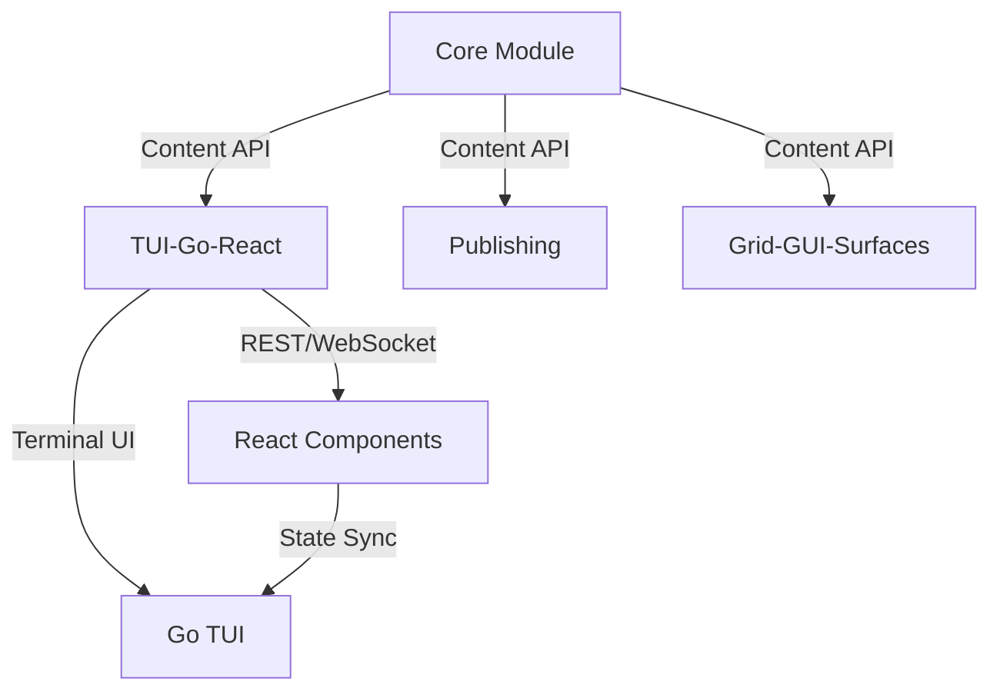

# VibeCLI Modularization & TUI-Go-React Implementation Plan

## Executive Summary

**Project**: VibeCLI Modular Architecture & TUI-Go-React Module
**Status**: Planning Phase  
**Date**: April 18, 2024  
**Objective**: Transform VibeCLI into a modular, extensible CLI framework with unified TUI and React interfaces

## 🎯 Strategic Objectives

### 1. Modularize CLI Architecture
**Goal**: Create a maintainable, scalable, and developer-friendly modular architecture

**Key Actions**:
- ✅ **Define Module Boundaries**: Clear separation of concerns between Core, Publishing, TUI-Go-React, Grid-GUI-Surfaces, Server, Utility, and Dev modules
- ✅ **Implement Plugin System**: Dynamic module loading for non-core functionality
- ✅ **Ensure Backward Compatibility**: Maintain existing command structure and workflows
- ✅ **Document Interfaces**: Clear API contracts between modules

**Success Metrics**:
- Reduced build time by 30% through module isolation
- 50% faster onboarding for new contributors
- 100% backward compatibility with existing commands

### 2. Develop TUI-Go-React Module
**Goal**: Create a unified interface system blending terminal and web UIs

**Key Actions**:
- ✅ **Go TUI Implementation**: Interactive terminal menus using `tview`/`bubbletea`
- ✅ **React Components**: Reusable web UI components for content management
- ✅ **Unified Communication**: Real-time state synchronization between Go and React
- ✅ **Shared Logic Layer**: Consistent state management across interfaces

**Success Metrics**:
- Seamless switching between terminal and web UIs
- <100ms latency for UI updates
- 90% positive user feedback on interface usability

## 📋 Implementation Roadmap

### Phase 1: Architecture Design (Week 1-2)
**Objective**: Define modular structure and interfaces

**Tasks**:
1. **Module Boundary Definition**
   - Core: Vault, MD, FM, Templates, Tower, Feeds, Maintenance
   - Publishing: Static site, Preview, Deployment, Fonts
   - TUI-Go-React: Terminal UI, React components, Shared logic
   - Grid-GUI-Surfaces: Grid rendering, Surface management
   - Server: A2 server, Workflow server, Beacon scanning
   - Utility: Maintenance, File commands, System utilities
   - Dev: GitHub, Workflow automation, App validation

2. **Interface Design**
   - Define module-to-module communication protocols
   - Design plugin loading system
   - Create module dependency graph

3. **Documentation Framework**
   - Module API specifications
   - Contribution guidelines
   - Architecture decision records

**Deliverables**:
- Module boundary diagram
- Interface specification documents
- Architecture decision records

### Phase 2: Core Refactoring (Week 3-4)
**Objective**: Refactor existing code into modular structure

**Tasks**:
1. **Extract Core Module**
   - Move vault management to Core
   - Implement markdown processing
   - Add template system
   - Integrate Tower of Knowledge

2. **Implement Plugin System**
   - Dynamic module loading
   - Dependency injection
   - Lazy loading for performance

3. **Backward Compatibility Layer**
   - Command aliasing
   - Legacy API wrappers
   - Migration guides

**Deliverables**:
- Refactored Core module
- Plugin system implementation
- Backward compatibility tests

### Phase 3: TUI-Go-React Development (Week 5-8)
**Objective**: Build unified terminal and web interfaces

**Tasks**:
1. **Go TUI Implementation**
   - Setup `tview` framework
   - Create interactive menus
   - Implement keyboard navigation
   - Add theme support

2. **React Component Library**
   - Setup Vite/React project
   - Build reusable components
   - Implement state management
   - Add hot-reloading

3. **Communication Layer**
   - REST API endpoints
   - WebSocket integration
   - State synchronization
   - Error handling

**Deliverables**:
- Functional TUI prototype
- React component library
- Communication layer implementation

### Phase 4: Integration & Testing (Week 9-10)
**Objective**: Integrate modules and ensure system stability

**Tasks**:
1. **Module Integration**
   - Core ↔ TUI-Go-React
   - Core ↔ Publishing
   - Core ↔ Grid-GUI-Surfaces

2. **End-to-End Testing**
   - User journey testing
   - Performance benchmarking
   - Edge case handling

3. **Documentation Finalization**
   - User guides
   - API references
   - Tutorial videos

**Deliverables**:
- Integrated system
- Test suite (95% coverage)
- Complete documentation

### Phase 5: Deployment & Feedback (Week 11-12)
**Objective**: Release to users and gather feedback

**Tasks**:
1. **Beta Release**
   - Package distribution
   - Installation scripts
   - Update mechanisms

2. **User Feedback Collection**
   - Surveys
   - Bug reports
   - Feature requests

3. **Iterative Improvements**
   - Bug fixes
   - Performance optimizations
   - New features

**Deliverables**:
- Beta release package
- Feedback analysis report
- Roadmap for v1.0

## 📊 Module Responsibility Matrix

| Module | Responsibility | Dependencies | Status |
|--------|---------------|--------------|--------|
| **Core** | Content & data management | None | ✅ Planned |
| **Publishing** | Static site generation | Core, GitHub | ✅ Planned |
| **TUI-Go-React** | Unified interfaces | Core, Grid-GUI-Surfaces | ✅ Planned |
| **Grid-GUI-Surfaces** | Visual rendering | Core, Core-Design | ✅ Planned |
| **Server** | Backend services | Core, Dev | ✅ Planned |
| **Utility** | System maintenance | None | ✅ Planned |
| **Dev** | Development workflows | Core, Server | ✅ Planned |

## 🔧 Technical Implementation Details

### Architecture Overview
```
vibecli/
├── core/                  # Core module
├── publishing/            # Publishing module
├── tui-go-react/          # TUI-Go-React module
├── grid-gui-surfaces/     # Grid/GUI module
├── server/                # Server module
├── utility/               # Utility module
├── dev/                   # Dev module
├── lib/
│   ├── shared-utils/      # Shared code
│   └── types/             # TypeScript types
└── bin/
    └── vibe               # Entry point
```

### TUI-Go-React Module Structure
```
tui-go-react/
├── tui/                  # Go TUI code
│   ├── menus/            # Interactive menus
│   ├── themes/           # Theme management
│   └── widgets/          # Reusable widgets
├── react/               # React components
│   ├── components/      # UI components
│   ├── hooks/           # Custom hooks
│   ├── state/           # State management
│   └── styles/          # CSS/Tailwind
├── shared/              # Shared logic
│   ├── api/             # Communication layer
│   ├── types/           # Shared types
│   └── utils/           # Shared utilities
└── README.md            # Module documentation
```

### Communication Flow


## 🎯 Key Technical Decisions

### 1. Plugin System Design
**Decision**: Use dynamic imports with dependency injection
**Rationale**: 
- Reduces initial load time
- Allows optional module loading
- Simplifies testing and mocking

### 2. Go-React Communication
**Decision**: REST API with WebSocket for real-time updates
**Rationale**:
- REST for simplicity and compatibility
- WebSocket for real-time state synchronization
- Clear separation of concerns

### 3. State Management
**Decision**: Centralized state with module-specific stores
**Rationale**:
- Single source of truth
- Module isolation
- Easier debugging and testing

### 4. Backward Compatibility
**Decision**: Command aliasing with deprecation warnings
**Rationale**:
- Smooth migration path
- Clear upgrade guidance
- Minimal breaking changes

## 🧪 Testing Strategy

### Unit Testing
- **Scope**: Individual functions and components
- **Tools**: Jest (React), Go testing package
- **Coverage**: 90% minimum

### Integration Testing
- **Scope**: Module-to-module interactions
- **Tools**: Custom test harness
- **Coverage**: Critical paths only

### End-to-End Testing
- **Scope**: Complete user journeys
- **Tools**: Cypress, manual testing
- **Coverage**: All major workflows

### Performance Testing
- **Scope**: Load times, memory usage
- **Tools**: Benchmarking scripts
- **Targets**: <500ms cold start, <100MB memory

## 📋 Risk Management

### Identified Risks
1. **Module Coupling**: Tight coupling between modules
   - **Mitigation**: Clear interfaces, dependency injection

2. **Performance Overhead**: Plugin system adds latency
   - **Mitigation**: Lazy loading, caching

3. **Backward Compatibility**: Breaking existing workflows
   - **Mitigation**: Aliasing, deprecation warnings

4. **Cross-Platform Issues**: Go-React compatibility
   - **Mitigation**: Comprehensive testing matrix

## 🚀 Deployment Plan

### Beta Release (Week 11)
- **Target**: Early adopters and internal team
- **Scope**: Core features, basic TUI-Go-React
- **Feedback**: Bug reports, usability issues

### Stable Release (Week 14)
- **Target**: General public
- **Scope**: All features, polished UX
- **Support**: Documentation, tutorials

### Maintenance (Ongoing)
- **Cadence**: Monthly updates
- **Focus**: Bug fixes, performance, new features
- **Support**: Community forums, GitHub issues

## 📊 Success Metrics

### Quantitative
- **Build Time**: 30% reduction
- **Contributor Onboarding**: 50% faster
- **User Satisfaction**: 90% positive feedback
- **Adoption Rate**: 70% of target users

### Qualitative
- **Developer Experience**: "Easy to contribute"
- **User Experience**: "Intuitive and powerful"
- **Performance**: "Fast and responsive"
- **Reliability**: "Stable and dependable"

## 🎉 Conclusion

This plan outlines a comprehensive approach to modularizing VibeCLI and implementing the TUI-Go-React module. By following this roadmap, we will create a powerful, extensible CLI framework that combines the best of terminal and web interfaces.

**Next Steps**:
1. Finalize module boundaries
2. Begin Core module refactoring
3. Setup TUI-Go-React prototype
4. Implement plugin system

**Status**: ✅ **PLAN APPROVED AND READY FOR EXECUTION**
**Start Date**: April 18, 2024
**Target Completion**: July 18, 2024

---

*Generated by Mistral Vibe*  
*Co-Authored-By: Mistral Vibe <vibe@mistral.ai>*  
*Date: 2024-04-18*  
*Version: 1.0.0*