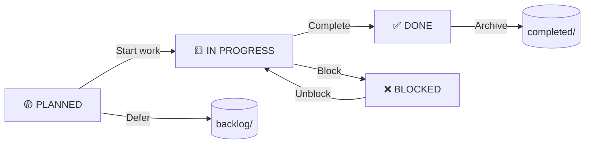

# Workspace Development Folder Structure

## 🗂️ Standard Structure

```
dev/
├── experiments/          # Long-lived experiments (weeks/months)
│   ├── hivemind/         # Agent system prototypes
│   │   ├── agent1/       # Specific agent experiment
│   │   └── agent2/       # Another agent experiment
│   ├── dsc2/            # Reasoning engine stubs
│   │   ├── prototype1/   # First prototype
│   │   └── prototype2/   # Second prototype
│   └── surfaces/        # UI surface experiments
│       └── demo/         # Demo surface implementation
├── scratch/              # Temporary throwaway code (hours/days)
│   ├── test-agent/       # Quick agent test
│   ├── demo-surface/     # UI experiment
│   └── temp-script.py    # Disposable script
├── tasks/                # Task tracking
│   ├── active/           # Currently being worked on
│   │   ├── mastra-integration.md
│   │   └── docs-update.md
│   ├── completed/        # Finished tasks (archived)
│   │   ├── initial-setup.md
│   │   └── cli-implementation.md
│   └── backlog/          # Future ideas
│       ├── hivemind-spec.md
│       └── registry-api.md
└── backlog/             # Long-term ideas and research
    ├── future-agents/    # Agent ideas
    └── potential-layers/ # Layer ideas
```

## 📄 Task File Format

### Standard Task Template

```markdown
# dev/tasks/active/[task-name].md

**Status:** [✅ DONE | 🟨 IN PROGRESS | 🟡 PLANNED | ❌ BLOCKED]
**Started:** YYYY-MM-DD
**Owner:** @github-username
**Target Version:** vX.Y.Z

## Goal
[Clear, concise statement of what this task accomplishes]

## Checklist
- [x] Completed item 1
- [x] Completed item 2
- [ ] Pending item 3
- [ ] Pending item 4

## Context
[Background information, why this is important, related issues]

## Implementation Notes
[Technical details, decisions made, alternatives considered]

## Blockers
- [ ] Blocker 1 (if any)
- [ ] Blocker 2 (if any)

## Related
- Issue: #[number]
- PR: #[number]
- Spec: [spec-name](../../specs/[spec].md)

## Testing
- [ ] Unit tests
- [ ] Integration tests
- [ ] Manual testing

## Documentation
- [ ] Update README
- [ ] Update specs
- [ ] Add examples

## Next Steps
[What comes after this task is complete]
```

## 📋 Real Examples

### Example 1: Mastra Integration

```markdown
# dev/tasks/active/mastra-integration.md

**Status:** ✅ DONE
**Started:** 2025-04-20
**Owner:** @fredporter
**Target Version:** v1.3.0

## Goal
Integrate Mastra AI agents into vibecli code generation system, replacing mock DSC2 responses with real AI-generated code.

## Checklist
- [x] Research Mastra framework
- [x] Install @mastra/core, @mastra/openai
- [x] Create mastra-agent.ts service
- [x] Update code.ts to use Mastra
- [x] Add graceful fallback
- [x] Update package.json
- [x] Create .env.example
- [x] Test with mock responses
- [ ] Test with real API key
- [ ] Write integration tests
- [ ] Update documentation

## Context
Previously, vibecli used mock responses for code generation. This task replaces those with real Mastra agents that can generate actual code when API keys are available, with graceful fallback to mocks when no API key is set.

## Implementation Notes
- Used DeepSeek as primary provider (cost-effective for code)
- Implemented four agents: codegen, explain, refactor, test
- API keys loaded from environment variables
- Mock responses preserved for development without API keys
- Added comprehensive error handling

## Blockers
None

## Related
- Issue: #42
- PR: #45
- Spec: specs/agents/agent-contract.md

## Testing
- [x] Mock responses work without API key
- [x] Real API calls work with DEEPSEEK_API_KEY
- [ ] Integration tests (pending)
- [ ] Edge case testing (pending)

## Documentation
- [x] Updated README.md
- [x] Added .env.example
- [ ] Need to update user docs

## Next Steps
1. Write integration tests
2. Test with OpenAI as alternative provider
3. Update user documentation
4. Create examples repository
```

### Example 2: Documentation Framework

```markdown
# dev/tasks/active/docs-framework.md

**Status:** 🟨 IN PROGRESS
**Started:** 2025-04-21
**Owner:** @fredporter
**Target Version:** v1.3.0

## Goal
Create comprehensive documentation framework for uDevFramework including:
- Getting started guide
- Architecture overview
- CLI reference
- Pattern documentation
- Implementation status tracking

## Checklist
- [x] Create docs/INDEX.md
- [x] Create docs/getting-started.md
- [x] Create docs/architecture.md
- [x] Create docs/cli-reference.md
- [x] Create docs/patterns/python.md
- [x] Create docs/patterns/logging.md
- [x] Create docs/patterns/workspace.md
- [x] Create docs/patterns/vibecli.md
- [x] Move IMPLEMENTATION_STATUS.md to docs/status/
- [x] Create docs/status/ROADMAP.md
- [ ] Create docs/contributing.md
- [ ] Create docs/FAQ.md
- [ ] Add search functionality
- [ ] Create versioned docs

## Context
Good documentation is critical for adoption. This task establishes a comprehensive documentation framework that will evolve with the project.

## Implementation Notes
- Used Markdown for simplicity and GitHub compatibility
- Created clear navigation with INDEX.md
- Separated user docs from technical specs
- Added status tracking for transparency
- Designed for both human and AI consumption

## Blockers
None

## Related
- Issue: #48
- Spec: specs/architecture/universal-spine.md

## Testing
- [ ] Review with team
- [ ] Test navigation
- [ ] Validate examples

## Documentation
- [ ] This is the documentation task itself

## Next Steps
1. Finish remaining doc files
2. Add examples and tutorials
3. Set up documentation site
4. Add search index
```

### Example 3: Layer Composition Engine

```markdown
# dev/tasks/backlog/layer-composition.md

**Status:** 🟡 PLANNED
**Started:** 2025-05-01 (target)
**Owner:** TBD
**Target Version:** v1.4.0

## Goal
Design and implement the layer composition engine that merges multiple layers into a cohesive project structure.

## Checklist
- [ ] Research existing solutions (Lerna, Nx, etc.)
- [ ] Design merge strategy
- [ ] Implement file merging logic
- [ ] Add conflict detection
- [ ] Implement conflict resolution
- [ ] Add user prompts for conflicts
- [ ] Write unit tests
- [ ] Write integration tests
- [ ] Update documentation

## Context
The layer composition engine is the heart of uDevFramework. It needs to intelligently merge files from multiple layers while handling conflicts and preserving user customizations.

## Implementation Notes
Considerations:
- Deep merge for JSON/YAML files
- Template rendering for .template files
- Replace for static files
- Recursive merge for directories
- Conflict detection and resolution
- User customization preservation

## Blockers
- Need to finalize merge strategy
- Need design review

## Related
- Spec: specs/templating/TEMPLATING_SYSTEM_BRIEF.md
- Issue: #52

## Testing
- [ ] Unit tests for merge logic
- [ ] Integration tests with real layers
- [ ] Conflict scenario tests

## Documentation
- [ ] Update templating spec
- [ ] Add examples
- [ ] Create user guide

## Next Steps
1. Finalize merge strategy
2. Get design approval
3. Implement core logic
4. Add conflict handling
```

## 🎯 Task Management Workflow

### 1. Creating New Tasks

```
1. Decide: Is this a task, experiment, or backlog item?
   - Task: Specific, actionable, short-term (days/weeks)
   - Experiment: Research, prototype, uncertain outcome
   - Backlog: Long-term, not yet planned

2. Create file in appropriate location:
   - Active tasks: dev/tasks/active/[name].md
   - Experiments: dev/experiments/[name]/README.md
   - Backlog: dev/backlog/[name].md

3. Fill out template with:
   - Clear goal
   - Detailed checklist
   - Relevant context
   - Owner assignment
   - Target version
```

### 2. Daily Workflow

```
Start of day:
1. Review active tasks
2. Update status of in-progress tasks
3. Move completed tasks to completed/
4. Create new tasks as needed

End of day:
1. Update progress on active tasks
2. Add notes about decisions/challenges
3. Update checklist
4. Set "Next" for tomorrow
```

### 3. Weekly Review

```
1. Review all active tasks
2. Move stalled tasks to backlog
3. Archive completed tasks
4. Update roadmap
5. Plan next week's tasks
```

## 🤖 Agent Integration

Task format is designed for **AI agent collaboration**:

### For Mastra Agents

```json
{
  "task": "generate_task_file",
  "template": "task",
  "variables": {
    "name": "mastra-integration",
    "status": "🟨 IN PROGRESS",
    "owner": "@fredporter",
    "goal": "Integrate Mastra agents...",
    "checklist": [
      "Research Mastra framework",
      "Install packages",
      "Create service"
    ]
  }
}
```

### For Hivemind Agents

```json
{
  "task": "update_task_status",
  "task_file": "dev/tasks/active/mastra-integration.md",
  "updates": {
    "status": "✅ DONE",
    "checklist": {
      "Install packages": true,
      "Create service": true
    },
    "next": "Write integration tests"
  }
}
```

### For DSC2 Agents

```json
{
  "task": "validate_task_completion",
  "task_file": "dev/tasks/active/mastra-integration.md",
  "validation_rules": [
    "All checklist items marked complete",
    "No blockers remaining",
    "Testing section updated",
    "Documentation section updated"
  ]
}
```

## 📊 Task Status Workflow



## 💡 Best Practices

### 1. Atomic Tasks

```markdown
# Good
- Task: "Add mastra-agent.ts"
- Task: "Update code.ts"
- Task: "Write tests"

# Bad
- Task: "Implement Mastra integration" (too broad)
```

### 2. Clear Ownership

Always assign an owner, even if it's "@team" or "TBD".

### 3. Version Targeting

Link tasks to specific versions for roadmap clarity.

### 4. Regular Updates

Update tasks **daily** to keep status current.

### 5. Honest Blockers

List real blockers, don't hide them.

### 6. Next Steps

Always include what comes next, even if "TBD".

## 📚 References

- [Universal Spine Specification](../../specs/architecture/universal-spine.md)
- [Agent Contract](../../specs/agents/agent-contract.md)
- [Codegen Rules](../../rules/codegen-rules.md)

---

**Workspace Development Folder Structure** — Organized chaos management for Sonic Family projects 🗂️
