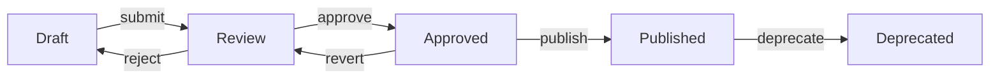

# PublishLane

**The modular publishing system for uDos documentation**

PublishLane handles documentation building, theming, and deployment while keeping publishing concerns separate from the uDos core execution engine.

---

## 🚀 Quick Start

### Install

```bash
npm install -g @okagent/publishlane
```

### Build Documentation

```bash
publishlane build --config .publishlane/config.yaml
```

### Deploy to GitHub Pages

```bash
publishlane deploy --config .publishlane/config.yaml
```

---

## 📦 Architecture

```
PublishLane (Node.js)
├── Build System (Jekyll/Next.js/Static)
├── Theme Engine (Liquid/React)
├── Deployment (GitHub Pages, Vercel)
└── Status Tracking (Draft → Published)
```

---

## 🔧 Configuration

### Basic Config (`publishlane/config.yaml`)

```yaml
version: 1
source: ./docs              # Source directory
output: ./_site            # Build output
format: jekyll             # jekyll | static | nextjs

github:
  repo: owner/repo        # GitHub repository
  branch: gh-pages         # Target branch
  token: ${GITHUB_TOKEN}    # GitHub token (from env)

themes:
  primary: minima          # Default theme
  fallback: default        # Fallback theme
```

### Advanced Config

```yaml
version: 1
source: ./docs
output: ./_site
format: nextjs

plugins:
  - '@publishlane/plugin-mdx'
  - '@publishlane/plugin-search'

redirects:
  - from: /old-page
    to: /new-page
    status: 301

status:
  default: draft
  workflow:
    - draft → review
    - review → approved
    - approved → published
```

---

## 📁 Directory Structure

```
PublishLane/
├── src/                # Core source code
│   ├── cli.js          # Command-line interface
│   ├── builder/        # Build system
│   ├── deployer/       # Deployment
│   └── themes/         # Theme management
├── templates/          # Built-in templates
│   ├── jekyll/         # Jekyll themes
│   └── nextjs/         # Next.js themes
├── actions/            # GitHub Actions workflows
│   └── publish.yml    # Standard publishing workflow
├── docs/               # PublishLane documentation
└── package.json        # Node.js package
```

---

## 🔄 uDos Integration

### CLI Bridge

```bash
# From uDos CLI
ucode publish --use publishlane --config .publishlane/config.yaml
```

### GitHub Actions

```yaml
# .github/workflows/publish.yml
- name: Publish Documentation
  uses: OkAgentDigital/PublishLane/.github/workflows/publish.yml@v1
  with:
    config_path: .publishlane/config.yaml
```

---

## 📖 Commands

| Command | Description |
|---------|-------------|
| `build` | Build static site from documentation |
| `deploy` | Deploy to GitHub Pages/Vercel |
| `serve` | Local preview server |
| `validate` | Validate documentation structure |
| `status` | Check document statuses |
| `init` | Initialize PublishLane in a project |

---

## 🎨 Themes

### Built-in Themes

- **Minima** (Jekyll default)
- **Modernist** (Clean, responsive)
- **Darkmode** (Dark theme variant)
- **Print** (Print-optimized)

### Custom Themes

```yaml
themes:
  custom:
    name: my-theme
    path: ./themes/my-theme
    engine: liquid  # or 'react' for Next.js
```

---

## 📝 Document Frontmatter

```markdown
---
title: "Snack & Relic Specification"
status: published      # draft | review | approved | published | deprecated
date: 2026-04-26
version: 1.0
authors:
  - name: uDos Team
    email: team@udos.go
tags:
  - core
  - specification
  - ucode1
---

# Specification Content
...
```

---

## 🔗 Status Workflow



---

## 🚀 Roadmap

### v1.0 (Current - uCode1)
- [x] Static site generation (Jekyll)
- [x] GitHub Pages deployment
- [x] Basic theming
- [x] Status tracking

### v2.0 (uCode2)
- [ ] Next.js support
- [ ] MDX components
- [ ] Search functionality
- [ ] Multi-target deployment

### v3.0 (uCode3)
- [ ] WASM-based builder
- [ ] Decentralized publishing
- [ ] Real-time collaboration
- [ ] AI-assisted writing

---

## 📚 Examples

### Build and Deploy

```bash
publishlane build
publishlane deploy
```

### Local Preview

```bash
publishlane serve --port 4000
```

### Validate Docs

```bash
publishlane validate --strict
```

---

## 🤝 Contributing

See [CONTRIBUTING.md](CONTRIBUTING.md) for guidelines.

---

## 📄 License

MIT © OkAgentDigital
