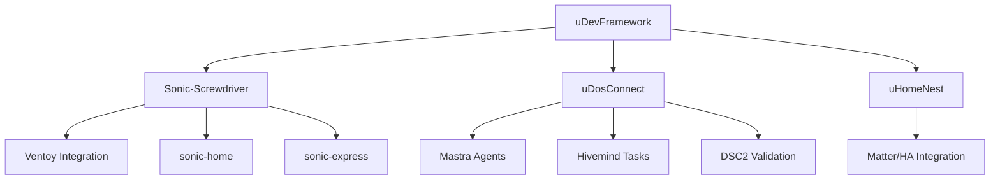
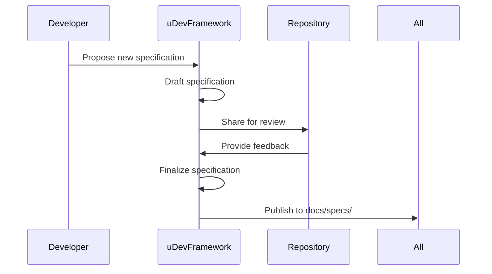
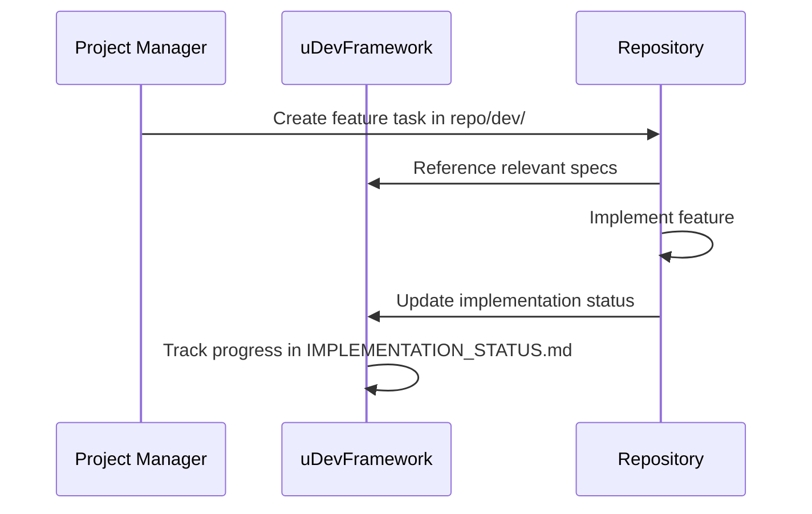
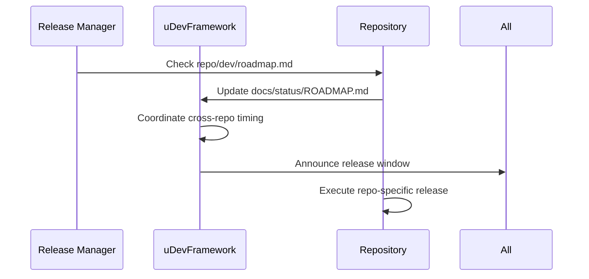
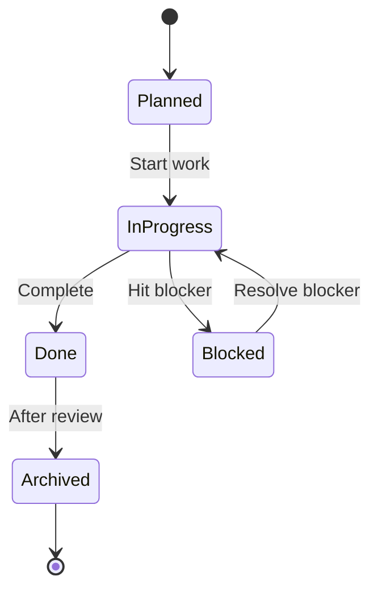

# uDevFramework Development Hub

**Primary coordination point for Sonic Family ecosystem development**

## 🗺️ Ecosystem Overview



## 🎯 Development Principles

1. **Central Coordination**: uDevFramework serves as the primary hub for specifications, standards, and cross-repo coordination
2. **Repo Autonomy**: Each repository maintains its own dev plans, roadmaps, and release cycles
3. **Universal Spine**: All repositories adhere to the common directory structure and conventions
4. **Agent-Aware**: All specifications are written for both human and AI consumption

## 📁 Repository Structure

```
code-vault/
├── udevframework/          # PRIMARY HUB - Specs, standards, coordination
│   ├── docs/               # All documentation
│   ├── specs/              # Technical specifications
│   ├── rules/              # Coding rules and standards
│   ├── dev/                # Cross-repo development coordination
│   └── DEV_HUB.md          # This file
│
├── sonic-screwdriver/      # Container runtime and CLI
│   ├── dev/                # Sonic-specific dev plans
│   ├── modules/            # sonic-home, sonic-express, ventoy
│   └── internal/           # Core implementation
│
├── uDosConnect/           # AI agents and connectivity
│   ├── dev/                # uDos-specific dev plans
│   ├── agents/             # Mastra, Hivemind, DSC2
│   └── modules/            # Connectivity modules
│
└── uHomeNest/             # Home automation
    ├── dev/                # uHome-specific dev plans
    ├── server/             # API server
    └── integrations/       # Matter, HA, Jellyfin
```

## 🔄 Cross-Repository Workflows

### 1. Specification Development



### 2. Feature Implementation



### 3. Release Coordination



## 📋 Current Development Focus

### uDevFramework (This Repo)
- **Priority**: Specification finalization and documentation
- **Current Work**:
  - Finalizing Agent Contract specification
  - Completing Templating System documentation
  - Creating cross-repo integration guides
- **Next Steps**:
  - Implement layer composition engine (v1.4.0)
  - Add remote registry support (v2.0.0)
  - Create web UI for layer browsing (v2.4.0)

### Sonic-Screwdriver
- **Priority**: Runtime stabilization and self-healing
- **Current Work**:
  - Implementing container health checks
  - Adding automatic recovery mechanisms
  - Enhancing error handling
- **Next Steps**:
  - Complete Docker integration (vA1.2.0)
  - Add test coverage (vA1.3.0)
  - Implement Ventoy promotion workflow (vA1.3.0)

### uDosConnect
- **Priority**: Agent integration and task automation
- **Current Work**:
  - Mastra agent implementation
  - Hivemind task management
  - DSC2 validation integration
- **Next Steps**:
  - Complete agent contract implementation
  - Add agent-driven project generation
  - Implement CI/CD integration

### uHomeNest
- **Priority**: Home automation integration
- **Current Work**:
  - Matter protocol integration
  - Home Assistant core integration
  - Jellyfin media server
- **Next Steps**:
  - Complete sonic-home packager
  - Add USB auto-install
  - Implement update channels

## 📊 Implementation Status Matrix

| Component | Status | Owner | Target Version |
|-----------|--------|-------|----------------|
| Universal Spine | ✅ Complete | uDevFramework | v1.3.0 |
| Agent Contract | 🟨 Partial | uDevFramework | v2.0.0 |
| Templating System | 🟡 Planned | uDevFramework | v2.0.0 |
| Container Runtime | ✅ Working | Sonic-Screwdriver | vA1.1.0 |
| Library Manager | ✅ Working | Sonic-Screwdriver | vA1.1.0 |
| State Management | ✅ Working | Sonic-Screwdriver | vA1.1.0 |
| Self-Healing | 🟨 Partial | Sonic-Screwdriver | vA1.2.0 |
| Ventoy Integration | 🟨 Partial | Sonic-Screwdriver | vA1.3.0 |
| Mastra Agents | 🟡 Planned | uDosConnect | v2.0.0 |
| Matter Integration | 🟨 Partial | uHomeNest | v1.0.0 |
| sonic-home | 🟨 Partial | uHomeNest | v1.0.0 |

## 🤖 Agent Integration

### Specification Format for Agents

```json
{
  "agent": "codegen",
  "task": "implement_self_healing",
  "input": "Add automatic recovery for failed Docker containers",
  "context": {
    "language": "go",
    "framework": "docker-sdk",
    "repository": "sonic-screwdriver",
    "module": "internal/container",
    "max_tokens": 4000,
    "temperature": 0.2
  },
  "references": [
    "internal/container/docker.go",
    "docs/roadmap.md",
    "dev/active/active-index.md"
  ]
}
```

### Agent Capabilities by Repository

| Repository | Agents | Capabilities |
|------------|--------|--------------|
| uDevFramework | Mastra, DSC2 | Specification generation, validation |
| Sonic-Screwdriver | Mastra, Hivemind | Code generation, task management |
| uDosConnect | Mastra, Hivemind, DSC2 | Full agent suite |
| uHomeNest | Mastra | Code generation, documentation |

## 📈 Roadmap Coordination

### Q2 2026 - Foundation Stabilization
- **uDevFramework**: Complete core specifications (v1.3.0)
- **Sonic-Screwdriver**: Stabilize runtime and CLI (vA1.2.0)
- **uDosConnect**: Implement agent contract (v1.3.0)
- **uHomeNest**: Complete Matter/HA integration (v1.0.0)

### Q3 2026 - Feature Completion
- **uDevFramework**: Implement layer composition (v2.0.0)
- **Sonic-Screwdriver**: Add Ventoy promotion (vA1.3.0)
- **uDosConnect**: Add agent automation (v2.0.0)
- **uHomeNest**: Complete sonic-home (v1.1.0)

### Q4 2026 - Ecosystem Maturity
- **uDevFramework**: Add registry and UI (v2.4.0)
- **Sonic-Screwdriver**: Production hardening (vA1.4.0)
- **uDosConnect**: IDE integration (v2.5.0)
- **uHomeNest**: Fleet management (v1.2.0)

## 📚 Documentation Standards

### Specification Format
```markdown
# Specification Title

## Status
🟨 PARTIAL (vX.Y.Z)

## Overview
Brief description of the specification

## Detailed Sections
### Subsection 1
Detailed content

### Subsection 2
More detailed content

## Implementation Status
| Component | Status | Notes |
|-----------|--------|-------|
| Feature 1 | ✅ Done | Working |
| Feature 2 | 🟨 Partial | In progress |

## References
- [Related Spec](link)
- [Implementation](link)
```

### Roadmap Format
```markdown
## Version Plan

### vX.Y.Z - Target Date
**Goal**: Clear objective

| Feature | Status | Notes |
|---------|--------|-------|
| Feature A | 🟡 Planned | Description |
| Feature B | 🟡 Planned | Description |

**Deliverables**:
- Item 1
- Item 2

**Success Metrics**:
- Metric 1
- Metric 2
```

## 🔧 Development Workflow

### 1. Daily Standup
- Review `dev/active/active-index.md` in each repo
- Update `dev/active/execution-notes.md` with progress
- Sync with cross-repo dependencies

### 2. Weekly Planning
- Review uDevFramework `docs/status/ROADMAP.md`
- Update individual repo `dev/roadmap.md` files
- Identify cross-repo dependencies
- Create tasks in respective `dev/active/` folders

### 3. Sprint Review
- Update `docs/status/IMPLEMENTATION_STATUS.md`
- Move completed work to `dev/completed-summary.md`
- Archive old tasks to `dev/compost/`
- Plan next sprint in `dev/active/active-index.md`

### 4. Release Process
- Verify all specs are up to date
- Ensure cross-repo compatibility
- Update CHANGELOG.md files
- Create release notes
- Announce in #releases channel

## 📋 Task Management

### Task File Format
```markdown
# Task Title

**Status**: ✅ DONE | 🟨 IN PROGRESS | 🟡 PLANNED | ❌ BLOCKED
**Owner**: @github-username
**Repo**: repository-name
**Milestone**: vX.Y.Z

## Objective
Clear statement of what this task accomplishes

## Checklist
- [x] Completed item 1
- [ ] Pending item 2
- [ ] Blocked item 3

## Context
Background and rationale

## Implementation
Technical details and decisions

## Testing
- Unit tests: ✅
- Integration tests: 🟡
- Manual testing: ❌

## Blockers
- Issue #123
- Waiting on PR #456

## Related
- Spec: [spec-name](../../specs/spec.md)
- Issue: #789
- PR: #1011
```

### Task Lifecycle


## 🎯 Success Metrics

### Specification Quality
- ✅ All specs follow template
- ✅ Agent-aware format
- ✅ Cross-referenced
- ✅ Implementation status tracked

### Code Quality
- ✅ Follows codegen rules
- ✅ Type hints/comments
- ✅ Error handling
- ✅ Test coverage

### Documentation
- ✅ Complete and accurate
- ✅ Up to date
- ✅ Cross-referenced
- ✅ Agent-readable

### Integration
- ✅ Cross-repo workflows documented
- ✅ Version compatibility
- ✅ Release coordination
- ✅ Health monitoring

## 🔗 Quick Links

- [Universal Spine Spec](docs/specs/universal-spine.md)
- [Agent Contract](docs/specs/agents/agent-contract.md)
- [Templating System](docs/specs/templating.md)
- [Implementation Status](docs/status/IMPLEMENTATION_STATUS.md)
- [Roadmap](docs/status/ROADMAP.md)

---

**Last Updated**: 2026-04-20
**Maintainer**: @fredporter
**Status**: Active
