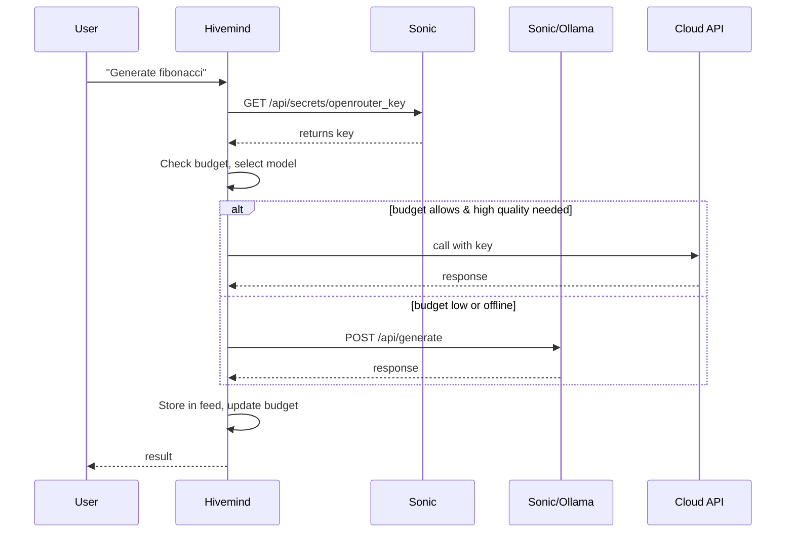

# 🧠 Hivemind as Persistent Intelligence Layer – Rethinking the Stack

**Status:** Proposed
**Last Updated:** 2025-04-22
**Author:** @fredporter

## Overview

This specification defines the separation of intelligence capabilities from infrastructure management, creating a dedicated Hivemind layer that handles decision-making while Sonic-Screwdriver focuses on infrastructure operations.

## Core Insight

**Sonic should NOT do intelligence.** Sonic manages infrastructure. Hivemind makes decisions.

```
Sonic-Screwdriver (Workhorse)
• Container runtime (Docker/Podman)
• API proxy with rate limiting
• Secret store (encrypted keys)
• Node registry & authentication
• Ventoy USB creation
• Health monitoring & auto-repair
• Local model hosting (Ollama)

✅ NO routing decisions
✅ NO agent orchestration
✅ NO task decomposition

Hivemind (Nimble Intelligence)
• Model selector (which model for which task)
• Budget-aware routing (track costs across providers)
• Fallback chain (cloud → local → queue)
• Task decomposition (swarm orchestration)
• Agent coordination (parallel execution)
• Quality synthesis (confidence scoring)
• Reply feed management (memory, context)
• RAG / vector search

✅ NO infrastructure management
✅ NO container operations
✅ NO secret storage (gets from Sonic)
```

## Revised Architecture

```
┌─────────────────────────────────────────────────────────────────────────────┐
│                         Sonic-Screwdriver (Workhorse)                        │
│  • Container runtime (Docker/Podman)                                        │
│  • API proxy with rate limiting                                             │
│  • Secret store (encrypted keys)                                            │
│  • Node registry & authentication                                           │
│  • Ventoy USB creation                                                      │
│  • Health monitoring & auto-repair                                          │
│  • Local model hosting (Ollama) – serves models, but doesn't decide        │
│                                                                              │
│  ✅ NO routing decisions                                                     │
│  ✅ NO agent orchestration                                                   │
│  ✅ NO task decomposition                                                    │
└─────────────────────────────────────────────────────────────────────────────┘
                                      │
                                      │ API calls (model inference, secrets)
                                      ▼
┌─────────────────────────────────────────────────────────────────────────────┐
│                         Hivemind (Nimble Intelligence)                       │
│  • Model selector (which model for which task)                              │
│  • Budget-aware routing (track costs across providers)                      │
│  • Fallback chain (cloud → local → queue)                                   │
│  • Task decomposition (swarm orchestration)                                 │
│  • Agent coordination (parallel execution)                                  │
│  • Quality synthesis (confidence scoring)                                   │
│  • Reply feed management (memory, context)                                  │
│  • RAG / vector search                                                      │
│                                                                              │
│  ✅ NO infrastructure management                                             │
│  ✅ NO container operations                                                  │
│  ✅ NO secret storage (gets from Sonic)                                      │
└─────────────────────────────────────────────────────────────────────────────┘
                                      │
                                      │ consumes models via API
                                      ▼
                              ┌───────────────┐
                              │  Sonic Local  │
                              │  Models       │
                              │  (Ollama)     │
                              └───────────────┘
```

## Why This Separation Works

### Sonic as Workhorse (Heavy, Persistent)

| Responsibility | Why It Belongs in Sonic |
|----------------|------------------------|
| Container management | Heavy, stateful, needs daemon |
| Secret storage | Security-critical, one place |
| API proxy | Infrastructure layer |
| Health monitoring | Continuous, system-level |
| Ventoy USB | One-time heavy operation |
| Local model serving | Memory-heavy, persistent |

**Sonic runs as a daemon** – always on, managing infrastructure.

### Hivemind as Intelligence (Nimble, Ephemeral)

| Responsibility | Why It Belongs in Hivemind |
|----------------|----------------------------|
| Model selection | Decision-making, changes often |
| Budget routing | Context-dependent, per request |
| Swarm orchestration | Complex logic, evolving |
| Agent coordination | Stateful but lightweight |
| RAG / memory | Smart, requires embeddings |
| Feed management | Core intelligence feature |

**Hivemind can be stateless** – decisions per request, can be restarted freely.

## Data Flow



**Hivemind calls Sonic for secrets and local models, but makes all decisions.**

## Local Model Routing

Sonic **hosts** the models (Ollama), but Hivemind **decides** when to use them.

```bash
# Sonic just serves the model
curl http://sonic.local:11434/api/generate -d '{"model":"llama3.2:3b","prompt":"Hello"}'

# Hivemind decides to use it (or not) based on:
# - Budget remaining
# - Task complexity
# - Internet availability
# - Quality requirements
```

**This keeps Sonic dumb (fast, reliable) and Hivemind smart (adaptive, evolving).**

## Benefits of This Split

| Aspect | Before (Monolithic) | After (Split) |
|--------|---------------------|---------------|
| **Sonic complexity** | High (intelligence + infra) | Low (infra only) |
| **Hivemind persistence** | Tied to uDosConnect | Can be its own repo |
| **Model routing logic** | Buried in code | Centralized in Hivemind |
| **Testing** | Hard (mock everything) | Easy (mock Sonic API) |
| **Scaling** | Scale everything together | Scale Hivemind horizontally |
| **Restarts** | Restart Sonic loses decisions | Hivemind can restart freely |
| **Local model switching** | Hardcoded | Dynamic via Hivemind |

## Hivemind as Its Own Persistent Repo

Yes – Hivemind should become its own repository:

```
code-vault/
├── uDevFramework/        # Base specs & contracts
├── sonic-screwdriver/    # Workhorse (infrastructure)
├── hivemind/             # NEW: Nimble intelligence
│   ├── .udev/
│   ├── src/
│   │   ├── router/       # Model selection, budget routing
│   │   ├── swarm/        # Task decomposition, agent coordination
│   │   ├── feed/         # Reply memory, context
│   │   ├── rag/          # Vector search, embeddings
│   │   └── quality/      # Confidence scoring, synthesis
│   └── tests/
├── uDosConnect/          # Domain logic (uses Hivemind)
└── uHomeNest/            # Domain logic (uses Hivemind)
```

**uDosConnect and uHomeNest become thin clients** that call Hivemind for intelligence.

## What Hivemind Needs from Sonic

| Service | How Hivemind Uses It |
|---------|---------------------|
| Secret store | Get API keys for cloud models |
| Ollama endpoint | Call local models |
| Node registry | Identify caller for permissions |
| Audit log | Log decisions (optional) |

**Hivemind does NOT need:**
- Container management
- Ventoy operations
- Health monitoring
- USB creation

## What Hivemind Provides to uDosConnect

| Capability | How uDosConnect Uses It |
|------------|------------------------|
| `POST /api/generate` | Generate code, text, etc. |
| `POST /api/complete` | FIM code completion |
| `POST /api/explain` | Code explanation |
| `POST /api/swarm` | Multi-agent tasks |
| `GET /api/feed` | Get reply history |
| `POST /api/rag` | Semantic search |

**uDosConnect calls Hivemind like an API – no intelligence inside uDosConnect.**

## Implementation Path

### Step 1: Extract Hivemind from uDosConnect (Week 1)

```bash
# Create new repo
mkdir -p ~/code-vault/hivemind
cd ~/code-vault/hivemind

# Copy intelligence code from uDosConnect
cp -r ../uDosConnect/core/src/swarm ./src/
cp -r ../uDosConnect/core/src/orchestrator ./src/
cp -r ../uDosConnect/core/src/feed ./src/
cp -r ../uDosConnect/core/src/rag ./src/
```

### Step 2: Add Sonic Client to Hivemind (Week 1-2)

```typescript
// hivemind/src/sonic-client.ts
export class SonicClient {
    async getSecret(name: string): Promise<string> {
        const res = await fetch(`http://sonic.local:3010/api/secrets/${name}`, {
            headers: { Authorization: `Bearer ${this.token}` }
        });
        return res.json();
    }
    
    async callLocalModel(model: string, prompt: string): Promise<string> {
        const res = await fetch(`http://sonic.local:11434/api/generate`, {
            method: 'POST',
            body: JSON.stringify({ model, prompt })
        });
        return res.json();
    }
}
```

### Step 3: Hivemind API Server (Week 2)

```typescript
// hivemind/src/server.ts
app.post('/api/generate', async (req, res) => {
    const { prompt, model_hint, max_budget } = req.body;
    
    // Hivemind decides which model to use
    const decision = await router.decide({
        task: prompt,
        modelHint: model_hint,
        maxBudget: max_budget,
        availableModels: await sonic.listModels()
    });
    
    // Execute with chosen model
    const result = await execute(decision, prompt);
    res.json(result);
});
```

### Step 4: Update uDosConnect to Call Hivemind (Week 2-3)

```typescript
// uDosConnect/src/commands/generate.ts
// BEFORE: local logic
// const result = await dsc2.generate(prompt);

// AFTER: call Hivemind
const result = await fetch('http://hivemind.local:3002/api/generate', {
    method: 'POST',
    body: JSON.stringify({ prompt })
});
```

### Step 5: Remove Intelligence from uDosConnect (Week 3)

Delete `swarm/`, `orchestrator/`, `feed/`, `rag/` from uDosConnect. It now only contains domain logic.

## New Architecture Summary

```
┌─────────────────┐     ┌─────────────────┐     ┌─────────────────┐
│   uDosConnect   │────▶│    Hivemind     │────▶│     Sonic       │
│   (thin CLI)    │     │  (intelligence) │     │  (workhorse)    │
│                 │     │                 │     │                 │
│ • Domain logic  │     │ • Model router  │     │ • Containers    │
│ • Commands      │     │ • Budget tracker│     │ • Secrets       │
│ • Vault access  │     │ • Swarm         │     │ • Ollama        │
│                 │     │ • Feed/RAG      │     │ • Ventoy        │
└─────────────────┘     └─────────────────┘     └─────────────────┘
```

**Each layer has one job. Each can be developed, scaled, and restarted independently.**

## Decision: Proceed with Hivemind as Separate Repo

| Question | Answer |
|----------|--------|
| Should Hivemind be its own repo? | ✅ Yes |
| Should Sonic handle intelligence? | ❌ No (infra only) |
| Should uDosConnect have intelligence? | ❌ No (calls Hivemind) |
| Does Hivemind need persistence? | ✅ Yes (feed, budget, state) |
| Can Hivemind be stateless? | Partial (feed needs storage) |

**Next step:** Create `~/code-vault/hivemind` repo and extract intelligence code from uDosConnect.

## Naming Convention

Given the architecture, the repository should be named:

**`uDosHivemind`**

This clearly indicates:
- Part of the uDos ecosystem
- Focused on hive/mind intelligence
- Separate from uDosConnect (CLI)

## Repository Structure

```
uDosHivemind/
├── .udev/
│   └── manifest.yaml      # References base layers
├── src/
│   ├── router/            # Model selection, budget routing
│   ├── swarm/             # Task decomposition, agent coordination
│   ├── feed/              # Reply memory, context
│   ├── rag/               # Vector search, embeddings
│   ├── quality/           # Confidence scoring, synthesis
│   ├── budget/            # Cost tracking
│   ├── agents/            # Agent definitions
│   └── api/               # HTTP server
├── tests/
│   ├── unit/
│   └── integration/
├── .dev/
│   ├── agents/
│   └── flows/
├── package.json
├── README.md
└── .gitignore
```

## API Endpoints

### Core Intelligence Endpoints

| Endpoint | Method | Description |
|----------|--------|-------------|
| `/health` | GET | Health check |
| `/api/generate` | POST | Generate response from best model |
| `/api/complete` | POST | Code completion (FIM) |
| `/api/explain` | POST | Code explanation |
| `/api/swarm` | POST | Multi-agent task orchestration |

### Memory and Context

| Endpoint | Method | Description |
|----------|--------|-------------|
| `/api/feed/recent` | GET | Recent replies |
| `/api/feed/thread` | GET | Thread context |
| `/api/feed/search` | GET | Search feed |
| `/api/rag/search` | POST | Semantic search |

### Management

| Endpoint | Method | Description |
|----------|--------|-------------|
| `/api/budget` | GET | Current budget status |
| `/api/models` | GET | Available models |
| `/api/agents` | GET | Available agents |

## Integration with Sonic

### Sonic Services Used

1. **Secret Store**: `GET /api/secrets/{name}`
2. **Ollama Models**: `POST /api/generate` (proxy)
3. **Node Registry**: `GET /api/nodes/{id}`
4. **Audit Log**: `POST /api/audit` (optional)

### Authentication

Hivemind should authenticate with Sonic using:
- API key in headers
- Node ID for identification
- Rate limiting per node

## Deployment Strategy

### Development
```bash
# Start Hivemind in dev mode
npm run dev

# Test with curl
curl -X POST http://localhost:3002/api/generate \
  -H "Content-Type: application/json" \
  -d '{"prompt":"Write a fibonacci function"}'
```

### Production
```bash
# Build and start
npm run build
npm start

# With PM2 for process management
pm2 start dist/server.js --name hivemind
```

### Docker
```dockerfile
FROM node:20-alpine
WORKDIR /app
COPY package*.json ./
RUN npm install --production
COPY . .
RUN npm run build
CMD ["node", "dist/server.js"]
```

## Monitoring and Metrics

### Key Metrics
- Request latency
- Model selection accuracy
- Budget adherence
- Error rates
- Concurrent requests

### Health Checks
- `/health` endpoint
- Dependency checks (Sonic, DB)
- Model availability

## Testing Strategy

### Unit Tests
- Test each module independently
- Mock Sonic API calls
- Test decision logic

### Integration Tests
- Test with real Sonic instance
- Test full workflows
- Test error handling

### Performance Tests
- Load testing
- Latency benchmarks
- Memory usage

## Security Considerations

### Authentication
- Require API keys for all endpoints
- Validate node registration
- Rate limit per node

### Data Protection
- No secret storage in Hivemind
- Encrypt sensitive data
- Secure API endpoints

### Input Validation
- Validate all inputs
- Sanitize prompts
- Limit request size

## Benefits Summary

### For the Ecosystem
1. **Clear separation** of concerns
2. **Reusable intelligence** across products
3. **Independent scaling** of components
4. **Easier testing** and development
5. **Faster innovation** in intelligence

### For uDosConnect
1. **Smaller size** (~50-100MB)
2. **Simpler code** (domain logic only)
3. **Faster startup** (no intelligence)
4. **Easier maintenance** (less code)

### For Hivemind
1. **Focused development** (intelligence only)
2. **Reusable** across products
3. **Centralized improvements**
4. **Better monitoring** (single point)

## Risks and Mitigations

### Risk: Network Dependency
**Mitigation:**
- Implement local fallback
- Cache common responses
- Retry failed requests

### Risk: Performance Overhead
**Mitigation:**
- Optimize API calls
- Use connection pooling
- Implement caching

### Risk: Complex Debugging
**Mitigation:**
- Unified logging
- Distributed tracing
- Detailed error responses

### Risk: Version Mismatch
**Mitigation:**
- API versioning
- Backward compatibility
- Clear upgrade path

## Conclusion

Separating Hivemind from Sonic creates a cleaner, more maintainable architecture:
- **Sonic** focuses on infrastructure (what it's good at)
- **Hivemind** focuses on intelligence (what it's good at)
- **uDosConnect** becomes a thin client (simple and fast)

This separation enables:
- Independent development and scaling
- Reusable intelligence across products
- Clearer code organization
- Better performance and reliability

**Recommendation:** Proceed with creating `uDosHivemind` as a separate repository and extract intelligence code from uDosConnect following this specification.
