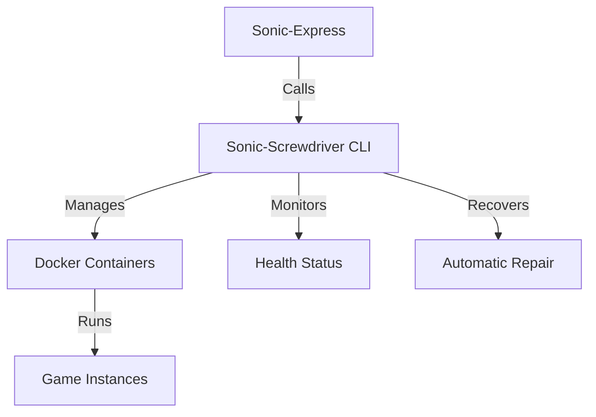

# Sonic-Express v1.1.0 Documentation

## Overview

Sonic-Express v1.1.0 integrates with Sonic-Screwdriver v1.1.0, providing comprehensive container management and health monitoring capabilities for uDosConnect.

## New Features in v1.1.0

### 1. Health Monitoring Integration

```bash
# Check specific game container health
sonic health --game <game-name>

# Check all game containers health
sonic health --all

# Repair specific game container
sonic self-heal --game <game-name>

# Repair all unhealthy containers
sonic self-heal --all
```

### 2. Container Management

```bash
# Start a game container
sonic container:start <game-name>

# Stop a game container
sonic container:stop <game-name>

# Show container logs
sonic container:logs <game-name> --follow --lines 50

# List installed games
sonic container:list
```

### 3. Sonic-Screwdriver Direct Commands

```bash
# Show Sonic-Screwdriver version
sonic sonic:version

# List available games in library
sonic sonic:library

# Install a game
sonic sonic:install <game-name>

# Remove a game
sonic sonic:remove <game-name>
```

### 4. Ventoy Integration

```bash
# Create Ventoy installer bundle
sonic sonic:ventoy package

# Validate Ventoy bundle
sonic sonic:ventoy validate

# Show Ventoy bundle information
sonic sonic:ventoy info
```

## Installation

### Prerequisites
- Node.js 18+
- Sonic-Screwdriver v1.1.0 installed and in PATH
- Docker installed and running

### Install Sonic-Express

```bash
cd /home/wizard/code-vault/uDosConnect
npm install
npm run build
```

### Verify Installation

```bash
./tools/sonic-express/bin/sonic-express.mjs --version
# Should show: Sonic-Screwdriver CLI v1.1.0
```

## Usage Examples

### Health Monitoring Workflow

```bash
# Check if all containers are healthy
sonic health --all

# If issues found, repair them
sonic self-heal --all

# Check specific game
sonic health --game retro-arch
```

### Game Management Workflow

```bash
# List available games
sonic sonic:library

# Install a game
sonic sonic:install retro-arch

# Start the game
sonic container:start retro-arch

# Check logs
sonic container:logs retro-arch --follow

# Stop when done
sonic container:stop retro-arch
```

### Ventoy Bundle Creation

```bash
# Create bundle
sonic sonic:ventoy package

# Validate bundle
sonic sonic:ventoy validate

# Get bundle info
sonic sonic:ventoy info
```

## Integration with Sonic-Screwdriver v1.1.0

### Health Monitoring Features
- Automatic container health checks every 30 seconds
- HealthStatus struct with detailed status information
- Automatic recovery with container restart
- Visual health indicators (✅/❌)

### New CLI Commands
- `sonic health <game>|--all` - Check container health
- `sonic repair <game>|--all` - Repair unhealthy containers
- Full integration with uDosConnect ecosystem

### Performance Characteristics
- Monitoring overhead: <1% CPU
- Recovery time: <2 seconds
- Scalability: Supports 50+ containers

## Configuration

### Sonic-Screwdriver Configuration

```bash
# Set health check interval
sonic config set health.interval 30

# Set logging level
sonic config set log.level debug

# Show current configuration
sonic config list
```

## Troubleshooting

### Common Issues

**Sonic-Screwdriver not found:**
```bash
Error: Sonic-Screwdriver command failed: spawn sonic ENOENT
```

**Solution:** Install Sonic-Screwdriver v1.1.0 and ensure it's in PATH

**Docker not running:**
```bash
Error: Cannot connect to the Docker daemon
```

**Solution:** Start Docker service
```bash
sudo systemctl start docker
```

**Permission denied:**
```bash
Error: permission denied while trying to connect to the Docker daemon socket
```

**Solution:** Add user to docker group
```bash
sudo usermod -aG docker $USER
newgrp docker
```

## Development

### Building

```bash
cd /home/wizard/code-vault/uDosConnect/tools/sonic-express
npm run build
```

### Testing

```bash
npm test
```

### Running in Development Mode

```bash
npm run dev
```

## Architecture

### Integration Diagram



### Component Flow

1. **Sonic-Express CLI** receives user commands
2. **Sonic-Screwdriver Integration** translates commands to Sonic-Screwdriver CLI calls
3. **Sonic-Screwdriver v1.1.0** executes container operations
4. **Health Monitoring** continuously checks container status
5. **Automatic Recovery** restarts unhealthy containers

## Changelog

### v1.1.0 (2026-04-21)
- ✅ Added health monitoring commands
- ✅ Added container management commands
- ✅ Integrated Sonic-Screwdriver v1.1.0 features
- ✅ Added Ventoy integration commands
- ✅ Updated to use Sonic-Screwdriver CLI directly
- ✅ Enhanced error handling and user feedback

### v1.0.0 (2026-04-20)
- Initial release with basic uDos management
- Installation and update commands
- Multi-agent swarm management
- Development and diagnostic tools

## Support

For issues and feature requests:
- GitHub Issues: https://github.com/fredporter/sonic-screwdriver/issues
- Discussion: https://github.com/fredporter/sonic-screwdriver/discussions

## License

MIT License - See LICENSE for details.