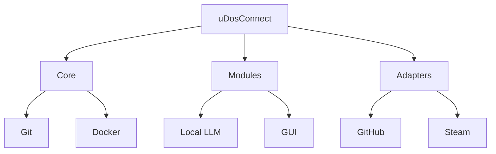

# Complex Canvas Example

## Slide 1: Project Overview
- **Name**: uDosConnect
- **Description**: A modular, extensible framework for integrating tools and workflows.
- **Status**: Active Development
---

## Slide 2: Architecture

---

## Slide 3: Features
| Feature               | Status      | Description                          |
|-----------------------|-------------|--------------------------------------|
| GitHub Integration    | ✅ Active    | PR reviews, file operations          |
| Code Interpreter      | ✅ Active    | Spreadsheets, math, data analysis   |
| Canvas Mode           | ✅ Active    | Structured content generation        |
| Secret Scanning       | ✅ Auto      | Auto-scan for secrets in files       |
---

## Slide 4: Roadmap
- **Q2 2026**: Add support for Kubernetes adapters.
- **Q3 2026**: Enhance GUI with real-time collaboration.
- **Q4 2026**: Expand LLM integrations (e.g., Mistral, Llama).
---

## Slide 5: Getting Started
1. Clone the repo: `git clone https://github.com/your-org/uDosConnect.git`
2. Install dependencies: `pnpm install`
3. Run the CLI: `vibecli configure --mcp-tools "github=true"`
