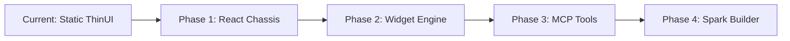
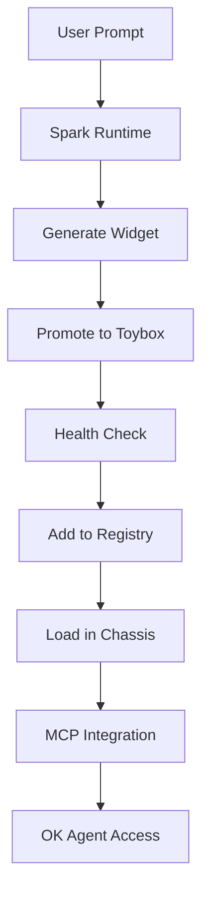

# uDos UI/UX Roadmap - From CLI to Adaptive Interface

## 🎯 Vision

Transform uDos from a powerful CLI-based system into an **adaptive, composable UI platform** inspired by GitHub's experimental projects (Blocks and Spark). This roadmap builds on the solid foundation established in Steps 1 and 2.

## 📚 Current State (Post-Step 2)

### Strengths
- ✅ **Stable CLI core** (uCode1 with all commands)
- ✅ **Plugin promotion pipeline** (Toybox → Sandbox → Launch → Deploy)
- ✅ **Vault intelligence specification** (Copernicus integration ready)
- ✅ **Spark micro-app framework** (SonicExpress runtime ready)
- ✅ **Centralized documentation** (25,000+ words)
- ✅ **Dev/production isolation** (UDOS_DEV_MODE)

### Opportunities
- 🔄 **Static ThinUI** → Adaptive Chassis
- 🧩 **Monolithic dashboard** → Composable Blocks
- 🤖 **Manual setup** → LLM-powered app builder
- 🔗 **Loose integration** → MCP-powered smart tools

## 🚀 The Path Forward: Four Phases

### Phase 1: The Static Chassis (4-6 weeks)

**Goal:** Replace current ThinUI with a React-based, plugin-aware dashboard

**Implementation:**
```bash
# Current ThinUI is the starting point
cd ThinUI

# Enhance to read from Registry
# 1. Add plugin loader that scans Registry/
# 2. Create widget mounting system
# 3. Build basic chassis layout

# Result: Static dashboard that displays installed plugins
```

**Deliverables:**
- Plugin loader service
- Basic widget mounting
- Registry integration
- Static chassis layout

**Success Criteria:**
```bash
# Load and display plugins from Registry
udos thinui start
# Shows: Installed plugins, basic navigation
```

### Phase 2: The Decentralized Widget Engine (6-8 weeks)

**Goal:** Enable discovery and loading of external widgets

**Implementation:**
```bash
# Extend promote-plugin.sh to handle GitHub repos
./promote-plugin.sh --from-github https://github.com/user/widget.git

# Widget loader enhancements:
# 1. GitHub repo scanning
# 2. Health check integration
# 3. Sandboxed execution
# 4. Permission management

# Result: Decentralized widget ecosystem
```

**Deliverables:**
- GitHub repo integration
- Enhanced health checks
- Sandboxed execution
- Permission system

**Success Criteria:**
```bash
# Install widget from GitHub
udos widget install https://github.com/user/container-manager.git

# Widget appears in ThinUI
udos thinui start
# Shows: New widget in dashboard
```

### Phase 3: The MCP-Powered Smart Tool Box (4-6 weeks)

**Goal:** Make widgets MCP-aware for intelligence and interoperability

**Implementation:**
```bash
# Create MCP widget standard
# 1. Define widget MCP interface
# 2. Add MCP hooks to widgets
# 3. Build widget communication bus
# 4. Integrate with OK Agent

# Result: Intelligent, interconnected widgets
```

**Deliverables:**
- Widget MCP interface
- Communication bus
- OK Agent integration
- Inter-widget messaging

**Success Criteria:**
```bash
# Widgets communicate via MCP
udos widget call container-manager list

# OK Agent uses widgets
ok ask "What containers are running?"
# Uses: container-manager widget
```

### Phase 4: The Spark App Builder (8-12 weeks)

**Goal:** LLM-powered app generation and scaffolding

**Implementation:**
```bash
# Build Spark runtime in SonicExpress
cd SonicExpress

# 1. Prompt-based scaffolding
# 2. Plugin generation
# 3. Promotion workflow
# 4. ThinUI integration

# Result: Natural language app builder
```

**Deliverables:**
- Spark runtime engine
- Prompt-based scaffolding
- Plugin generation
- ThinUI integration

**Success Criteria:**
```bash
# Generate widget from prompt
udos spark create "Docker container monitor"

# Creates:
# - container-monitor.udx
# - monitor.udo
# - Promotes to Toybox

# Deploy to production
udos spark deploy container-monitor --to Deploy
```

## 🔧 Technical Implementation

### Architecture Evolution



### Component Mapping

| Current | Future | GitHub Inspiration |
|---------|--------|-------------------|
| ThinUI | Chassis | GitHub Blocks |
| Plugins | Widgets | GitHub Blocks |
| Registry | Widget Registry | - |
| promote-plugin.sh | Widget Promoter | - |
| health-check.sh | Widget Validator | - |
| SonicExpress | Spark Runtime | GitHub Spark |
| OK Agent | Smart Tools | - |

### Data Flow



## 📦 Deliverables by Phase

### Phase 1: Static Chassis
- [ ] React-based dashboard
- [ ] Plugin loader from Registry
- [ ] Basic widget mounting
- [ ] Static layout system

### Phase 2: Widget Engine
- [ ] GitHub repo integration
- [ ] Enhanced health checks
- [ ] Sandboxed execution
- [ ] Permission system
- [ ] Widget marketplace

### Phase 3: MCP Tools
- [ ] Widget MCP interface
- [ ] Communication bus
- [ ] OK Agent integration
- [ ] Inter-widget messaging
- [ ] Event system

### Phase 4: Spark Builder
- [ ] Spark runtime engine
- [ ] Prompt-based scaffolding
- [ ] Plugin generation
- [ ] ThinUI integration
- [ ] Deployment pipeline

## 🎯 Integration Points

### With Existing Components

1. **uCode1 CLI**
   ```bash
   # Manage widgets
   udos widget list
   udos widget install <url>
   udos widget remove <name>
   ```

2. **ThinUI/Chassis**
   ```bash
   # Load and display widgets
   udos thinui start
   # Shows: All installed widgets
   ```

3. **Registry**
   ```bash
   # Widget storage
   Registry/
   ├── Widgets/
   │   ├── container-manager/
   │   │   ├── widget.udx
   │   │   ├── main.udo
   │   │   └── assets/
   │   └── karaoke-tracker/
   └── index.json
   ```

4. **MCP Server**
   ```bash
   # Widget communication
   {
     "method": "widget.call",
     "params": {
       "widget": "container-manager",
       "method": "list"
     }
   }
   ```

5. **SonicExpress/Spark**
   ```bash
   # App generation
   udos spark create "Widget that shows GitHub issues"
   ```

## 📊 Metrics & Success Criteria

### Phase 1: Static Chassis
- **Widget Load Time**: < 500ms
- **Memory Usage**: < 100MB
- **Widgets Supported**: 10+

### Phase 2: Widget Engine
- **Install Time**: < 2s
- **Health Check Time**: < 1s
- **Concurrent Widgets**: 20+

### Phase 3: MCP Tools
- **MCP Call Latency**: < 50ms
- **Message Throughput**: 100+ msg/s
- **Widget Interop**: 5+ simultaneous

### Phase 4: Spark Builder
- **Generation Time**: < 10s
- **Success Rate**: 90%+ valid widgets
- **Deployment Time**: < 5s

## 🎉 Benefits

### For Users
- **Natural Language**: "Create a widget that..."
- **Instant Gratification**: Immediate results
- **No Boilerplate**: Focus on functionality
- **Discoverable**: Find widgets in marketplace

### For Developers
- **Rapid Prototyping**: Test ideas quickly
- **Reusable Components**: Widget library
- **Sandboxed Safety**: Isolated execution
- **Versioned**: Promotion pipeline

### For the Ecosystem
- **Decentralized**: Anyone can contribute
- **Extensible**: Infinite possibilities
- **Maintainable**: Health checks enforce quality
- **Scalable**: MCP enables growth

## 🔮 Future Enhancements

### Beyond Phase 4
1. **Widget Marketplace** - Discover and install community widgets
2. **Widget Versioning** - Update and rollback support
3. **Widget Collaboration** - Multi-user widget development
4. **Widget Analytics** - Usage tracking and optimization
5. **Widget AI** - Auto-generated widgets from usage patterns

### Advanced Integration
1. **Copernicus** - Semantic widget search
2. **GitHub Actions** - CI/CD for widgets
3. **VS Code** - Widget development extension
4. **Mobile** - ThinUI on iOS/Android
5. **Cloud Sync** - Widget synchronization

## 📅 Timeline

| Phase | Duration | Target Date |
|-------|----------|-------------|
| 1. Static Chassis | 4-6 weeks | June 2024 |
| 2. Widget Engine | 6-8 weeks | August 2024 |
| 3. MCP Tools | 4-6 weeks | October 2024 |
| 4. Spark Builder | 8-12 weeks | December 2024 |

## 🎯 Summary

This roadmap transforms uDos from a **powerful CLI** into a **complete development platform** with:

1. **Adaptive UI** (Chassis + Widgets)
2. **Decentralized Ecosystem** (Widget marketplace)
3. **AI-Powered Creation** (Spark builder)
4. **Intelligent Integration** (MCP + Copernicus)

**Building on the solid foundation from Steps 1 and 2, this UI/UX evolution will make uDos the most adaptive, extensible, and intelligent development platform available.**

---

*Roadmap Created: April 25, 2024*
*Status: Ready for Implementation 🚀*