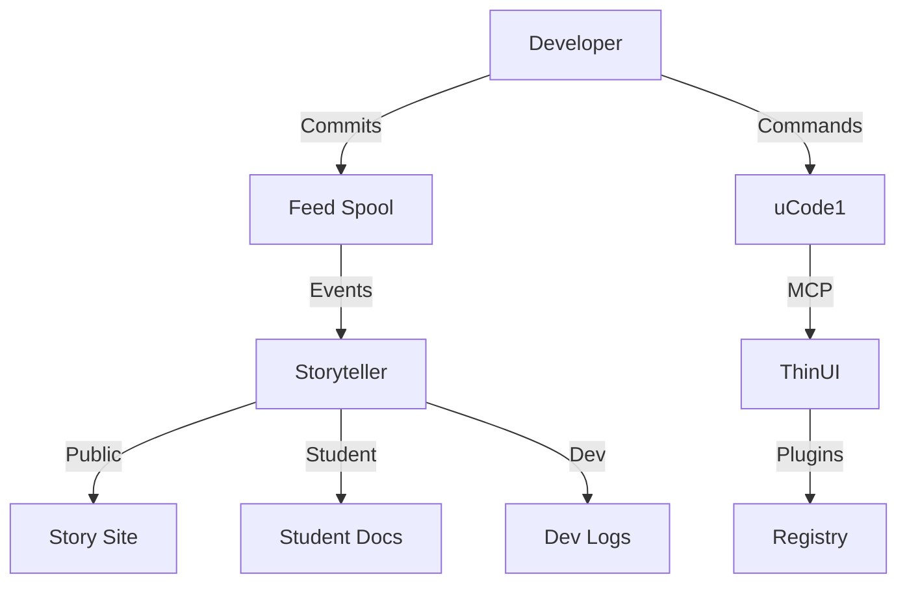

# uDos Architecture Overview

## Introduction

uDos is a **unified development operating system** that integrates code, content, and collaboration into a single coherent workflow. This document describes the high-level architecture of the system.

## Core Components

### 1. uCode1 (Core CLI)

The foundation of uDos, providing:
- **Vault Management**: Secure storage for notes, maps, feeds
- **MCP Server**: Model Context Protocol for inter-process communication
- **Feed Spool**: Event logging and replay
- **Spatial Engine**: Geospatial operations
- **TUI**: Terminal user interface

**Language**: Rust
**Location**: `uCode1/`

### 2. ThinUI (Dashboard)

A Tauri-based dashboard that provides:
- **Plugin Management**: Load and manage plugins
- **System Monitoring**: Health checks and status
- **Configuration**: Settings and preferences
- **MCP Tools**: Integration with GitHub services

**Language**: React + TypeScript
**Location**: `ThinUI/`

### 3. DevStudio (VS Code Extension)

A Visual Studio Code extension for:
- **Plugin Promotion**: Move plugins between environments
- **Health Validation**: Run health checks
- **Script Execution**: Run uDos scripts

**Language**: TypeScript
**Location**: `DevStudio/` (planned)

### 4. Storyteller (Documentation Engine)

Automatically translates technical events into:
- **Public Stories**: Gamified narrative
- **Student Tutorials**: Instructional content
- **Dev Logs**: Private technical logs

**Language**: Rust
**Location**: `SonicExpress/storyteller/`

## Data Flow



## Directory Structure

```
uDosGo/
├── uCode1/              # Core CLI (Rust)
├── ThinUI/              # Dashboard (Tauri + React)
├── DevStudio/           # VS Code extension (planned)
├── SonicExpress/        # Tools and services
│   └── storyteller/     # Documentation engine
├── docs/                # Documentation
├── scripts/             # Utility scripts
├── Vendor/              # Third-party dependencies
│   └── .legacy/         # Legacy code (gitignored)
└── .compost/            # Deleted files (30-day TTL)
```

## Key Concepts

### Vault

A secure storage system for:
- **Notes**: Markdown files
- **Maps**: Geospatial data
- **Feeds**: Event logs
- **Binders**: Structured data

**Location**: `~/Code/Vault/`

### MCP (Model Context Protocol)

A lightweight protocol for inter-process communication:
- **Tools**: `spark_launch`, `agentic_workflow_create`, etc.
- **Transport**: HTTP or WebSocket
- **Port**: 3000

### Feed Spool

A log of all system events:
- **Move Log**: User actions (audit trail)
- **Code Log**: System events (debugging)

**Location**: `~/Code/Vault/.local/feed.json`

### Story Format

A structured format for interactive narratives:
- **Panels**: Slides, forms, interactions
- **Variables**: User input storage
- **Actions**: MCP calls, vault operations

**Extension**: `.story`

## Development Workflow

1. **Clone the repository**:
   ```bash
   git clone https://github.com/uDosGo/uDosGo.git
   ```

2. **Build the project**:
   ```bash
   make build
   ```

3. **Start the development server**:
   ```bash
   make dev
   ```

4. **Run health checks**:
   ```bash
   make doctor
   ```

## Configuration

Configuration is managed through:
- **Environment Variables**: `UDOS_DEV_MODE`, `VAULT_PATH`, etc.
- **Config Files**: `~/.udos/config.toml`
- **Trusted Folders**: `~/.udos/trusted_folders.toml`

## Security

- **Vault Encryption**: Notes and sensitive data are encrypted
- **MCP Authentication**: Token-based authentication
- **Trusted Folders**: Only trusted directories can execute scripts

## Roadmap

### Phase 1: Foundation (Complete)
- Core CLI (uCode1)
- Basic dashboard (ThinUI)
- Documentation engine (Storyteller)

### Phase 2: UI/UX Transformation (In Progress)
- React migration
- MCP tool integration
- Gamified documentation

### Phase 3: Ecosystem Expansion
- VS Code extension (DevStudio)
- Plugin marketplace
- Advanced analytics

### Phase 4: Cloud Integration
- GitHub services
- Cloud storage
- Collaboration features

## Conclusion

uDos is designed to be **modular**, **extensible**, and **developer-friendly**. The architecture supports multiple editions (uCode1-4) with different themes and features, all built on the same core foundation.

For more details, see the individual component documentation.
