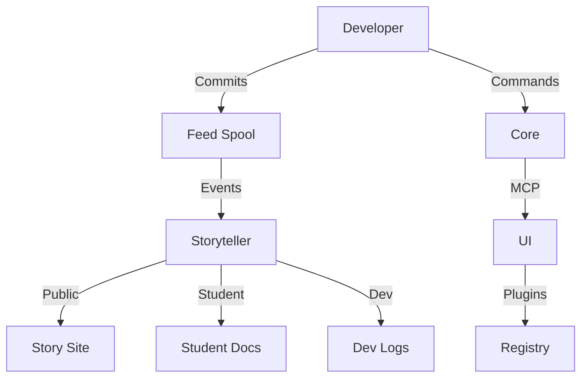

# uDos Architecture

## Overview

uDos is a modular, vault-native development platform designed for knowledge management and productivity.

## Core Components

### Vault-Native Architecture
- **Vault Structure**: Follows Obsidian-like vault structure
- **Templates**: Reusable templates for content creation
- **Modules**: Independent functional units

### Development Stack
- **Frontend**: Vue.js 3
- **Backend**: Node.js with TypeScript
- **Build**: npm workspaces
- **Testing**: Jest, ESLint
- **CI/CD**: GitHub Actions

### Core System

The foundation of uDos, providing:
- **Vault Management**: Secure storage for notes, maps, feeds
- **MCP Server**: Model Context Protocol for inter-process communication
- **Feed Spool**: Event logging and replay
- **Spatial Engine**: Geospatial operations
- **TUI**: Terminal user interface

**Language**: Rust / Python / TypeScript
**Location**: `core/`

### Tools & Utilities

Development tools including:
- **sonic-express**: Fast development server
- **usxd-express**: USXD processing tools

**Location**: `tools/`

## Data Flow



## Directory Structure

```
uDosGo/
├── core/                # Core system modules
├── ui/                  # User interface components
├── tools/               # Development tools
├── docs/                # Documentation
├── scripts/             # Utility scripts
├── templates/           # Project templates
└── .archive/            # Archived legacy directories (gitignored)
```

## Key Concepts

### Vault

A secure storage system for:
- **Notes**: Markdown files
- **Maps**: Geospatial data
- **Feeds**: Event logs
- **Binders**: Structured data

**Location**: `~/Code/Vault/`

### MCP (Model Context Protocol)

A lightweight protocol for inter-process communication:
- **Tools**: `spark_launch`, `agentic_workflow_create`, etc.
- **Transport**: HTTP or WebSocket
- **Port**: 3000

### Feed Spool

A log of all system events:
- **Move Log**: User actions (audit trail)
- **Code Log**: System events (debugging)

**Location**: `~/Code/Vault/.local/feed.json`

### Story Format

A structured format for interactive narratives:
- **Panels**: Slides, forms, interactions
- **Variables**: User input storage
- **Actions**: MCP calls, vault operations

**Extension**: `.story`

## Development Workflow

1. **Local Development**: Use `npm run dev` for local development
2. **Testing**: Run `npm test` for unit tests
3. **Building**: `npm run build` for production builds
4. **Deployment**: Automated via GitHub Actions

## Integration Points

- **VibeCLI**: Configuration validation
- **uDos Feed**: Notification system
- **Webhooks**: External integrations

## Related Repositories

- **SonicScrewdriver** (`~/Code/SonicScrewdriver`) — TARDIS Console: API Central Hub for smart home automation, secrets management, and container orchestration
- **DevStudio** (`~/Code/DevStudio`) — Development environment configuration and tooling
- **Vault** (`~/Code/Vault`) — Secure storage for notes, maps, feeds, and configuration

## Future Directions

- Enhanced modularization
- Improved template system
- Better CI/CD integration
- Expanded testing coverage

## Conclusion

uDos is designed to be **modular**, **extensible**, and **developer-friendly**. The architecture supports multiple components built on the same core foundation.

For more details, see the individual component documentation.
