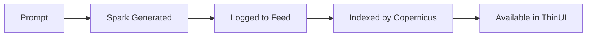

# uDos Logging System

## Overview

uDos implements a dual logging system designed for clarity, auditability, and performance. The system distinguishes between user actions and system events, with automatic cleanup and privacy protections.

## Logging Taxonomy

### 1. Move Log

**Purpose**: Captures user-initiated actions

**Characteristics:**
- Records intentional, reversible operations
- Answers: "What did the user do?"
- Used for user flow analysis and support

**Examples:**
- Creating a note
- Promoting a plugin
- Running a health check
- Starting/stopping services

**Format:**
```json
{
  "type": "move",
  "timestamp": "2024-04-25T06:30:00Z",
  "user": "developer@localhost",
  "action": "note.create",
  "target": "hello.md",
  "parameters": {"content": "# Hello World"},
  "result": "success",
  "hash": "a1b2c3d4..."  // Content hash for privacy
}
```

### 2. Code Log

**Purpose**: Records internal system events

**Characteristics:**
- Captures agent reasoning and tool calls
- Answers: "How did the agent decide?"
- Used for debugging and performance analysis

**Examples:**
- Agent intent classification
- MCP server requests
- Plugin loading events
- System state changes

**Format:**
```json
{
  "type": "code",
  "timestamp": "2024-04-25T06:30:01Z",
  "component": "ok-agent",
  "event": "intent.classified",
  "data": {
    "text": "create a note",
    "intent": "note.create",
    "confidence": 0.95
  },
  "level": "debug"
}
```

## Feed Spool Integration

Both log types are stored in the **Feed Spool** as structured entries:

**Location:** `~/Code/Vault/.local/state/feed_spool/replies.jsonl`

**Benefits:**
- Queryable with `udos feed search --tag <type>`
- Append-only for auditability
- JSON Lines format for efficiency
- Automatic indexing

## Privacy Protection

### Content Hashing

Sensitive data is automatically hashed:
- File contents
- Personal information
- Local paths

**Example:**
```json
{
  "content": "# Hello World",
  "hash": "sha256:a1b2c3..."
}
```

Only the hash is stored, protecting privacy while enabling verification.

## Development Mode Isolation

When `--dev` flag is used:
- Logs go to `~/.local/dev/`
- State isolated from production
- Safe experimentation environment

**Environment Variable:**
```bash
UDOS_DEV_MODE=1 udos note create test.md
```

## Agent Dev Folder Rule

All agents (`ok-agent`, `Re3Engine`) operate within `.dev/` folders:
- Read/write exclusively to `.dev/` scope
- No remote operations without explicit promotion
- Automatic cleanup on exit

## Log Management

### Automatic Cleanup

**Compost Cleanup:**
```bash
# Dry run
./clean-compost.sh --dry-run --verbose

# Actual cleanup (default: 30 days)
./clean-compost.sh --older-than 30
```

**TTL Policy:**
- Move Logs: 30 days
- Code Logs: 7 days (debug), 30 days (info/warn/error)
- Compost: 30 days before permanent deletion

### Manual Queries

**Search by type:**
```bash
udos feed search --tag move
udos feed search --tag code
```

**Search by component:**
```bash
udos feed search --tag agent,ok-agent
```

**Search by date range:**
```bash
# Requires jq for JSON processing
udos feed recent --limit 100 | jq 'select(.timestamp | startswith("2024-04"))'
```

## Integration with Copernicus

### Semantic Indexing

The Copernicus engine indexes logs for semantic search:

```bash
# Semantic search
udos search --semantic "find all note creations"

# Combined search
udos feed search --tag move | udos search --semantic "note operations"
```

### Index Structure

```
~/Code/uDosGo/.copernicus/
├── move-index/      # Move Log index
├── code-index/      # Code Log index
└── semantic-cache/  # Semantic embeddings
```

## Integration with Spark

### Spark Runtime Logging

SonicExpress Sparks generate structured logs:

```json
{
  "type": "spark",
  "spark_id": "karaoke-tracker-123",
  "event": "created",
  "timestamp": "2024-04-25T06:35:00Z",
  "data": {
    "prompt": "track weekly karaoke night",
    "files": ["karaoke.udx", "summary.udo"]
  }
}
```

### Spark Lifecycle



## Best Practices

### For Developers

1. **Use appropriate log levels:**
   - `debug`: Detailed troubleshooting
   - `info`: Normal operation
   - `warn`: Potential issues
   - `error`: Failures

2. **Include context:**
   - Component name
   - Timestamp
   - Relevant IDs

3. **Protect sensitive data:**
   - Use built-in hashing
   - Never log passwords or tokens

### For Users

1. **Use `--dev` for experimentation:**
   ```bash
   udos --dev note create test.md
   ```

2. **Monitor logs:**
   ```bash
   tail -f ~/Code/Vault/.local/state/feed_spool/replies.jsonl
   ```

3. **Clean regularly:**
   ```bash
   ./clean-compost.sh --verbose
   ```

## Performance Considerations

### Log Compaction

- **Hash-based deduplication:** Identical entries stored once
- **TTL enforcement:** Automatic cleanup
- **Lazy indexing:** Copernicus indexes asynchronously

### Storage Estimates

| Log Type | Entry Size | Retention | Daily Volume | Monthly Storage |
|----------|------------|-----------|--------------|-----------------|
| Move Log | ~500B | 30 days | ~100 | ~15MB |
| Code Log | ~1KB | 7-30 days | ~500 | ~150MB |
| Total | - | - | - | ~165MB |

## Troubleshooting

### Logs Not Appearing

```bash
# Check daemon status
udos daemon status

# Restart if needed
udos daemon restart

# Verify feed spool exists
ls -la ~/Code/Vault/.local/state/feed_spool/
```

### High Log Volume

```bash
# Check retention settings
cat ~/.udos/config.yaml

# Adjust cleanup frequency
# Edit clean-compost.sh schedule
```

### Privacy Concerns

```bash
# Verify hashing is enabled
udos doctor | grep "hashing"

# Manual hash verification
echo "test content" | sha256sum
```

## Future Enhancements

1. **Real-time log streaming** to ThinUI dashboard
2. **Log export** to external systems (ELK, Splunk)
3. **Anomaly detection** using Copernicus patterns
4. **Log-based metrics** for performance monitoring

## License

MIT License - See [LICENSE](../LICENSE) for details.