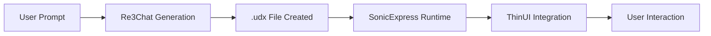

# uDos Sparks - Micro-App Runtime

## Overview

Sparks are lightweight, AI-generated micro-applications that extend uDos functionality without requiring traditional coding. Inspired by GitHub Spark, uDos Sparks enable rapid prototyping and deployment of custom tools.

## What are Sparks?

Sparks are:
- **AI-generated**: Created from natural language prompts
- **Lightweight**: Small, focused functionality
- **Portable**: `.udx` format for easy sharing
- **Integrated**: Run within SonicExpress runtime

## Spark Lifecycle



## Creating Sparks

### Using Re3Chat

```bash
# Start Re3Chat
udos chat start

# In Re3Chat interface:
# "Create a micro-app that tracks my weekly karaoke night and sends a summary to my vault"

# Re3Chat will generate:
# - karaoke.udx (Spark definition)
# - summary.udo (Data format)
```

### Manual Creation

```bash
# Create Spark definition
cat > my-spark.udx << 'EOF'
{
  "name": "My Spark",
  "version": "1.0.0",
  "description": "Example Spark",
  "entry": "main.udo",
  "permissions": ["vault:read", "vault:write"],
  "dependencies": []
}
EOF

# Create main logic
cat > main.udo << 'EOF'
// UDO Script
function main() {
  vault.write("notes/spark-test.md", "Hello from Spark!");
  return "Success";
}
EOF
```

## Spark Format (.udx)

```json
{
  "name": "string",           // Spark name
  "version": "string",        // Semantic version
  "description": "string",    // Human-readable description
  "entry": "string",          // Main UDO file
  "permissions": ["string"], // Required permissions
  "dependencies": ["string"], // Other Sparks required
  "metadata": {               // Optional metadata
    "author": "string",
    "license": "string",
    "tags": ["string"]
  }
}
```

## Spark Commands

### List Sparks

```bash
udos spark list
```

### Create Spark

```bash
udos spark create my-spark.udx
```

### Run Spark

```bash
udos spark run my-spark
```

### Deploy Spark

```bash
udos spark deploy my-spark --to production
```

### Remove Spark

```bash
udos spark remove my-spark
```

## SonicExpress Runtime

SonicExpress provides the execution environment for Sparks:

**Features:**
- Sandboxed execution
- Permission management
- Dependency resolution
- Lifecycle management

**Architecture:**
```
SonicExpress/
├── runtime/       # Execution engine
├── registry/      # Spark registry
├── sandbox/       # Isolated execution
└── logs/          # Spark logs
```

## Integration with ThinUI

Sparks appear in ThinUI as:
- Dashboard widgets
- Sidebar tools
- Context menu actions
- Automated workflows

**Example:** Karaoke tracker appears as a dashboard widget showing weekly statistics.

## Spark Permissions

| Permission | Description |
|------------|-------------|
| `vault:read` | Read from vault |
| `vault:write` | Write to vault |
| `net:http` | Make HTTP requests |
| `fs:local` | Access local filesystem |
| `ui:notify` | Send notifications |

## Spark Development

### Testing Sparks

```bash
# Run in development mode
udos spark run my-spark --dev

# View logs
udos spark logs my-spark

# Debug mode
UDOS_DEV_MODE=1 udos spark run my-spark
```

### Spark API

```javascript
// Access vault
const note = vault.read("notes/test.md");
vault.write("notes/result.md", "Processed: " + note);

// Send notification
ui.notify("Processing complete");

// Make HTTP request
const response = net.http.get("https://api.example.com/data");

// Access local filesystem (with permission)
const files = fs.local.list("~/Downloads");
```

## Spark Examples

### 1. Note Summary Spark

**Prompt:** "Create a spark that summarizes my daily notes and creates a weekly digest"

**Generates:**
- `note-summary.udx` - Spark definition
- `summary.udo` - Processing logic
- `digest-template.md` - Output template

### 2. Karaoke Tracker

**Prompt:** "Create a micro-app that tracks my weekly karaoke night and sends a summary to my vault"

**Generates:**
- `karaoke-tracker.udx` - Spark definition
- `tracker.udo` - Tracking logic
- `karaoke-template.md` - Summary template

### 3. GitHub Issue Spark

**Prompt:** "Create a spark that fetches my GitHub issues and creates a daily todo list"

**Generates:**
- `github-issues.udx` - Spark definition
- `fetcher.udo` - API integration
- `todo-template.md` - Output format

## Spark Registry

The Registry tracks all installed Sparks:

```bash
# List installed Sparks
udos spark list

# Show Spark details
udos spark show my-spark

# Search Sparks
udos spark search "karaoke"
```

**Registry Structure:**
```
Registry/
├── Sparks/          # Installed Sparks
│   ├── my-spark/
│   │   ├── spark.udx
│   │   ├── main.udo
│   │   └── assets/
│   └── karaoke-tracker/
└── index.json       # Registry index
```

## Best Practices

### 1. Keep Sparks Focused
- One Spark = One Function
- Avoid monolithic Sparks
- Compose multiple Sparks for complex workflows

### 2. Use Permissions Wisely
- Request only necessary permissions
- Document permission requirements
- Test with minimal permissions first

### 3. Design for Reuse
- Parameterize inputs
- Use templates for outputs
- Document dependencies

### 4. Test Thoroughly
- Test in development mode first
- Verify permission requirements
- Check error handling

## Spark Security

### Sandboxing
- Sparks run in isolated sandbox
- No direct system access
- Permission-based capabilities

### Code Review
- AI-generated code is reviewed before deployment
- Static analysis for security issues
- Permission validation

### Audit Logging
- All Spark executions logged to feed spool
- Permission usage tracked
- Execution history available

## Performance Considerations

### Resource Limits
- Memory: 100MB per Spark
- Execution time: 30 seconds
- Concurrent Sparks: 5 maximum

### Caching
- Spark definitions cached
- Dependency resolution cached
- Execution results cached when appropriate

## Troubleshooting

### Spark Won't Run

```bash
# Check permissions
udos spark show my-spark | grep permissions

# Check logs
udos spark logs my-spark

# Test in dev mode
udos spark run my-spark --dev
```

### Missing Dependencies

```bash
# List dependencies
udos spark show my-spark | grep dependencies

# Install missing Sparks
udos spark install missing-spark
```

### Permission Denied

```bash
# Check required permissions
udos spark show my-spark

# Grant permissions (admin only)
udos spark grant my-spark vault:write
```

## Future Enhancements

1. **Spark Marketplace** - Discover and install community Sparks
2. **Spark Versioning** - Update and rollback support
3. **Spark Collaboration** - Multi-user Spark development
4. **Spark Analytics** - Usage tracking and optimization

## Integration with Copernicus

Sparks leverage Copernicus for:
- Semantic search of Spark registry
- Intent-based Spark discovery
- Natural language Spark generation

```bash
# Find Sparks by intent
udos search --semantic "track my habits"

# Generate Spark from intent
udos spark create --from-intent "track my reading progress"
```

## License

MIT License - See [LICENSE](../LICENSE) for details.