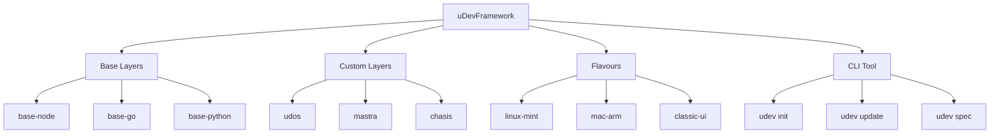
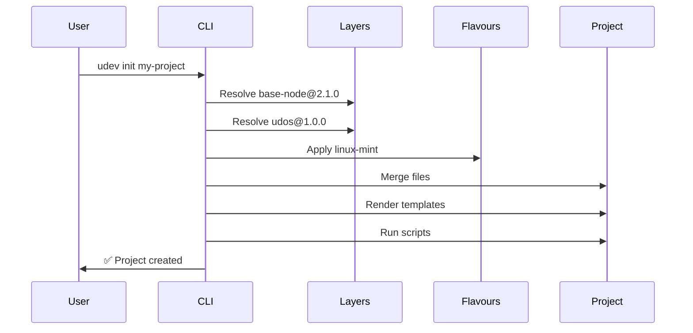

# uDevFramework Architecture

## 🏗️ Overview

uDevFramework is a **layered, versioned, flavour-aware** project scaffolding system designed for the Sonic Family ecosystem.



## 🎯 Core Components

### 1. Layer System

**Layers** are reusable, versioned components that provide project structure and functionality.

```
Layer Types:
├── Base Layers (required)
│   ├── base-node (Node.js/TypeScript)
│   ├── base-go (Go)
│   ├── base-python (Python)
│   └── base-rust (Rust)
└── Custom Layers (optional)
    ├── udos (CLI framework)
    ├── mastra (AI agents)
    ├── chasis (containers)
    ├── wordpress (CMS)
    └── github-actions (CI/CD)
```

### 2. Flavour System

**Flavours** customize layers for specific platforms, OS, or styles.

```
Flavour Families:
├── OS Flavours
│   ├── linux-ubuntu
│   ├── linux-mint
│   ├── mac-arm
│   └── mac-intel
├── UI Flavours
│   ├── classic
│   ├── modern
│   ├── minimal
│   └── retro
└── Runtime Flavours
    ├── node18
    ├── node20
    ├── py3.11
    └── go1.22
```

### 3. Versioning System

All components use **semantic versioning** with range support:
- Exact: `base-node@2.1.0`
- Range: `base-node@^2.0.0`
- Latest: `mastra@latest`
- Branch: `udos@branch:develop`

### 4. CLI Tool

The `udev` CLI provides:
- Project initialization
- Layer management
- Specification viewing
- Status tracking

## 📦 Project Composition

### Example: uDos Project

```bash
udev init my-udos \
  --layers base-node@2.1.0,udos@1.0.0,mastra@0.5.0 \
  --flavour linux-mint \
  --flavour udos:classic
```

**Resolution Process:**

1. Load `base-node@2.1.0` with `node20` flavour
2. Load `udos@1.0.0` with `classic` flavour
3. Load `mastra@0.5.0` with `deepseek` flavour
4. Apply `linux-mint` flavour overrides
5. Merge all files (later layers override earlier)
6. Render templates with variables
7. Execute post-install scripts
8. Write `.udev/manifest.yaml`

### Generated Structure

```
my-udos/
├── .udev/
│   ├── manifest.yaml
│   ├── cache/
│   └── logs/
├── src/
│   ├── core/
│   ├── commands/
│   └── services/
├── dev/
│   ├── experiments/
│   └── scratch/
├── tests/
├── docs/
├── .github/workflows/
├── package.json
├── tsconfig.json
└── README.md
```

## 🔧 Technical Architecture

### File Merging Strategy

```
Merge Rules:
1. Config files (package.json): Deep merge
2. Template files (*.template): Render + replace
3. Static files: Replace
4. Directory conflicts: Recursive merge
```

### Template Engine

```handlebars
# Before: tsconfig.json.template
{
  "compilerOptions": {
    "outDir": "./{{out_dir | default("dist")}}"
  }
}

# After: tsconfig.json
{
  "compilerOptions": {
    "outDir": "./build"
  }
}
```

### Dependency Resolution

```
Layer Dependencies:
- udos → base-node
- mastra → base-node
- chasis → base-node
- wordpress → base-php

Conflict Resolution:
- Later layers override earlier
- Explicit conflicts listed in manifest
- User prompted for resolution
```

## 📁 Directory Structure

```
uDevFramework/
├── README.md
├── version
├── bin/
│   └── udev
├── docs/
│   ├── INDEX.md
│   ├── getting-started.md
│   ├── architecture.md
│   ├── cli-reference.md
│   ├── patterns/
│   ├── specs/
│   └── status/
├── specs/
│   ├── architecture/
│   ├── agents/
│   └── templating/
├── rules/
│   ├── codegen-rules.md
│   └── security-rules.md
├── patterns/
│   ├── python-execution.md
│   └── logging/
└── IMPLEMENTATION_STATUS.md
```

## 🔄 Data Flow



## 🤖 Agent Integration

### For Code Generation Agents

```json
{
  "agent": "codegen",
  "task": "generate_project",
  "layers": ["base-node", "udos"],
  "flavour": "linux-mint",
  "variables": {
    "project_name": "my-udos",
    "description": "AI-powered CLI"
  }
}
```

### For Review Agents

```json
{
  "agent": "review",
  "task": "validate_layer",
  "layer": "base-node@2.1.0",
  "checklist": [
    "Has README.md",
    "Has package.json",
    "Has tsconfig.json",
    "Follows universal spine"
  ]
}
```

## 🎯 Design Principles

1. **Universal Spine**: Consistent structure across all projects
2. **Agent-Aware**: Specifications written for both humans and AI
3. **Self-Documenting**: Specs are the source of truth
4. **Batteries Included**: Linting, testing, CI out of the box
5. **Self-Updating**: `udev update` propagates improvements
6. **Versioned**: Every component has semantic version
7. **Flavour-Aware**: Platform-specific customizations
8. **Layered**: Compose projects from reusable components

## 📊 Status Matrix

| Component | Status | Version | Notes |
|-----------|--------|---------|-------|
| CLI Core | ✅ Working | v1.3.0 | Basic commands |
| Layer System | 🟡 Planned | v2.0.0 | Design complete |
| Flavour System | 🟡 Planned | v2.0.0 | Not implemented |
| Template Engine | 🟡 Planned | v2.0.0 | Specification only |
| Registry API | ❌ Blocked | v2.1.0 | Needs backend |

## 🔮 Future Architecture

### Phase 2: Remote Registry

```
https://registry.udev.sh/
├── v1/
│   ├── layers/
│   │   ├── base-node/
│   │   │   ├── 2.1.0/
│   │   │   ├── 2.0.0/
│   │   │   └── latest
│   │   └── udos/
│   └── flavours/
│       ├── linux-mint/
│       └── mac-arm/
└── v2/ (future)
```

### Phase 3: Agent Integration

```
Agents → uDevFramework → Projects
├── Mastra generates code
├── Hivemind manages tasks
└── DSC2 validates specs
```

## 📚 References

- [Universal Spine Specification](specs/architecture/universal-spine.md)
- [Agent Contract](specs/agents/agent-contract.md)
- [Templating System](specs/templating/TEMPLATING_SYSTEM_BRIEF.md)
- [Implementation Status](../IMPLEMENTATION_STATUS.md)

---

**uDevFramework Architecture** — The DNA of Sonic Family projects 🧬
