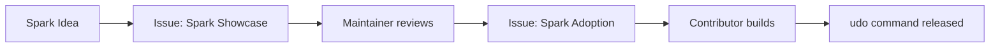

# Level 0.5: From Spark to uCode

**Course:** uDos Orientation (Bridge Module)
**Time:** 30–45 minutes
**Difficulty:** Beginner (no coding required)
**Output:** A GitHub Spark that you understand well enough to build as a `udo` command

---

## What You'll Learn

By the end of this lesson, you will be able to:

- Create a **GitHub Spark** using natural language (no coding!)
- Understand how a spark's data model maps to **markdown files**
- Write a simple **shell script** that does what your spark does
- Explain how sparks become **uCode commands**

---

## Prerequisites

- A **GitHub account** (free)
- Completed **Lesson 1** (you know markdown, frontmatter, and tasks)
- Curiosity (required)

---

## Part 1: What's a Spark?

A **GitHub Spark** is a micro-app you build with natural language. You describe what you want, and AI generates it. No coding required.

**Examples of sparks:**
- "A to-do list that saves my tasks"
- "A habit tracker that shows my weekly progress"
- "A reading log that stores book notes"

Sparks are:
- **Visual** – they run in your browser as a PWA
- **AI-generated** – you describe, AI builds
- **Portable** – you can export the code
- **Free** – no server, no database, no cost

---

## Part 2: Your First Spark

### Step 1: Open GitHub Spark

1. Go to [https://github.com/spark](https://github.com/spark)
2. Sign in with your GitHub account
3. Click **"New Spark"**

### Step 2: Describe Your App

In the prompt box, type:

```
Create a simple to-do list that stores tasks in markdown format.
Each task should have: a title, a due date, and a done/not-done status.
Show me a list of all tasks, and let me mark them as done.
```

Click **Generate** (or press Enter).

### Step 3: See What You Get

GitHub Spark will generate a working app. It will have:
- A text input to add tasks
- A list showing all tasks
- Checkboxes to mark tasks as done
- A way to delete tasks

**Try it out:**
1. Add a few tasks
2. Mark one as done
3. Delete one

### Step 4: Peek Inside

Click **"View Code"** (or the code icon). You'll see:

```jsx
// This is React – don't worry if it looks unfamiliar!
function TodoApp() {
  const [tasks, setTasks] = React.useState([]);
  
  function addTask(title) {
    setTasks([...tasks, {
      id: Date.now(),
      title: title,
      done: false,
      createdAt: new Date().toISOString()
    }]);
  }
  // ...
}
```

**You don't need to understand React.** Just notice:
- Tasks have an `id`, `title`, `done` status, and `createdAt` date
- This is a **data model** – the same structure you'd use in uCode

---

## Part 3: The Same Thing in uCode

Your spark stores tasks in the browser's memory. When you refresh, they're gone.

**uCode stores tasks in markdown files.** They persist forever.

### The uCode Way

```bash
# Add a task
udo task add "Finish the grimoire" --due 2026-05-15

# List all tasks
udo task list

# Mark as done
udo task done 1

# Output: ~/vault/user/tasks/2026-05-10-finish-the-grimoire.md
```

### Compare and Contrast

| Feature | Spark | uCode |
|---------|-------|-------|
| **Interface** | Visual UI (browser) | Terminal commands |
| **Storage** | Browser memory (volatile) | Markdown files (permanent) |
| **Data format** | JSON (in code) | Markdown + frontmatter |
| **Portability** | PWA (runs in browser) | Anywhere (files are files) |
| **AI role** | Generates the app | You write commands |
| **Learning curve** | None (describe in English) | Low (learn `udo` commands) |

---

## Part 4: Bridge Project – From Spark to Shell Script

Let's build a **shell script** that does what your spark does – using markdown files.

### Step 1: Create a Task Directory

```bash
cd ~/vault/user/@toybox
mkdir -p tasks
cd tasks
```

### Step 2: Create a Task File

```bash
cat > my-first-task.md << 'EOF'
---
title: Finish the grimoire
due: 2026-05-15
status: pending
created: 2026-05-10
---

# Finish the grimoire

A task to complete Lesson 1 of the uDos course.

- [ ] Write the introduction
- [ ] Add frontmatter
- [ ] Link to related notes
EOF
```

### Step 3: Write a Script to List Tasks

```bash
cat > ~/vault/user/@toybox/bin/list-tasks.sh << 'EOF'
#!/bin/bash
# list-tasks.sh – List all tasks in the toybox
echo "=== Your Tasks ==="
for file in ~/vault/user/@toybox/tasks/*.md; do
  title=$(head -1 "$file" | sed 's/^# //')
  status=$(grep "^status:" "$file" | sed 's/status: //')
  due=$(grep "^due:" "$file" | sed 's/due: //')
  echo "  $title [$status] (due: $due)"
done
EOF
chmod +x ~/vault/user/@toybox/bin/list-tasks.sh
```

### Step 4: Run Your Script

```bash
~/vault/user/@toybox/bin/list-tasks.sh
```

**Output:**
```
=== Your Tasks ===
  Finish the grimoire [pending] (due: 2026-05-15)
```

**Congratulations!** You just built a `udo`-like command using shell scripting and markdown.

---

## Part 5: How Sparks Become uCode Commands

When a community member shares a spark, a maintainer can turn it into a real `udo` command:



### Real Example: From Spark to `udo habit`

```yaml
# Step 1: Community member creates a spark
Spark: "A habit tracker that stores data in markdown"

# Step 2: They share it as a Spark Showcase issue
Issue: "[SPARK] Habit Tracker – tracks daily habits in markdown"

# Step 3: Maintainer creates an Adoption issue
Issue: "[ADOPT] Turn habit tracker into `udo habit`"

# Step 4: Contributor builds it
Command: `udo habit add "meditate" --daily`
Storage: ~/vault/user/habits/meditate.md

# Step 5: Released in uCode v1.7.0
```

---

## What You've Learned

- ✅ **GitHub Spark** lets you build micro-apps with natural language
- ✅ Sparks have a **data model** (title, status, dates) – same as uCode
- ✅ uCode stores data in **markdown files** – permanent and portable
- ✅ You can write a **shell script** that mimics a `udo` command
- ✅ Sparks can become **real uCode commands** through community contribution

---

## Your Challenge

Choose one of these paths:

### Path A – Spark Explorer
Create a **new spark** that solves a problem you have. Export the code. Identify the data model. Write a shell script that does the same thing with markdown files.

### Path B – Spark Sharer
Take your spark from Part 2 and **share it** as a Spark Showcase issue in the [uDosGo community repo](https://github.com/uDosGo/Connect/issues/new?template=spark-showcase.md). Tag it with `[SPARK]`.

### Path C – uCode Builder
Take the shell script from Part 4 and **extend it**:
- Add a `mark-done.sh` script that changes `status: pending` to `status: done`
- Add a `delete-task.sh` script that moves tasks to `.compost`
- Make it feel like a real `udo` command

---

## Next Up

**Lesson 2: Local-First Development** – You'll run a local server that reads your vault and turns it into a live API. Your contacts will become JSON. Your tasks will become a REST endpoint.

But first, play with sparks. Build something fun. Share it with the community.

```ascii
┌─────────────────────────────────────────────────────────────────────┐
│                                                                     │
│   ╔═════════════════════════════════════════════════════════════╗   │
│   ║                                                             ║   │
│   ║   LEVEL 0.5 COMPLETE!                                       ║   │
│   ║                                                             ║   │
│   ║   You have learned:                                         ║   │
│   ║   ✓ What a GitHub Spark is                                  ║   │
│   ║   ✓ How sparks store data (vs uCode markdown)               ║   │
│   ║   ✓ How to write a shell script that mimics udo             ║   │
│   ║   ✓ How sparks become uCode commands                        ║   │
│   ║                                                             ║   │
│   ║   Spark is magic. uCode is power.                           ║   │
│   ║   Start with magic, stay for power.                         ║   │
│   ║                                                             ║   │
│   ║   PRESS [SPACE] TO CONTINUE TO LESSON 2                     ║   │
│   ║                                                             ║   │
│   ╚═════════════════════════════════════════════════════════════╝   │
│                                                                     │
└─────────────────────────────────────────────────────────────────────┘
```

---

**Ready for Lesson 2, or want to build more sparks?** 🔧
