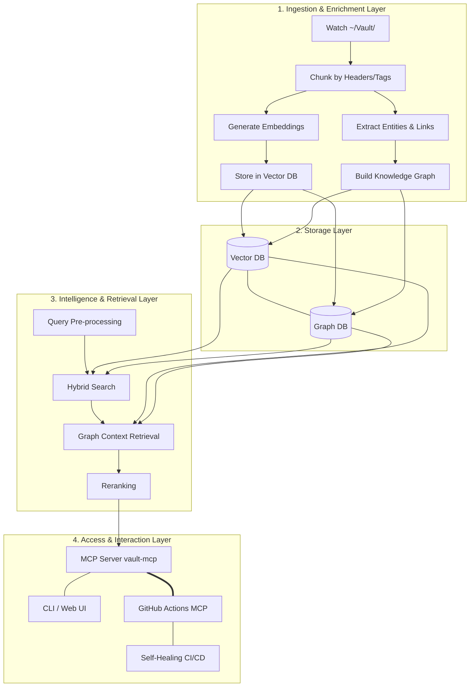
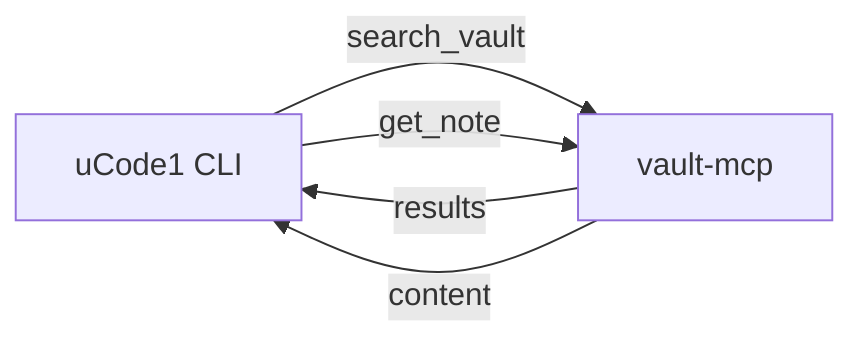
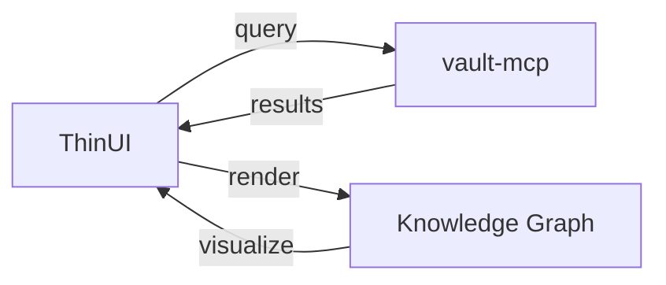
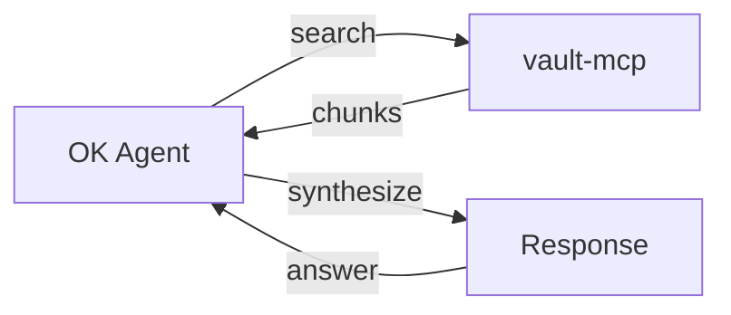
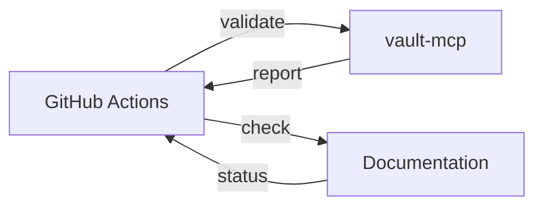

# Vault Intelligence Specification (v1.0)

## Overview

This specification defines a unified agentic system for the markdown vault, integrating lessons from Repo Mind, Discovery Agent, and MCP/RAG architecture into a four-layer intelligent system.

## Core Architecture



## Component Deep Dive

### 1. Ingestion & Enrichment Layer

**Purpose:** Continuously index `~/Vault/` and create multiple views of the content

**Components:**

1. **Markdown Parser & Watcher**
   - Uses `chokidar` or `inotify` to monitor `~/Vault/`
   - Parses markdown files with `marked` or `remark`
   - Splits content into chunks based on:
     - Headers (`##`, `###`)
     - Thematic breaks (`---`)
     - Maximum token size (configurable)

2. **Vector Embedder**
   - Generates semantic embeddings using local models
   - Supported models: Ollama, llama.cpp, or custom
   - Embedding dimensions: 384-1024 (configurable)
   - Stores: chunk text, path, source hash, embedding vector

3. **Entity & Graph Extractor**
   - Extracts entities (people, projects, concepts)
   - Uses NER models or LLM prompting
   - Identifies relationships:
     - Explicit: `[[wiki-links]]`
     - Implicit: co-mentioned entities
   - Builds knowledge graph of connections

**Example Workflow:**
```
User updates note.md → Watcher detects change → Parser chunks file → 
Embedder creates vectors → Extractor finds entities/links → Graph updated
```

### 2. Storage Layer

**Purpose:** Store and retrieve vector embeddings and knowledge graph

**Components:**

1. **Vector Database**
   - Options: LanceDB or SQLite with `sqlite-vec` extension
   - Stores: chunk text, file path, content hash, embedding vector
   - Indexes: FAISS or HNSW for fast similarity search
   - File-based for local-first, multi-device sync

2. **Graph Database**
   - Options: DuckDB or file-based JSON
   - Stores: nodes (entities), edges (relationships)
   - Supports: property graphs with attributes
   - Query language: SQL or Cypher-like

**Schema Example:**
```sql
-- Vector DB (SQLite)
CREATE TABLE chunks (
    id INTEGER PRIMARY KEY,
    file_path TEXT NOT NULL,
    content_hash TEXT NOT NULL,
    content TEXT NOT NULL,
    embedding BLOB NOT NULL,  -- Vector embedding
    created_at DATETIME DEFAULT CURRENT_TIMESTAMP,
    updated_at DATETIME DEFAULT CURRENT_TIMESTAMP
);

-- Graph DB (DuckDB)
CREATE TABLE entities (
    id TEXT PRIMARY KEY,
    type TEXT NOT NULL,  -- person, project, concept
    name TEXT NOT NULL,
    description TEXT
);

CREATE TABLE relationships (
    id TEXT PRIMARY KEY,
    source_id TEXT NOT NULL,
    target_id TEXT NOT NULL,
    relationship_type TEXT NOT NULL,
    weight REAL DEFAULT 1.0,
    FOREIGN KEY (source_id) REFERENCES entities(id),
    FOREIGN KEY (target_id) REFERENCES entities(id)
);
```

### 3. Intelligence & Retrieval Layer

**Purpose:** Find relevant information and provide context-aware answers

**Components:**

1. **Query Pre-processing**
   - Query rewriting for better retrieval
   - Expansion: synonyms, related terms
   - Intent classification

2. **Hybrid Search**
   - **Vector Search**: Semantic similarity
   - **Keyword (BM25) Search**: Exact matches
   - **Reciprocal Rank Fusion (RRF)**: Combine results
   - Returns: Top N candidate chunks

3. **Graph Context Retrieval**
   - For top chunks, query knowledge graph
   - Find neighboring nodes (related entities)
   - Retrieve connected documents
   - Builds broader context

4. **Reranking**
   - Cross-encoder model for relevance
   - Compares query vs. retrieved chunks
   - Filters to most relevant content
   - Prepares for LLM consumption

**Example Query Flow:**
```
User asks: "How to configure MCP gateway?"
→ Pre-process: "configure MCP gateway setup"
→ Hybrid search finds:
   - Vector: setup documentation
   - Keyword: exact "MCP gateway" mentions
→ Graph retrieval adds:
   - Related: OK Agent integration
   - Connected: Vector DB configuration
→ Reranker selects best 3 chunks
→ Passed to OK Agent for synthesis
```

### 4. Access & Interaction Layer

**Purpose:** Provide interfaces for agents and users to interact with the vault

**Components:**

1. **MCP Server (vault-mcp)**
   - Dedicated server for vault operations
   - Methods:
     - `search_vault(query)`: Hybrid search
     - `get_note(path)`: Retrieve file content
     - `write_note(path, content)`: Update files
     - `find_concepts(query)`: Graph traversal
     - `list_entities(type)`: Entity lookup
   - Authentication: Unix socket + token-based

2. **CLI / Web UI Integration**
   - CLI commands:
     ```bash
     # Search vault
     udos vault search "MCP configuration"
     
     # Get note
     udos vault get path/to/note.md
     
     # Find related concepts
     udos vault concepts "OK Agent"
     ```
   - ThinUI integration:
     - Search widget
     - Knowledge graph visualization
     - Concept explorer

3. **GitHub Actions MCP**
   - CI/CD integration
   - Methods:
     - `pr_validate(pr_number)`: Check against vault
     - `doc_check(path)`: Verify documentation
     - `concept_map(pr)`: Find related concepts
   - Triggers:
     - On PR creation
     - On documentation updates
     - On release preparation

4. **Self-Healing CI/CD**
   - Automatic validation
   - Documentation checks
   - Concept mapping
   - Auto-fix suggestions

## Implementation Roadmap

### Phase 1: Intelligent Index (4-6 weeks)

**Goals:**
- [ ] File watcher for `~/Vault/`
- [ ] Basic vector storage and embedding
- [ ] CLI tool for vault queries

**Deliverables:**
```bash
# Basic search
vault find "MCP configuration"

# Get file
vault get path/to/file.md
```

### Phase 2: Knowledge Graph (3-4 weeks)

**Goals:**
- [ ] Entity extraction pipeline
- [ ] Wiki-link parsing
- [ ] Graph storage and querying
- [ ] Related concept finding

**Deliverables:**
```bash
# Find related concepts
vault concepts "OK Agent"

# Explore relationships
vault graph "MCP gateway"
```

### Phase 3: MCP-Powered OK Agent (4-6 weeks)

**Goals:**
- [ ] `vault-mcp` server implementation
- [ ] OK Agent integration
- [ ] Basic query/response workflow

**Deliverables:**
```bash
# Ask OK Agent about vault
ok ask "How to set up MCP?"

# Agent uses vault-mcp to find answer
```

### Phase 4: Full Integration (6-8 weeks)

**Goals:**
- [ ] Complete four-layer pipeline
- [ ] Discovery Agent loop integration
- [ ] GitHub Actions MCP server
- [ ] CI/CD integration

**Deliverables:**
```bash
# Full workflow
ok research "Best practices for vector DB"

# CI/CD validation
github pr validate 42
```

## Technical Specifications

### Performance Targets

| Operation | Target Time | Notes |
|-----------|-------------|-------|
| Index 100 files | < 5 seconds | Initial indexing |
| Query response | < 200ms | 90th percentile |
| Graph traversal | < 100ms | 3-hop neighborhood |
| Full reindex | < 2 minutes | 1000 files |

### Storage Requirements

| Component | Size per 1000 files | Notes |
|-----------|---------------------|-------|
| Vector DB | ~50MB | 384-dim embeddings |
| Graph DB | ~10MB | Compressed storage |
| Raw files | ~5MB | Markdown text |
| **Total** | **~65MB** | Per 1000 files |

### Memory Usage

| Component | Memory Usage | Notes |
|-----------|--------------|-------|
| Watcher | 50MB | File system monitoring |
| Embedder | 500MB | Local LLM model |
| Vector DB | 100MB | In-memory index |
| Graph DB | 50MB | Query cache |
| **Total** | **~700MB** | Peak usage |

## Security Considerations

### Data Protection

1. **Content Hashing**
   - Sensitive content hashed before storage
   - SHA-256 for verification
   - Never store raw sensitive data

2. **Access Control**
   - Unix socket permissions (600)
   - Token-based authentication
   - Role-based access (admin/user)

3. **Audit Logging**
   - All operations logged
   - Immutable log trail
   - Regular audits

### Privacy

1. **Local-First**
   - All data stays local by default
   - No cloud sync without explicit opt-in
   - End-to-end encryption for sync

2. **Data Minimization**
   - Only necessary data collected
   - Automatic cleanup of old data
   - User control over retention

## Integration Points

### uCode1 Integration



### ThinUI Integration



### OK Agent Integration



### CI/CD Integration



## Example Use Cases

### 1. Developer Research

**Scenario:** Developer wants to learn about MCP configuration

**Workflow:**
```bash
# Natural language query
ok ask "How do I configure the MCP gateway?"

# OK Agent uses vault-mcp to:
# 1. Search for "MCP gateway" in vector DB
# 2. Find exact matches in keyword index
# 3. Retrieve related concepts from graph
# 4. Rerank results
# 5. Synthesize answer

# Response includes:
# - Configuration documentation
# - Related OK Agent integration
# - Vector DB setup notes
```

### 2. CI/CD Validation

**Scenario:** Pull request updates MCP server code

**Workflow:**
```yaml
# .github/workflows/validate.yml
- name: Validate PR
  uses: uDosGo/vault-mcp-action@v1
  with:
    query: "MCP server best practices"
    pr_number: ${{ github.event.pull_request.number }}

# Action performs:
# 1. Queries vault for best practices
# 2. Checks PR against documentation
# 3. Validates concept relationships
# 4. Comments on PR with findings
```

### 3. Knowledge Discovery

**Scenario:** User wants to explore relationships between concepts

**Workflow:**
```bash
# Start with a concept
udos vault concepts "OK Agent"

# Explore relationships
udos vault graph "OK Agent" --depth 2

# Visualize in ThinUI
udos vault visualize "OK Agent" --output graph.png

# Shows:
# - Direct connections (MCP, Vector DB)
# - Indirect connections (Plugins, Intent Classification)
# - Related documentation
```

## Future Enhancements

### 1. Multi-Modal Support
- Index images, diagrams, and screenshots
- OCR for text extraction
- Visual search capabilities

### 2. Collaborative Features
- Real-time multi-user editing
- Change tracking and versioning
- Conflict resolution

### 3. Advanced Analytics
- Usage patterns and insights
- Recommendation engine
- Predictive indexing

### 4. Cloud Sync (Optional)
- End-to-end encrypted sync
- Selective sharing
- Team collaboration

### 5. Voice Interface
- Natural language voice queries
- Audio transcription
- Voice responses

## Migration Plan

### From Existing System

1. **Export current data**
   ```bash
   # Export existing notes
   udos vault export --format json > vault-backup.json
   ```

2. **Import into new system**
   ```bash
   # Initialize new vault
   vault-init --import vault-backup.json
   ```

3. **Reindex content**
   ```bash
   # Build vector and graph indexes
   vault-reindex --full
   ```

4. **Verify integrity**
   ```bash
   # Check all files indexed
   vault-verify --all
   ```

### Rollback Procedure

1. **Stop new system**
   ```bash
   vault-mcp stop
   ```

2. **Restore backup**
   ```bash
   udos vault restore vault-backup.json
   ```

3. **Restart old system**
   ```bash
   udos daemon start
   ```

## Testing Strategy

### Unit Tests
- Vector embedding generation
- Chunking algorithms
- Graph traversal
- Search algorithms

### Integration Tests
- Watcher → Parser → Embedder
- Vector DB → Graph DB → Retrieval
- MCP Server → OK Agent

### End-to-End Tests
- Full query workflow
- CI/CD integration
- Multi-user scenarios

### Performance Tests
- Indexing speed
- Query latency
- Memory usage
- Concurrent access

## Documentation

### User Documentation
- Getting started guide
- CLI reference
- Web UI guide
- Troubleshooting

### Developer Documentation
- API reference
- Architecture diagrams
- Integration guide
- Extension points

### Admin Documentation
- Installation guide
- Configuration reference
- Security guide
- Performance tuning

## License

MIT License - See [LICENSE](../../LICENSE) for details.

## Appendix A: Glossary

| Term | Definition |
|------|------------|
| Chunk | Segment of markdown file for embedding |
| Embedding | Vector representation of text |
| Entity | Person, project, or concept |
| RRF | Reciprocal Rank Fusion (search combination) |
| MCP | Model Context Protocol (IPC) |
| OK Agent | Intent-based assistant |
| Wiki-link | `[[double-bracket]]` reference |

## Appendix B: References

1. Repo Mind Architecture
2. Discovery Agent Patterns
3. MCP/RAG Best Practices
4. Vector Database Comparison
5. Knowledge Graph Design

## Appendix C: Example Queries

```json
{
  "query": "MCP configuration",
  "type": "hybrid",
  "limit": 10,
  "graph_depth": 2,
  "rerank": true
}
```

Response:
```json
{
  "results": [
    {
      "chunk": "Configuring the MCP server requires...",
      "file": "docs/MCP_SETUP.md",
      "score": 0.95,
      "entities": ["MCP", "Configuration", "OK Agent"]
    },
    {
      "chunk": "The OK Agent integrates with MCP via...",
      "file": "docs/OK_AGENT.md",
      "score": 0.87,
      "entities": ["OK Agent", "MCP", "Integration"]
    }
  ],
  "graph": {
    "MCP": ["OK Agent", "Vector DB", "Configuration"],
    "OK Agent": ["MCP", "Intent Classification", "Plugins"]
  }
}
```