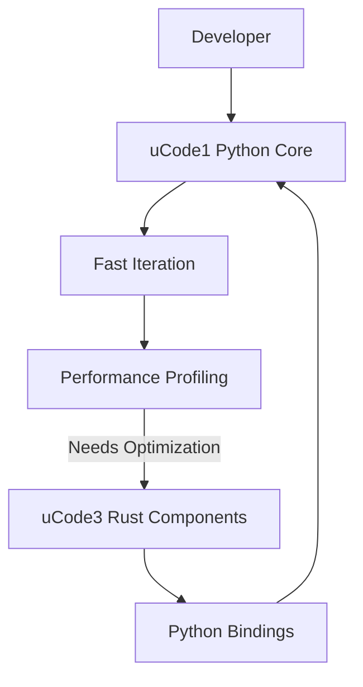
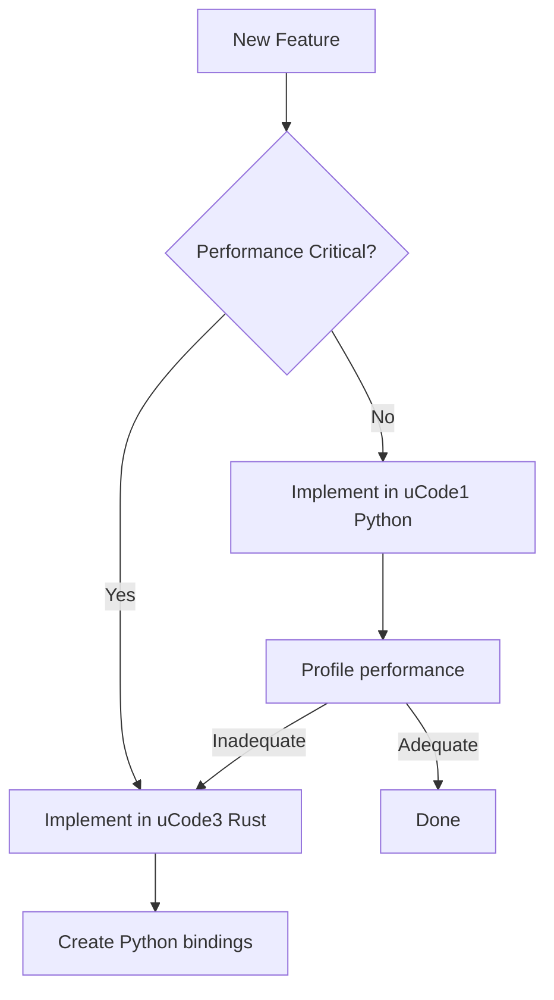

# uDos Core Architecture: Python/Rust Version Boundaries

## Overview

This document defines the version boundaries and architecture decisions for uDos core components, establishing clear separation between Python and Rust implementations.

## Version Boundaries

### uCode1: Python Core (Primary Development)

**Location**: `uCode1/core_py/`
**Language**: Python 3.11+
**Purpose**: Primary development platform, accessibility, rapid iteration

#### Key Characteristics:

- **Development Focus**: Primary development occurs in Python
- **Accessibility**: Lower barrier to entry for contributors
- **Ecosystem**: Rich Python ecosystem integration
- **Performance**: Good enough for 80% of use cases
- **Integration**: Optional uCode3 Rust components for performance-critical paths

#### Components:

```bash
uCode1/core_py/
├── snack/          # Python Snack system
├── relic/          # Python Relic system  
├── binder/         # Python Binder system
├── usxd/           # Python USXD/OBF system
└── integration/    # uCode3 Rust integration layer
```

### uCode3: Rust Core (Performance Components)

**Location**: `uCode3/core/`
**Language**: Rust 1.89.0+
**Purpose**: High-performance components, memory safety, zero-cost abstractions

#### Key Characteristics:

- **Performance Focus**: Optimized for speed and memory efficiency
- **Safety**: Memory safety through Rust's ownership model
- **Interoperability**: Python bindings via `pyo3`
- **Selective Usage**: Used only where performance is critical
- **Stability**: Mature Rust implementation from uCode1 migration

#### Components:

```bash
uCode3/core/src/
├── snack/          # Rust Snack system (performance)
├── relic/          # Rust Relic system (binary operations)
├── binder/         # Rust Binder system (large datasets)
├── usxd/           # Rust USXD/OBF system (grid operations)
└── ffi/            # Python bindings
```

## Architecture Decision Records

### ADR-001: Python Core Migration

**Status**: Accepted
**Date**: 2026-04-26

**Context**: 
- Rust core in uCode1 created high barrier to entry
- Python ecosystem better suited for rapid development
- Need to maintain performance for critical operations

**Decision**: 
- Migrate uCode1 to Python core
- Create uCode3 for Rust performance components
- Establish clear version boundaries

**Consequences**:
- ✅ Lower barrier to entry for contributors
- ✅ Faster development iteration
- ✅ Rich Python ecosystem integration
- ⚠️ Potential performance regression in some areas
- ⚠️ Need for careful performance monitoring

### ADR-002: Hybrid Architecture

**Status**: Accepted
**Date**: 2026-04-26

**Context**:
- Some operations require Rust-level performance
- Full Python rewrite not feasible for all components
- Need seamless integration between languages

**Decision**:
- Implement hybrid Python/Rust architecture
- Use uCode3 Rust components selectively via Python bindings
- Create clear integration layer in uCode1

**Consequences**:
- ✅ Maintain performance for critical operations
- ✅ Best of both worlds approach
- ⚠️ Increased build complexity
- ⚠️ FFI overhead for cross-language calls

## Development Workflow

### Python-First Development

1. **Implement in Python** (uCode1)
   - Rapid prototyping
   - Easier debugging
   - Rich ecosystem

2. **Identify Performance Bottlenecks**
   - Profile critical paths
   - Benchmark against requirements
   - Document performance characteristics

3. **Optimize Selectively**
   - Move performance-critical components to uCode3
   - Implement Rust versions with Python bindings
   - Maintain identical APIs for seamless switching

### Build System



## Performance Guidelines

### When to Use Python (uCode1)

- **Business logic** and application flow
- **Glue code** and integration layers
- **Prototyping** and rapid development
- **I/O operations** (files, network, databases)
- **Non-performance-critical** operations

### When to Use Rust (uCode3)

- **Performance-critical algorithms**
- **Memory-intensive operations**
- **Binary data processing**
- **Large dataset manipulation**
- **Real-time processing requirements**

## Integration Patterns

### Pattern 1: Direct Python Usage

```python
# Most common pattern - pure Python
from ucode1.core_py import Snack

snack = Snack.create("test", "Test Snack", "1.0.0", "echo hello")
result = snack.execute()
```

### Pattern 2: Optional Rust Optimization

```python
# Fallback to Rust for performance
from ucode1.core_py import Snack
from ucode3.ffi import RustSnack  # Optional import

# Try Python first
snack = Snack.create("test", "Test Snack", "1.0.0", "echo hello")

# Fallback to Rust if performance is inadequate
if snack.needs_optimization():
    rust_snack = RustSnack.from_python(snack)
    result = rust_snack.execute()
else:
    result = snack.execute()
```

### Pattern 3: Hybrid Processing Pipeline

```python
# Use Python for orchestration, Rust for heavy lifting
from ucode1.core_py import SnackProcessor
from ucode3.ffi import RustSnackExecutor

def process_batch(snacks: List[Snack]) -> List[Result]:
    # Python: Filter and prepare
    critical_snacks = [s for s in snacks if s.is_critical()]
    
    # Rust: Execute performance-critical operations
    rust_executor = RustSnackExecutor()
    critical_results = rust_executor.execute_batch(critical_snacks)
    
    # Python: Process remaining snacks
    normal_results = [s.execute() for s in snacks if not s.is_critical()]
    
    return critical_results + normal_results
```

## Build and Deployment

### Development Setup

```bash
# Python environment
python -m venv .venv
source .venv/bin/activate
pip install -e uCode1

# Rust environment (for uCode3)
cd uCode3
cargo build
cd ..

# Run tests
pytest uCode1/tests/
cargo test --manifest-path uCode3/Cargo.toml
```

### Production Deployment

```bash
# Build Python package
cd uCode1
python setup.py sdist bdist_wheel

# Build Rust components
cd uCode3
cargo build --release

# Create hybrid distribution
mkdir -p dist/hybrid
cp uCode1/dist/* dist/hybrid/
cp uCode3/target/release/libucode3.* dist/hybrid/
```

## Performance Monitoring

### Benchmarking Framework

```python
import time
from ucode1.core_py import Snack
from ucode3.ffi import RustSnack

def benchmark_implementation():
    test_data = load_test_data()
    
    # Python implementation
    start = time.time()
    python_results = [Snack.execute(data) for data in test_data]
    python_time = time.time() - start
    
    # Rust implementation
    start = time.time()
    rust_results = RustSnack.execute_batch(test_data)
    rust_time = time.time() - start
    
    # Compare and decide
    if rust_time < python_time * 0.8:  # 20% faster
        print(f"Using Rust: {rust_time:.3f}s vs Python: {python_time:.3f}s")
        return rust_results
    else:
        print(f"Using Python: {python_time:.3f}s vs Rust: {rust_time:.3f}s")
        return python_results
```

## Migration Guide

### For Existing uCode1 (Rust) Users

1. **Update imports**: Change from Rust to Python modules
   ```python
   # Old (Rust)
   from ucode1.core import Snack
   
   # New (Python)
   from ucode1.core_py import Snack
   ```

2. **Review performance requirements**: Identify components needing uCode3

3. **Update build system**: Add Python dependencies

4. **Test thoroughly**: Validate behavior matches expectations

### For New Developers

1. **Start with Python**: Use uCode1 for primary development
2. **Profile early**: Identify performance bottlenecks
3. **Optimize selectively**: Move only critical paths to uCode3
4. **Maintain compatibility**: Keep APIs consistent between implementations

## Version Compatibility Matrix

| uCode1 Version | uCode3 Version | Status |
|---------------|---------------|--------|
| 0.1.0 | 0.1.0 | ✅ Compatible |
| 0.2.0 | 0.1.0 | ✅ Compatible |
| 0.2.0 | 0.2.0 | ✅ Recommended |
| 1.0.0 | 1.0.0 | ✅ Required |

## Decision Tree



## Best Practices

### 1. API Consistency

Maintain identical APIs between Python and Rust implementations to allow seamless switching.

### 2. Performance Profiling

Profile before optimizing - don't assume Rust is always needed.

### 3. Documentation

Clearly document which components use Python vs Rust and why.

### 4. Testing

Test both implementations with identical test suites.

### 5. Benchmarking

Establish performance baselines and monitor regressions.

## Future Evolution

### uCode2: Next Generation Architecture

- **Unified runtime**: Seamless Python/Rust interoperability
- **Automatic optimization**: JIT compilation of hot paths
- **Adaptive execution**: Runtime switching between implementations
- **Unified packaging**: Single distribution with both runtimes

### uCode3: Performance Evolution

- **Expanded coverage**: More components available in Rust
- **Better bindings**: Improved Python/Rust interoperability
- **Performance guarantees**: SLA-based optimization targets
- **WASM compilation**: Browser-based execution options

## Appendix: Common Patterns

### Pattern: Conditional Import

```python
try:
    from ucode3.ffi import RustComponent
    USE_RUST = True
except ImportError:
    from ucode1.core_py import PythonComponent as RustComponent
    USE_RUST = False

def process_data(data):
    component = RustComponent()
    if USE_RUST:
        return component.process_fast(data)
    else:
        return component.process(data)
```

### Pattern: Configuration-Based Selection

```python
# config.yaml
performance:
  use_rust: true
  thresholds:
    dataset_size: 10000
    execution_time: 100

# loader.py
import yaml

with open('config.yaml') as f:
    config = yaml.safe_load(f)

if config['performance']['use_rust']:
    from ucode3.ffi import RustProcessor
else:
    from ucode1.core_py import PythonProcessor
```

## Current System Architecture (v1.2.0+)

### uServer (Snackbar) — Core Infrastructure

**Location**: `~/Code/uServer/snackbar/`
**Language**: Rust
**Port**: 8484 (REST API), 8485 (WebSocket)
**Status**: ✅ Core infrastructure

The Snackbar service has been elevated from a peripheral component to **core infrastructure**. It provides:

- **Container orchestration** — Manages lifecycle of Snack containers
- **REST API** — `POST /v1/snacks/execute`, `GET /v1/health`, etc.
- **WebSocket** — Real-time event streaming for surface updates
- **Secret management** — Encrypted storage for API keys and credentials
- **MCP bridge** — Model Context Protocol server for AI tool integration
- **Narrator daemon** — Feed spool translator for human-readable stories

#### Integration with uConnect

```bash
# Start all surfaces + uServer
node scripts/udos.js start --all --with-server

# Or start uServer independently
node scripts/udos.js start-server
```

The uServer is managed by `scripts/udos.cjs` which handles:
- Building from source (`cargo build --release`)
- Process lifecycle (start, stop, restart)
- Auto-recovery on crash
- Health checks via HTTP endpoint

### Container System (USX Surfaces)

Each surface in uConnect is a **standalone Vite application** that acts as a container:

| Surface | Port | Purpose | Framework |
|---------|------|---------|-----------|
| **ui** (Hub) | 5173 | Index page with 5 surface cards | React/TypeScript |
| **proseui** | 5174 | Prose editor, kanban, chat | React/TypeScript |
| **code3ui** | 5175 | Code editor v3 | React/TypeScript |
| **code4ui** | 5176 | Code editor v4 | React/TypeScript |
| **opsui** | 5177 | Server operations | React/TypeScript |
| **gridui** | 5178 | Grid workspace | Vue 3 |

Each surface:
- Is independently runnable (`npx vite --port XXXX`)
- Shares the `@usx/styles` design system
- Can communicate via the Snackbar WebSocket
- Has its own store (Zustand for React, Pinia for Vue)

### USX/UDO Package Architecture

#### `@usx/styles` (packages/usx/)

The shared design system providing:

```
packages/usx/
├── tokens/          # M3-inspired design tokens (colors, typography, shapes, elevation, motion, spacing)
├── palettes/        # Surface-specific color palettes (base, proseui, code3ui, code4ui, gridui)
├── components/      # CSS component classes (btn, card, switch, chip, dialog, snackbar, etc.)
├── react/           # React component wrappers (Button, Card, Input, Grid, SurfaceHeader, etc.)
└── icons/           # Icon system
```

#### `@udos/core` (packages/udos/)

The unified automation framework providing:

```
packages/udos/
├── commands/        # CLI commands (bench, condense, dev, devmode, mcp, oracle, publish, run, story, surface, task, vault)
├── types.ts         # Shared type definitions
├── skill.ts         # Skill system
├── task.ts          # Task system
├── agent.ts         # Agent definitions
├── automation.ts    # Automation engine
├── oracle.ts        # Oracle Trinity engine (Knowledge, Creation, Insight)
└── providers/       # LLM provider implementations (planned)
```

### Oracle Trinity (Phase 8B)

The Oracle Trinity is a three-oracle system that provides AI-powered reasoning across the uDos ecosystem:

| Oracle | Domain | Purpose | CLI |
|--------|--------|---------|-----|
| **Oracle of Knowledge** | `knowledge` | Vault search, semantic retrieval, Q&A | `udo oracle ask "..."` |
| **Oracle of Creation** | `creation` | Content/code/story generation | `udo oracle ask --domain creation "..."` |
| **Oracle of Insight** | `insight` | Pattern recognition, anomaly detection | `udo oracle ask --domain insight "..."` |

Each oracle is registered as both an **Agent** and a **Skill**, making them accessible through:
- **CLI**: `udo oracle ask "What is in the vault?"`
- **Agent system**: `udo agent list` → `oracle-knowledge`, `oracle-creation`, `oracle-insight`
- **Skill system**: `udo run oracle-knowledge --params '{"query":"..."}'`
- **Automation**: Task completion triggers, cron schedules, event rules
- **MCP bridge**: Via Snackbar's MCP server for AI tool integration

The `OracleConductor` (Hivemind) routes queries to the appropriate oracle(s) based on keyword analysis and merges responses for a unified answer.

### Centralized LLM Architecture (Planned — Phase 9)

The LLM infrastructure follows a **centralized server, distributed client** model:

```
┌─────────────────────────────────────────────────────────────────────┐
│                    Linux Server (uServer)                            │
│                                                                     │
│  ┌──────────────────────────────────────────────────────────────┐   │
│  │                    Ollama (LLM Runtime)                       │   │
│  │  ┌──────────┐ ┌──────────┐ ┌──────────┐ ┌──────────┐        │   │
│  │  │ DeepSeek │ │  Llama   │ │  Mistral │ │  CodeLlama│       │   │
│  │  │  Coder   │ │    3     │ │    7B    │ │   33B    │        │   │
│  │  │  33B     │ │  70B     │ │          │ │          │        │   │
│  │  └──────────┘ └──────────┘ └──────────┘ └──────────┘        │   │
│  └──────────────────────────────────────────────────────────────┘   │
│                          │ REST API :11434                           │
│                          ▼                                           │
│  ┌──────────────────────────────────────────────────────────────┐   │
│  │              uServer Snackbar (LLM Proxy)                     │   │
│  │  ┌──────────┐ ┌──────────┐ ┌──────────┐ ┌──────────┐        │   │
│  │  │ Ollama   │ │  Model   │ │  Cache   │ │  Rate    │        │   │
│  │  │ Client   │ │ Router   │ │  Layer   │ │  Limiter │        │   │
│  │  └──────────┘ └──────────┘ └──────────┘ └──────────┘        │   │
│  └──────────────────────────────────────────────────────────────┘   │
│                          │ MCP :8484 / REST :8484                    │
└──────────────────────────┼──────────────────────────────────────────┘
                           │
                           ▼ (LAN/WAN)
┌─────────────────────────────────────────────────────────────────────┐
│                    Local Machines (macOS/Linux)                      │
│                                                                     │
│  ┌──────────────────────────────────────────────────────────────┐   │
│  │              @udos/core Oracle Trinity                        │   │
│  │  ┌──────────┐ ┌──────────┐ ┌──────────┐ ┌──────────┐        │   │
│  │  │Knowledge │ │ Creation │ │ Insight  │ │ Fallback │        │   │
│  │  │ Oracle   │ │ Oracle   │ │ Oracle   │ │ Tiny LLM │        │   │
│  │  └──────────┘ └──────────┘ └──────────┘ └──────────┘        │   │
│  │                    │                                           │   │
│  │                    ▼                                           │   │
│  │  ┌──────────────────────────────────────────────────────┐     │   │
│  │  │           Provider Router                             │     │   │
│  │  │  ┌──────────┐ ┌──────────┐ ┌──────────┐              │     │   │
│  │  │  │  Remote  │ │  Local   │ │  Fallback│              │     │   │
│  │  │  │ (uServer)│ │ (Ollama) │ │ (Tiny)   │              │     │   │
│  │  │  └──────────┘ └──────────┘ └──────────┘              │     │   │
│  │  └──────────────────────────────────────────────────────┘     │   │
│  └──────────────────────────────────────────────────────────────┘   │
│                                                                     │
│  The fallback is a tiny custom LLM (~100MB) distributed to local    │
│  machines for offline/basic operations. All heavy LLM work routes   │
│  through the Linux server's Ollama instance.                        │
└─────────────────────────────────────────────────────────────────────┘
```

**Key Design Decisions:**

1. **Centralized LLMs on Linux Server**: All large models (DeepSeek Coder 33B, Llama 3 70B, etc.) run on the Linux server via Ollama. This keeps disk usage and GPU requirements off local machines.

2. **Tiny Local Fallback**: A small custom LLM (~100MB, distilled from a larger model) is distributed to local machines for:
   - Offline operation when the server is unreachable
   - Basic pattern matching and keyword extraction
   - Low-latency responses for simple queries
   - Graceful degradation when the server is busy

3. **Provider Router**: The Oracle Trinity uses a pluggable provider system:
   - `remote` — Routes to uServer Snackbar's Ollama proxy (default for heavy queries)
   - `local` — Routes to local Ollama instance (if installed)
   - `fallback` — Uses the tiny embedded LLM (always available)
   - `openai` / `anthropic` / `deepseek` — Cloud API providers (optional)

4. **uServer as LLM Proxy**: The Snackbar on the Linux server acts as an LLM proxy, providing:
   - Model routing (which model for which oracle)
   - Response caching (avoid redundant LLM calls)
   - Rate limiting (prevent resource exhaustion)
   - Request queuing (fair scheduling across clients)

### macOS Integration

The system provides native macOS integration:

- **`udosui.command`** — Double-clickable launcher that starts all surfaces + menu bar
- **`scripts/udos-menu-bar.swift`** — Native Swift menu bar app with snackbar icon
- **`scripts/udos.cjs`** — Process manager with port allocation, health checks, auto-recovery

### System Diagram

```
┌─────────────────────────────────────────────────────────────────────┐
│                         macOS Desktop                                │
├─────────────────────────────────────────────────────────────────────┤
│  ┌──────────────┐  ┌──────────────┐  ┌──────────────┐              │
│  │  Menu Bar    │  │  Browser     │  │  Terminal    │              │
│  │  (Swift)     │  │  (localhost) │  │  (udo CLI)   │              │
│  └──────────────┘  └──────────────┘  └──────────────┘              │
│                          │                    │                      │
│                          ▼                    ▼                      │
│  ┌──────────────────────────────────────────────────────────────┐   │
│  │                    uConnect Surfaces                          │   │
│  │  ┌─────┐ ┌──────┐ ┌──────┐ ┌──────┐ ┌─────┐ ┌──────┐       │   │
│  │  │ ui  │ │prose │ │code3 │ │code4 │ │ops  │ │grid  │       │   │
│  │  │:5173│ │:5174 │ │:5175 │ │:5176 │ │:5177│ │:5178 │       │   │
│  │  └─────┘ └──────┘ └──────┘ └──────┘ └─────┘ └──────┘       │   │
│  └──────────────────────────────────────────────────────────────┘   │
│                          │                                           │
│                          ▼                                           │
│  ┌──────────────────────────────────────────────────────────────┐   │
│  │              @udos/core (Oracle Trinity)                      │   │
│  │  ┌──────────┐ ┌──────────┐ ┌──────────┐ ┌──────────┐        │   │
│  │  │Knowledge │ │ Creation │ │ Insight  │ │ Fallback │        │   │
│  │  │ Oracle   │ │ Oracle   │ │ Oracle   │ │ Tiny LLM │        │   │
│  │  └──────────┘ └──────────┘ └──────────┘ └──────────┘        │   │
│  └──────────────────────────────────────────────────────────────┘   │
│                          │                                           │
│                          ▼                                           │
│  ┌──────────────────────────────────────────────────────────────┐   │
│  │              uServer (Snackbar) :8484                         │   │
│  │  ┌──────────┐ ┌──────────┐ ┌──────────┐ ┌──────────┐        │   │
│  │  │Container │ │  REST    │ │WebSocket │ │ Secrets  │        │   │
│  │  │Orchestr. │ │  API     │ │  :8485   │ │ Manager  │        │   │
│  │  └──────────┘ └──────────┘ └──────────┘ └──────────┘        │   │
│  └──────────────────────────────────────────────────────────────┘   │
│                          │                                           │
│                          ▼                                           │
│  ┌──────────────────────────────────────────────────────────────┐   │
│  │              uCode1 (Python Core)                             │   │
│  │  ┌──────┐ ┌──────┐ ┌──────┐ ┌──────┐ ┌──────────┐          │   │
│  │  │snack │ │relic │ │binder│ │usxd  │ │integration│          │   │
│  │  └──────┘ └──────┘ └──────┘ └──────┘ └──────────┘          │   │
│  └──────────────────────────────────────────────────────────────┘   │
│                          │                                           │
│                          ▼                                           │
│  ┌──────────────────────────────────────────────────────────────┐   │
│  │              uCode3 (Rust Performance)                        │   │
│  │  ┌──────┐ ┌──────┐ ┌──────┐ ┌──────┐ ┌──────┐              │   │
│  │  │snack │ │relic │ │binder│ │usxd  │ │ ffi  │              │   │
│  │  └──────┘ └──────┘ └──────┘ └──────┘ └──────┘              │   │
│  └──────────────────────────────────────────────────────────────┘   │
│                          │                                           │
│                          ▼ (LAN)                                     │
│  ┌──────────────────────────────────────────────────────────────┐   │
│  │              Linux Server (Ollama + uServer)                  │   │
│  │  ┌──────────┐ ┌──────────┐ ┌──────────┐ ┌──────────┐        │   │
│  │  │ DeepSeek │ │  Llama   │ │  Mistral │ │  CodeLlama│       │   │
│  │  │  Coder   │ │    3     │ │    7B    │ │   33B    │        │   │
│  │  │  33B     │ │  70B     │ │          │ │          │        │   │
│  │  └──────────┘ └──────────┘ └──────────┘ └──────────┘        │   │
│  └──────────────────────────────────────────────────────────────┘   │
└─────────────────────────────────────────────────────────────────────┘
```


## References

- [Integration Guide](integration-guide.md) — Python/Rust FFI technical details
- [Hybrid Workflow](hybrid-workflow.md) — Development workflow across language boundary
- [USX Specs](../uCode1/docs/specs/usx/) — Surface format specifications
- [UDO Specs](../uCode1/docs/specs/udo/) — Document format specifications
- [Python Performance Optimization Guide](https://docs.python.org/3/howto/optimization.html)
- [Rust Performance Guide](https://doc.rust-lang.org/1.89.0/book/ch13-04-performance.html)
- [Pyo3 User Guide](https://pyo3.rs/)
- [Hybrid Python/Rust Architecture Patterns](https://blog.rust-lang.org/inside-rust/2023/01/03/pyo3-maturate.html)
