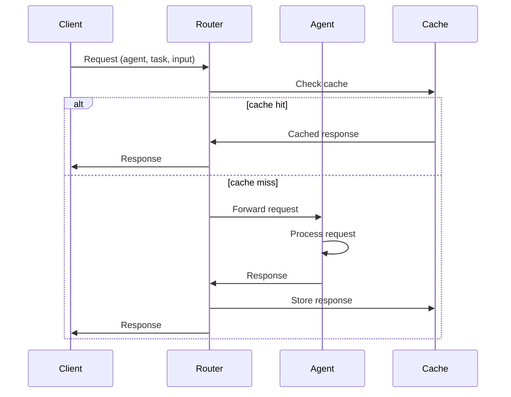

# Agent Contract Specification

## 🎯 Overview

**Status:** 🟡 PLANNED (v2.0.0)
**Last Updated:** 2025-04-20
**Target Version:** v2.0.0

The **Agent Contract** defines how agents (Mastra, Hivemind, DSC2) communicate within the Sonic Family ecosystem. This ensures interoperability, predictable behavior, and easy integration of new agent types.

## 📡 Input Format

All agents accept input in this standard format:

```json
{
  "agent": "codegen",
  "task": "generate_code",
  "input": "Write a function that returns the current timestamp",
  "context": {
    "language": "typescript",
    "framework": "none",
    "max_tokens": 2000,
    "temperature": 0.2,
    "session_id": "uuid-v4"
  },
  "metadata": {
    "request_id": "uuid-v4",
    "timestamp": "2025-04-20T10:00:00Z",
    "source": "vibecli"
  }
}
```

### Field Descriptions

| Field | Type | Required | Description |
|-------|------|----------|-------------|
| `agent` | string | ✅ | Agent name (codegen, explain, refactor, test) |
| `task` | string | ✅ | Specific task to perform |
| `input` | string | ✅ | Primary input/prompt |
| `context` | object | ❌ | Additional context |
| `metadata` | object | ❌ | Request metadata |

## 📤 Output Format

All agents return responses in this standard format:

```json
{
  "agent": "codegen",
  "task": "generate_code",
  "status": "success",
  "output": "// Generated code\nfunction getCurrentTimestamp() {\n  return new Date().toISOString();\n}",
  "usage": {
    "input_tokens": 150,
    "output_tokens": 250,
    "total_tokens": 400,
    "cost": 0.000056
  },
  "model": "deepseek-chat",
  "timestamp": "2025-04-20T10:00:01Z",
  "duration_ms": 1500
}
```

### Field Descriptions

| Field | Type | Description |
|-------|------|-------------|
| `agent` | string | Agent name |
| `task` | string | Task performed |
| `status` | string | "success" or "error" |
| `output` | string | Agent output/response |
| `usage` | object | Token usage and cost |
| `model` | string | Model used |
| `timestamp` | string | Response timestamp |
| `duration_ms` | number | Processing time |

## ❌ Error Format

When agents encounter errors:

```json
{
  "agent": "codegen",
  "task": "generate_code",
  "status": "error",
  "error": {
    "code": 2,
    "message": "API key not configured",
    "details": "DEEPSEEK_API_KEY environment variable not set"
  },
  "fallback": "mock",
  "suggestion": "Set DEEPSEEK_API_KEY environment variable or use --mock flag",
  "timestamp": "2025-04-20T10:00:01Z",
  "duration_ms": 50
}
```

### Error Codes

| Code | Name | Description |
|------|------|-------------|
| 100 | INVALID_INPUT | Input validation failed |
| 101 | UNSUPPORTED_TASK | Agent doesn't support task |
| 102 | MISSING_CONTEXT | Required context missing |
| 200 | API_KEY_MISSING | API key not configured |
| 201 | API_KEY_INVALID | API key invalid/expired |
| 202 | RATE_LIMITED | API rate limit exceeded |
| 203 | API_ERROR | API returned error |
| 300 | MODEL_UNAVAILABLE | Requested model not available |
| 301 | MODEL_TIMEOUT | Model response timeout |
| 400 | INTERNAL_ERROR | Internal agent error |

## 🤝 Agent Manifest

Each agent declares its capabilities in `manifest.yaml`:

```yaml
agents:
  - name: codegen
    endpoint: http://localhost:8080/agent/codegen
    capabilities:
      - generate
      - complete
      - insert
      - explain
      - refactor
    model: deepseek-chat
    timeout: 30s
    fallback: mock
    
  - name: explain
    endpoint: http://localhost:8080/agent/explain
    capabilities:
      - explain
      - document
    model: deepseek-chat
    timeout: 30s
    fallback: mock
```

## 🔄 Agent Lifecycle



## 🤖 Agent Types

### 1. Codegen Agent

**Purpose:** Generate code from natural language

**Capabilities:**
- `generate`: Full code generation
- `complete`: Code completion
- `insert`: Fill-in-the-middle
- `explain`: Code explanation
- `refactor`: Code refactoring

**Input Example:**
```json
{
  "agent": "codegen",
  "task": "generate",
  "input": "Write a TypeScript function that returns the current timestamp in ISO format"
}
```

**Output Example:**
```json
{
  "output": "function getCurrentTimestamp(): string {\n  return new Date().toISOString();\n}"
}
```

### 2. Explain Agent

**Purpose:** Explain code functionality

**Capabilities:**
- `explain`: Explain code
- `document`: Generate documentation

**Input Example:**
```json
{
  "agent": "explain",
  "task": "explain",
  "input": "function getCurrentTimestamp() { return new Date().toISOString(); }"
}
```

**Output Example:**
```json
{
  "output": "This function returns the current date and time in ISO 8601 format (YYYY-MM-DDTHH:mm:ss.sssZ). It uses the JavaScript Date object's toISOString() method which provides a standardized string representation of the date and time."
}
```

### 3. Refactor Agent

**Purpose:** Improve code quality

**Capabilities:**
- `refactor`: Suggest refactoring
- `optimize`: Performance optimization
- `modernize`: Update to modern practices

**Input Example:**
```json
{
  "agent": "refactor",
  "task": "refactor",
  "input": "function add(a, b) { return a + b; }"
}
```

**Output Example:**
```json
{
  "output": "/**\n * Adds two numbers\n * @param a - First number\n * @param b - Second number\n * @returns Sum of a and b\n */\nfunction add(a: number, b: number): number {\n  return a + b;\n}"
}
```

### 4. Test Agent

**Purpose:** Generate tests

**Capabilities:**
- `generate_tests`: Create unit tests
- `generate_mocks`: Create mocks
- `generate_snapshots`: Create snapshots

**Input Example:**
```json
{
  "agent": "test",
  "task": "generate_tests",
  "input": "function add(a, b) { return a + b; }"
}
```

**Output Example:**
```json
{
  "output": "import { add } from './math';\n\ndescribe('add', () => {\n  it('should add two numbers', () => {\n    expect(add(2, 3)).toBe(5);\n  });\n\n  it('should handle negative numbers', () => {\n    expect(add(-1, 1)).toBe(0);\n  });\n});"
}
```

## 📊 Implementation Status

| Component | Status | Target | Notes |
|-----------|--------|--------|-------|
| Input format | ✅ Complete | v1.3.0 | Specification done |
| Output format | ✅ Complete | v1.3.0 | Specification done |
| Error format | ✅ Complete | v1.3.0 | Specification done |
| Agent manifest | ✅ Complete | v1.3.0 | Specification done |
| Codegen agent | 🟡 Planned | v2.0.0 | Need implementation |
| Explain agent | 🟡 Planned | v2.0.0 | Need implementation |
| Refactor agent | 🟡 Planned | v2.0.0 | Need implementation |
| Test agent | 🟡 Planned | v2.0.0 | Need implementation |

## 🎯 Design Principles

1. **Consistent**: Same format across all agents
2. **Extensible**: Easy to add new agent types
3. **Agent-aware**: Designed for AI consumption
4. **Human-readable**: Also works for humans
5. **Versioned**: Contract can evolve over time
6. **Validated**: Schema validation for safety
7. **Documented**: Clear specification available
8. **Tested**: Reference implementations provided

## 🔮 Future Enhancements

### Agent Registry

```
https://registry.agents.sh/
├── v1/
│   ├── agents/
│   │   ├── codegen/
│   │   │   ├── 1.0.0/
│   │   │   └── manifest.yaml
│   │   ├── explain/
│   │   └── refactor/
│   └── providers/
│       ├── deepseek/
│       └── openai/
└── v2/ (future)
```

### Advanced Features

```
Agent discovery: Auto-discover available agents
Capability negotiation: Agents declare capabilities
Dynamic routing: Best agent for the task
Fallback chains: Try multiple agents
Load balancing: Distribute across agents
Health checking: Monitor agent status
```

## 📚 References

- [Universal Spine Specification](../architecture/universal-spine.md)
- [Codegen Rules](../../rules/codegen-rules.md)
- [Implementation Status](../../status/IMPLEMENTATION_STATUS.md)

---

**Agent Contract Specification** — How agents communicate in the Sonic Family ecosystem 🤝
