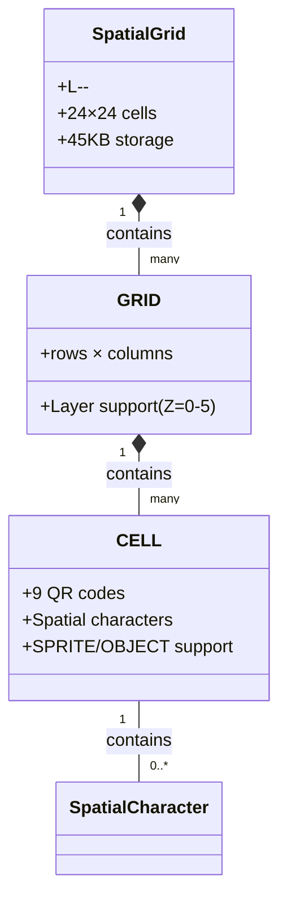
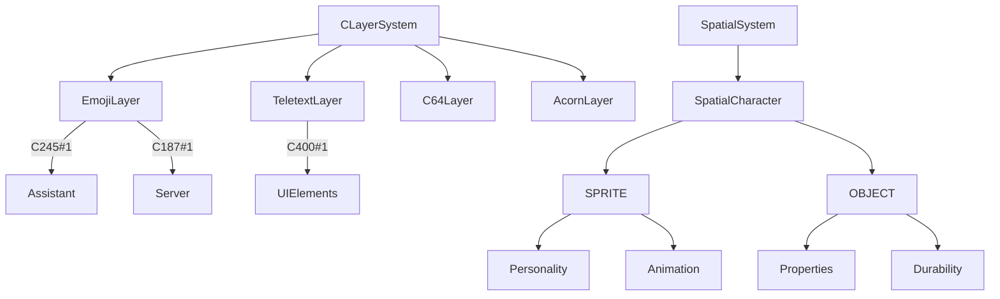
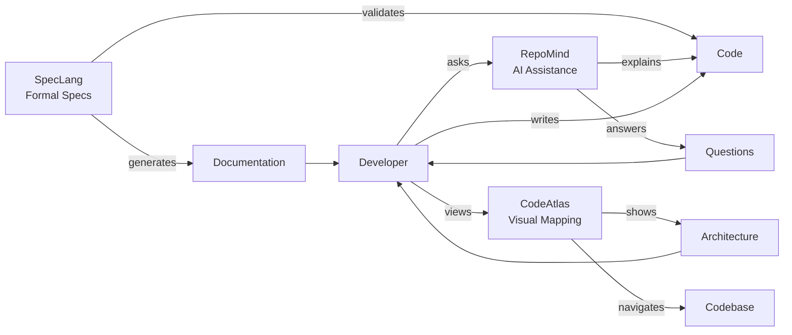
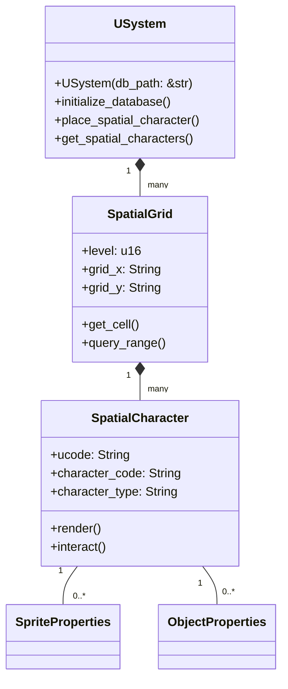

# uCode1 GitHub Next Integration Strategy

## Overview

This document explores how uCode1 can integrate with GitHub Next's experimental projects: **SpecLang**, **RepoMind**, and **CodeAtlas** to enhance our specification, documentation, and development workflows.

## 1. SpecLang Integration

### 1.1 What is SpecLang?

**SpecLang** is a domain-specific language for writing precise, machine-readable specifications. It enables:
- Formal specification of systems
- Automatic validation
- Generation of documentation and tests
- Integration with development workflows

### 1.2 uCode1 Integration Opportunities

#### Spatial Grid Specification

```spec
// Spatial grid specification in SpecLang
spec SpatialGrid {
  cell_size: 24x24 pixels
  qr_layout: 3x3 grid
  storage: 45KB per cell
  
  coordinate_system: {
    format: "L<level>-<gridXY>-<cellXY>-<layer>"
    levels: 0-65535
    encoding: base-36
  }
  
  validation: {
    cell_size == 24x24
    qr_layout == 3x3
    storage_capacity >= 45KB
  }
}
```

#### C-Layer Character Specification

```spec
spec CLayerCharacterSystem {
  format: "CXXX#YYY"
  layers: C100-C899
  
  character_types: {
    emoji: { range: C101#1-C356#256 }
    teletext: { range: C400#1-C499#256 }
    c64: { range: C500#1-C599#256 }
    acorn: { range: C600#1-C699#256 }
  }
  
  validation: {
    layer_range within C100-C899
    character_position between 1-256
    format_matches "C\d{3}#\d{1,3}"
  }
}
```

### 1.3 Implementation Plan

1. **SpecLang Adoption**:
   - Convert existing specifications to SpecLang format
   - Create SpecLang linter for uCode1 projects
   - Integrate with documentation generation

2. **Validation System**:
   - Automatic validation of spatial coordinates
   - Character format validation
   - Integration with CI/CD pipeline

3. **Documentation Generation**:
   - Auto-generate markdown from SpecLang
   - Create interactive specification viewers
   - Generate test cases from specs

## 2. RepoMind Integration

### 2.1 What is RepoMind?

**RepoMind** is an AI-powered knowledge base that understands your repository's structure, relationships, and context. It provides:
- Intelligent code search
- Context-aware assistance
- Automated documentation
- Knowledge graph of repository

### 2.2 uCode1 Integration Opportunities

#### Intelligent Spatial Queries

```markdown
# RepoMind-enhanced spatial queries

**Natural Language**: "Find all server rooms with warning status in data center L100-AA10"

**RepoMind Response**:
- L100-AA10-0318-1: :computer: Server Room (C187#1) ⚠️ Warning (C345#1)
- L100-AA10-0320-2: :computer: Backup Server (C187#1) ⚠️ Warning (C345#1)

**Generated Query**:
```sql
SELECT * FROM spatial_characters
WHERE ucode LIKE 'L100-AA10-%'
AND character_code = 'C187#1'
AND EXISTS (
  SELECT 1 FROM spatial_characters sc2
  WHERE sc2.ucode = spatial_characters.ucode
  AND sc2.character_code = 'C345#1'
);
```
```

#### Character System Assistance

```markdown
# RepoMind character assistance

**Question**: "How do I create an animated fairy sprite with helpful personality?"

**RepoMind Response**:
```markdown
To create an animated fairy sprite:

1. Use character code C245#50
2. Set animation to "float"
3. Add personality traits:
   ```json
   {
     "friendly": true,
     "helpful": true,
     "humorous": true
   }
   ```

Example:
```markdown
:fairy: Fairy (C245#50)@L100-AA10-0318-1[
  hover="Magic helper",
  click="spell",
  animation="float",
  personality={"friendly":true,"helpful":true,"humorous":true}
]
```

Related documentation:
- [SPRITE Reference Guide](../SPRITE_OBJECT_REFERENCE.md#character-sprites)
- [Animation Types](../SPRITE_OBJECT_REFERENCE.md#animation-types)
```
```

### 2.3 Implementation Plan

1. **Knowledge Base Setup**:
   - Train RepoMind on uCode1 codebase
   - Index spatial and character specifications
   - Create domain-specific knowledge graphs

2. **Integration Points**:
   - CLI assistance: `ucode1 ask "question"`
   - IDE plugin for intelligent code completion
   - Web interface for interactive exploration

3. **Enhanced Features**:
   - Natural language spatial queries
   - Character system assistance
   - Automated documentation generation
   - Context-aware code suggestions

## 3. CodeAtlas Integration

### 3.1 What is CodeAtlas?

**CodeAtlas** provides visual mapping and navigation of complex codebases through:
- Interactive code maps
- Dependency visualization
- Architecture diagrams
- Navigation assistance

### 3.2 uCode1 Integration Opportunities

#### Spatial Grid Visualization



#### Character System Architecture



### 3.3 Implementation Plan

1. **Visual Mapping**:
   - Generate architecture diagrams
   - Create dependency graphs
   - Visualize spatial relationships

2. **Navigation Enhancement**:
   - Interactive code exploration
   - Spatial grid navigation
   - Character system browsing

3. **Integration**:
   - Web-based CodeAtlas viewer
   - IDE plugin integration
   - Documentation embedding

## 4. Combined Integration Strategy

### 4.1 Unified Workflow



### 4.2 Implementation Roadmap

```yaml
integration_roadmap:
  phase_1:
    - SpecLang adoption for core specifications
    - Basic RepoMind knowledge base setup
    - CodeAtlas architecture diagrams
    timeline: "Q3 2024"
    
  phase_2:
    - Full SpecLang validation system
    - RepoMind natural language queries
    - CodeAtlas interactive exploration
    timeline: "Q4 2024"
    
  phase_3:
    - SpecLang test generation
    - RepoMind IDE integration
    - CodeAtlas real-time mapping
    timeline: "Q1 2025"
    
  phase_4:
    - SpecLang specification evolution
    - RepoMind context-aware coding
    - CodeAtlas augmented reality
    timeline: "Q2 2025+"
```

## 5. Integration Benefits

### 5.1 SpecLang Benefits

```yaml
benefits:
  - Formal, machine-readable specifications
  - Automatic validation and testing
  - Consistent documentation generation
  - Reduced ambiguity in requirements
  - Improved maintainability
```

### 5.2 RepoMind Benefits

```yaml
benefits:
  - Intelligent code search and navigation
  - Context-aware assistance
  - Reduced onboarding time
  - Improved code quality
  - Enhanced developer productivity
```

### 5.3 CodeAtlas Benefits

```yaml
benefits:
  - Visual codebase understanding
  - Architecture documentation
  - Dependency management
  - Complex system navigation
  - Team collaboration improvement
```

## 6. Implementation Examples

### 6.1 SpecLang Example: Spatial Grid

```spec
// uCode1/spatial_grid.spec
spec SpatialGridSystem {
  version: "1.0"
  
  constants: {
    CELL_SIZE: 24,
    QR_SIZE: 8,
    QR_PER_CELL: 9,
    STORAGE_PER_CELL: 45000
  }
  
  types: {
    Coordinate: {
      pattern: "L\d{1,5}-[A-Z0-9]{4}-[A-Z0-9]{4}-\d"
      example: "L100-AA10-0317-0"
    }
  }
  
  validation: {
    cell_size: CELL_SIZE == 24
    qr_layout: QR_PER_CELL == 9
    storage: STORAGE_PER_CELL >= 45000
  }
  
  examples: {
    valid_coordinate: "L100-AA10-0317-0"
    invalid_coordinate: "L99999-AAAA-BBBB-9" // level too high
  }
}
```

### 6.2 RepoMind Example: Character Query

```markdown
# Developer asks RepoMind

**Question**: "How do I create a warning status indicator for a server room?"

**RepoMind Analysis**:
- Context: Spatial character system
- Intent: Create status indicator
- Location: Server room context

**Response**:
```markdown
To create a warning status indicator:

1. Use the warning emoji :warning: (C345#1)
2. Place it at the server room coordinate
3. Add appropriate description

Example:
```markdown
# Server Room Status
:computer: Server (C187#1)@L100-AA10-0318-1
⚠️ Warning: High Load (C345#1)@L100-AA10-0318-1
```

Related:
- [Status Indicators](../SPATIAL_CHARACTER_MAPPING.md#status-alerts)
- [Server Room Patterns](../SPATIAL_CHARACTER_INTEGRATION.md#facility-map)
```

**Generated Code**:
```rust
usystem.place_spatial_character(
    "L100-AA10-0318-1",
    "C345#1",
    "emoji",
    "High Load Warning",
    16, 8
);
```
```

### 6.3 CodeAtlas Example: System Architecture



## 7. Integration with uCode1 Workflow

### 7.1 Enhanced Development Pipeline

```yaml
development_pipeline:
  toybox:
    - SpecLang: Experimental specs
    - RepoMind: Basic assistance
    - CodeAtlas: Simple diagrams
    
  sandbox:
    - SpecLang: Validated specs
    - RepoMind: Test generation
    - CodeAtlas: Architecture review
    
  launch:
    - SpecLang: Complete documentation
    - RepoMind: Full assistance
    - CodeAtlas: Interactive maps
    
  deploy:
    - SpecLang: Production specs
    - RepoMind: Production support
    - CodeAtlas: Full visualization
```

### 7.2 CLI Integration

```bash
# SpecLang commands
ucode1 spec validate spatial_grid.spec
ucode1 spec generate --format markdown spatial_grid.spec
ucode1 spec test --coverage 90% character_system.spec

# RepoMind commands
ucode1 ask "How to create animated sprite?"
ucode1 explain L100-AA10-0317-0
ucode1 suggest --context spatial character optimization

# CodeAtlas commands
ucode1 map --architecture spatial_system
ucode1 navigate --target character_rendering
ucode1 visualize --format mermaid spatial_grid
```

## 8. Future Enhancements

### 8.1 SpecLang Evolution

```yaml
future_enhancements:
  - Real-time specification validation
  - AI-assisted specification writing
  - Automatic test case generation
  - Specification versioning and diffing
  - Integration with design tools
```

### 8.2 RepoMind Evolution

```yaml
future_enhancements:
  - Context-aware code generation
  - Automated refactoring suggestions
  - Multi-language support
  - Team knowledge sharing
  - Security vulnerability detection
```

### 8.3 CodeAtlas Evolution

```yaml
future_enhancements:
  - 3D architecture visualization
  - Augmented reality code exploration
  - Real-time collaboration views
  - Historical evolution tracking
  - Performance hotspot identification
```

## 9. Implementation Checklist

### 9.1 SpecLang Integration

- [ ] Convert core specifications to SpecLang
- [ ] Create SpecLang validator
- [ ] Integrate with documentation generation
- [ ] Add to CI/CD pipeline
- [ ] Train team on SpecLang usage

### 9.2 RepoMind Integration

- [ ] Set up knowledge base
- [ ] Index uCode1 codebase
- [ ] Create query interfaces
- [ ] Develop CLI integration
- [ ] Build IDE plugin

### 9.3 CodeAtlas Integration

- [ ] Generate architecture diagrams
- [ ] Create interactive viewer
- [ ] Develop navigation tools
- [ ] Integrate with documentation
- [ ] Build real-time mapping

## 10. Success Metrics

### 10.1 SpecLang Success

```yaml
metrics:
  - Specification coverage: 90%+
  - Validation pass rate: 95%+
  - Documentation accuracy: 98%+
  - Developer adoption: 80%+
```

### 10.2 RepoMind Success

```yaml
metrics:
  - Query accuracy: 90%+
  - Response time: <2s
  - Developer satisfaction: 85%+
  - Productivity improvement: 20%+
```

### 10.3 CodeAtlas Success

```yaml
metrics:
  - Architecture understanding: 90%+
  - Navigation efficiency: 30% improvement
  - Onboarding time reduction: 40%+
  - Team collaboration: 25% improvement
```

---

© 2024 uCode1 Team
**GitHub Next Integration Version**: 1.0
**Last Updated**: 2024-04-25
**Reference**: uCode1/docs/GITHUB_NEXT_INTEGRATION.md