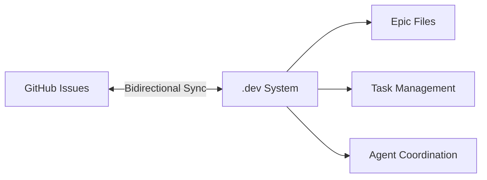

# GitHub Integration Guide

## Overview

This guide provides comprehensive documentation for integrating the uHomeNest .dev flow system with GitHub Issues. The integration enables bidirectional synchronization between local epics/tasks and GitHub issues.

## Architecture



## Setup

### Prerequisites

- Python 3.7+
- `requests` library
- `PyYAML` library
- `flask` library (for webhook server)
- GitHub Personal Access Token with `repo` scope

### Installation

```bash
# Install required packages
pip install requests pyyaml flask

# Verify installation
python -c "import requests, yaml, flask; print('✅ All dependencies installed')"
```

### Configuration

1. **Create configuration file**:

```bash
cd /Users/fredbook/code-vault/uHomeNest
python .dev/integration/github-connector.py create_github_config \
    "your-github-token" \
    "fredporter/uHomeNest" \
    ".dev/integration/github-config.yaml"
```

2. **Edit configuration**:

```yaml
# .dev/integration/github-config.yaml
github_token: "your-github-token"
default_repo: "fredporter/uHomeNest"
sync_interval: 3600
max_retries: 3
timeout: 30
labels:
  epic-linked: "epic-linked"
  dev-system: "dev-system"
  automated: "automated"

webhook:
  enabled: false  # Set to true to enable webhooks
  secret: "your-webhook-secret"  # Generate a secure secret
  port: 8080
  endpoint: "/webhook/github"
```

## Usage

### Command Line Interface

```bash
# Test GitHub connection
python .dev/integration/github-connector.py test_connection

# Perform bidirectional sync
python .dev/integration/github-connector.py sync

# Start webhook server
python .dev/integration/github-connector.py webhook

# Run integration tests
python .dev/integration/test_integration.py
```

### Python API

```python
from dev.integration.github_connector import GitHubConnector

# Initialize connector
connector = GitHubConnector(".dev/integration/github-config.yaml")

# Test connection
if connector.test_connection():
    print("✅ GitHub connection successful")

# Perform bidirectional sync
results = connector.full_bidirectional_sync("fredporter/uHomeNest")
print(f"📊 Sync results: {results}")

# Start webhook server (optional)
connector.start_webhook_server()
```

## Synchronization

### Bidirectional Sync Process

1. **GitHub → .dev System**:
   - Fetches all issues from GitHub
   - Extracts epic IDs from issue bodies
   - Updates corresponding epic files
   - Creates new tasks for unlinked issues

2. **.dev System → GitHub**:
   - Reads all epic files
   - Creates GitHub issues for new tasks
   - Updates existing issues
   - Maintains task-issue linkages

### Sync Modes

| Mode | Direction | Trigger | Frequency |
|------|-----------|---------|-----------|
| Manual | Bidirectional | CLI command | On demand |
| Scheduled | Bidirectional | Cron job | Configurable |
| Webhook | GitHub → .dev | GitHub event | Real-time |

### Conflict Resolution

The system uses a "dev-wins" strategy by default:

1. **Title conflicts**: .dev system title takes precedence
2. **Status conflicts**: .dev system status takes precedence
3. **Content conflicts**: Manual resolution required

## Webhooks

### Setup

1. **Enable webhooks in config**:

```yaml
webhook:
  enabled: true
  secret: "your-secure-secret"
  port: 8080
  endpoint: "/webhook/github"
```

2. **Configure GitHub webhook**:
   - Go to repository Settings → Webhooks
   - Add webhook with payload URL: `http://your-server:8080/webhook/github`
   - Set content type to `application/json`
   - Add secret (must match config)
   - Select events: `Issues`

3. **Start webhook server**:

```bash
python .dev/integration/github-connector.py webhook
```

### Supported Events

- `issues.opened`: Create new task in epic
- `issues.edited`: Update existing task
- `issues.closed`: Mark task as completed
- `issues.reopened`: Reopen completed task
- `issues.labeled`: Handle label changes (especially `epic-linked`)

## Epic Management

### Epic File Format

```markdown
# Epic Title

## Overview
Brief description of the epic

## Goals
- Goal 1
- Goal 2

## Tasks
- [ ] Task 1
- [ ] Task 2 (#123)  # Linked to GitHub issue #123
- [x] Completed Task ([Issue](https://github.com/.../issues/456))

## Roadmap Alignment
- **Track**: Track Name
- **Status**: Status
- **Owner**: Team Name
```

### Linking Tasks to Issues

**Manual linking**: Add GitHub issue number to task

```markdown
- [ ] Task Title (#123)
```

**Automatic linking**: System creates issue and adds reference

```markdown
- [ ] Task Title (#123) ([Issue](https://github.com/.../issues/123))
```

## Best Practices

### Issue Management

1. **Use consistent labels**: `epic-linked`, `dev-system`, `automated`
2. **Include epic reference**: Always add `**Linked Epic**: epic-id` to issue body
3. **Keep titles synchronized**: Changes in one system will sync to the other
4. **Use task status**: Open/closed status should match GitHub issue state

### Epic Organization

1. **One epic per file**: Keep epics focused and manageable
2. **Clear task descriptions**: Make tasks actionable and specific
3. **Regular sync**: Schedule frequent synchronization
4. **Backup epics**: Version control epic files in Git

### Performance

1. **Rate limiting**: GitHub API has rate limits (5000 requests/hour)
2. **Batch operations**: Process multiple items in single requests
3. **Caching**: Cache issue data to reduce API calls
4. **Error handling**: Implement retry logic for transient failures

## Troubleshooting

### Common Issues

**Connection Failed**
- Verify GitHub token is valid
- Check network connectivity
- Test with `test_connection()` method

**Sync Errors**
- Check epic file permissions
- Verify GitHub repository exists
- Review error logs in `.dev/integration/`

**Webhook Issues**
- Verify webhook secret matches
- Check server is accessible from internet
- Test with `ngrok` for local development

### Debugging

```python
import logging

# Enable debug logging
logging.basicConfig(level=logging.DEBUG)

# Test specific components
connector = GitHubConnector("config.yaml")
issues = connector.get_repo_issues("fredporter/uHomeNest")
print(f"Found {len(issues)} issues")
```

## Security

### Token Management

- **Never commit tokens** to public repositories
- Use GitHub secrets for CI/CD
- Rotate tokens regularly
- Limit token permissions

### Webhook Security

- Always use webhook secrets
- Validate all incoming payloads
- Implement rate limiting
- Use HTTPS in production

### Data Protection

- Encrypt sensitive configuration
- Limit access to integration logs
- Audit synchronization activities

## Advanced Usage

### Custom Sync Logic

```python
class CustomConnector(GitHubConnector):
    def custom_sync_logic(self):
        # Add custom synchronization rules
        results = super().full_bidirectional_sync("fredporter/uHomeNest")
        
        # Add custom processing
        for epic_file in os.listdir(".dev/tasks/epics"):
            if epic_file.endswith(".md"):
                # Custom logic here
                pass
        
        return results
```

### Scheduled Sync

```bash
# Add to crontab for hourly sync
0 * * * * cd /Users/fredbook/code-vault/uHomeNest && \
python .dev/integration/github-connector.py sync >> \
.dev/integration/sync.log 2>&1
```

### Docker Integration

```dockerfile
# Dockerfile for integration service
FROM python:3.9-slim

WORKDIR /app
COPY . .

RUN pip install requests pyyaml flask

CMD ["python", ".dev/integration/github-connector.py", "webhook"]
```

## Monitoring

### Metrics to Track

- **Sync success rate**: Percentage of successful synchronizations
- **Sync duration**: Time taken for synchronization
- **Issue-epic alignment**: Percentage of properly linked items
- **Error rate**: Frequency of synchronization errors

### Logging

```python
# Configure logging
import logging
from datetime import datetime

logging.basicConfig(
    filename='.dev/integration/github-integration.log',
    level=logging.INFO,
    format='%(asctime)s - %(levelname)s - %(message)s'
)

# Log synchronization events
logging.info(f"Starting sync at {datetime.now()}")
results = connector.full_bidirectional_sync("fredporter/uHomeNest")
logging.info(f"Sync completed: {results}")
```

## Migration Guide

### From Manual to Automated

1. **Inventory existing issues**: Identify issues that should be linked to epics
2. **Create epic files**: Organize issues into appropriate epics
3. **Initial sync**: Run bidirectional sync to establish linkages
4. **Verify results**: Check that all issues are properly linked
5. **Enable automation**: Set up scheduled sync or webhooks

### From Other Systems

1. **Export data**: Get issues from current system
2. **Transform format**: Convert to epic/task structure
3. **Import to .dev**: Create epic files
4. **Initial sync**: Establish GitHub linkages
5. **Decommission old**: Phase out previous system

## API Reference

### GitHubConnector Class

```python
GitHubConnector(config_path: str)
# Initialize connector with configuration

test_connection() -> bool
# Test GitHub API connection

get_repo_issues(repo: str, state: str = "all") -> List[Dict]
# Get issues from repository

create_issue(repo: str, title: str, body: str, labels: List[str] = None, epic_id: str = None) -> Dict
# Create new GitHub issue

update_issue(repo: str, issue_number: int, title: str = None, body: str = None, state: str = None) -> Dict
# Update existing issue

sync_issues_to_epics(repo: str, epics_dir: str = ".dev/tasks/epics") -> Dict
# Sync GitHub issues to local epics

sync_epics_to_issues(repo: str, epics_dir: str = ".dev/tasks/epics") -> Dict
# Sync local epics to GitHub issues

full_bidirectional_sync(repo: str, epics_dir: str = ".dev/tasks/epics") -> Dict
# Perform complete bidirectional synchronization

handle_webhook(payload: Dict, signature: str = None) -> Dict
# Handle incoming webhook payload

start_webhook_server(host: str = "0.0.0.0", port: int = None) -> None
# Start webhook server
```

## Support

### Getting Help

1. **Check logs**: `.dev/integration/github-integration.log`
2. **Run tests**: `python .dev/integration/test_integration.py`
3. **Review documentation**: This guide
4. **GitHub issues**: Report bugs in uHomeNest repository

### Contributing

1. **Fork repository**: Create your own fork
2. **Create branch**: `git checkout -b feature/integration-enhancement`
3. **Make changes**: Implement your improvements
4. **Add tests**: Update test suite
5. **Submit PR**: Create pull request with description

## Roadmap

### Future Enhancements

- **Multi-repository support**: Sync with multiple GitHub repos
- **Advanced conflict resolution**: Configurable strategies
- **Performance optimization**: Batch operations and caching
- **Enhanced webhook handling**: More event types
- **GraphQL API support**: More efficient queries

### Version History

**v1.0.0** (2024-04-19)
- Initial release
- Bidirectional synchronization
- Webhook support
- Comprehensive test suite

## Appendix

### Configuration Reference

```yaml
# Required settings
github_token: "your-token"  # GitHub Personal Access Token
default_repo: "owner/repo"  # Default repository

# Optional settings
sync_interval: 3600  # Auto-sync interval in seconds
max_retries: 3       # Maximum retry attempts
timeout: 30          # Request timeout in seconds

# Label configuration
labels:
  epic-linked: "epic-linked"  # Label for epic-linked issues
  dev-system: "dev-system"    # Label for system-managed issues
  automated: "automated"      # Label for automated issues

# Webhook configuration
webhook:
  enabled: false      # Enable webhook server
  secret: "secret"    # Webhook secret for validation
  port: 8080          # Webhook server port
  endpoint: "/webhook/github"  # Webhook endpoint path

# Integration settings
integration:
  auto_sync_interval: 3600  # Automatic sync interval
  max_sync_items: 100       # Maximum items per sync
  conflict_resolution: "dev-wins"  # Conflict resolution strategy

# Logging settings
logging:
  level: "INFO"              # Log level
  file: "integration.log"    # Log file path
  max_size: 1048576           # Max log size in bytes
  backup_count: 5             # Number of log backups
```

### Glossary

- **Epic**: Large body of work that can be broken into tasks
- **Task**: Individual work item within an epic
- **Issue**: GitHub issue that can be linked to a task
- **Bidirectional Sync**: Synchronization in both directions
- **Webhook**: HTTP callback for real-time notifications
- **Conflict Resolution**: Strategy for handling data conflicts

---
*GitHub Integration Guide - uHomeNest .dev Flow System*
*Version: 1.0.0 | Last Updated: 2024-04-19*