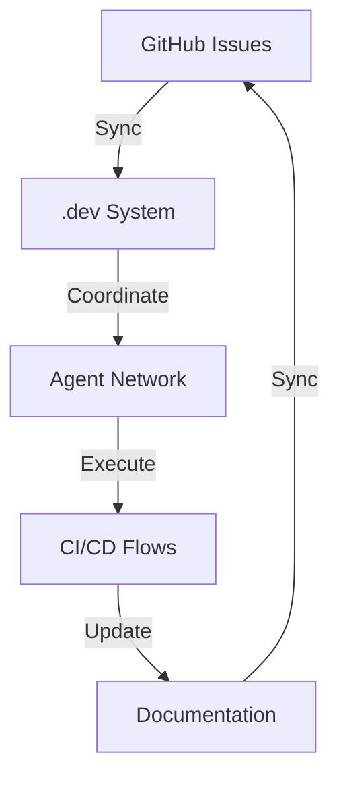

# Phase 2: Integration - Overview

## Phase 2 Objectives

**Duration**: 2024-04-20 to 2024-05-11 (3 weeks)
**Focus**: System integration and workflow automation

### Key Goals

1. **GitHub Issues Integration**
   - Connect .dev system with GitHub Issues tracking
   - Implement bidirectional synchronization
   - Enable issue-to-epic mapping

2. **Agent Coordination Enhancement**
   - Implement production-ready coordination protocols
   - Add load balancing capabilities
   - Enhance error handling and recovery

3. **CI/CD Pipeline Integration**
   - Connect automated flows with GitHub Actions
   - Implement build status reporting
   - Add deployment approval workflows

4. **Documentation Workflow Automation**
   - Implement automated doc generation
   - Add change tracking and versioning
   - Integrate with roadmap updates

## Integration Architecture

## Implementation Plan

### Week 1: GitHub Integration
- **Day 1-2**: API connection and authentication
- **Day 3-4**: Issue-epic mapping implementation
- **Day 5**: Testing and validation

### Week 2: Agent Coordination
- **Day 6-7**: Production protocol implementation
- **Day 8-9**: Load balancing development
- **Day 10**: Error handling enhancement

### Week 3: CI/CD & Docs Integration
- **Day 11-12**: GitHub Actions connection
- **Day 13-14**: Documentation workflow
- **Day 15**: Final testing and deployment

## Success Criteria

| Component | Target | Metric |
|-----------|-------|--------|
| GitHub Sync | 100% | Issue-epic alignment |
| Agent Coordination | 99.9% | Task success rate |
| CI/CD Integration | 100% | Pipeline reliability |
| Doc Automation | 95% | Coverage completeness |

## Risk Management

### High Risks
1. **GitHub API Limitations**
   - Mitigation: Comprehensive API testing
   - Contingency: Fallback to manual sync

2. **Agent Coordination Failures**
   - Mitigation: Enhanced error handling
   - Contingency: Manual intervention protocols

### Medium Risks
1. **CI/CD Pipeline Complexity**
   - Mitigation: Modular design
   - Contingency: Gradual rollout

2. **Documentation Consistency**
   - Mitigation: Automated validation
   - Contingency: Manual review process

## Resources

- **Team**: 3 developers, 1 DevOps engineer
- **Budget**: $0 (open source)
- **Tools**: GitHub API, Python, YAML, Markdown
- **Time**: 15 working days

## Deliverables

1. **GitHub Integration Module**
   - API connector
   - Sync engine
   - Mapping system

2. **Enhanced Coordinator**
   - Production protocols
   - Load balancer
   - Monitoring dashboard

3. **CI/CD Integration**
   - GitHub Actions workflows
   - Status reporting
   - Approval system

4. **Documentation Automation**
   - Generation engine
   - Versioning system
   - Change tracker

## Monitoring & Reporting

- **Daily**: Integration progress updates
- **Weekly**: System health reports
- **Final**: Comprehensive integration report

## Next Steps

1. Begin GitHub Issues integration
2. Set up development environment
3. Implement API connection
4. Create issue-epic mapping system

---
*Phase 2: Integration - uHomeNest .dev Flow System*
*Status: 🟡 Planning Complete | Ready for Execution*