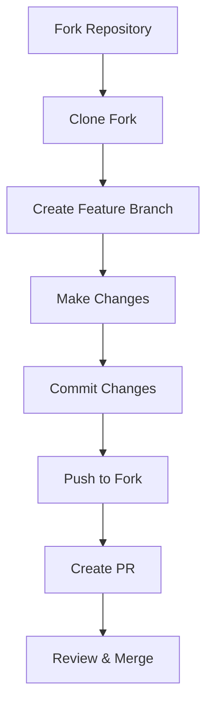

# Agent Sharing Instructions for uDosGo Ecosystem

## Overview

This document provides comprehensive instructions for sharing the uDosGo ecosystem with other agents. It covers repository structure, access methods, collaboration workflows, and best practices.

## Ecosystem Repository Structure

### 1. Core Repositories

#### Home Repository
- **Location**: `~/uDosGo/Home/`
- **Git Status**: ✅ Clean (except new docs)
- **Branch**: `main`
- **Remote**: `origin/main`
- **Recent Commit**: `676a6e2` - Task 13 completion
- **Purpose**: Core home automation and rules engine

#### 3dWorld Repository
- **Location**: `~/uDosGo/3dWorld/`
- **Git Status**: ✅ Clean
- **Branch**: `main`
- **Remote**: `origin/main`
- **Recent Commit**: `93e2bae` - Initialize scaffold
- **Purpose**: 3D visualization and world simulation

#### Connect Repository
- **Location**: `~/uDosGo/Connect/`
- **Git Status**: ✅ Clean (with SeedVault subdirectory)
- **Branch**: `main`
- **Remote**: `origin/main`
- **Recent Commit**: `ecf96ca` - Refine dev processes
- **Purpose**: Connect ecosystem with SeedVault module

### 2. Code Home

#### Code Repository
- **Location**: `~/Code/`
- **Git Status**: ✅ Git repository
- **Purpose**: Central code home with apps and vendor repos

#### AgentDigitalOK/Hivemind
- **Location**: `~/Code/Vendor/AgentDigitalOK/Hivemind/`
- **Git Status**: ✅ Moved from uDosGo
- **Purpose**: Multi-agent coordination system

### 3. User Vault

#### Vault Repository
- **Location**: `~/Vault/`
- **Git Status**: ✅ Git repository
- **Purpose**: Default user vault for secure storage

## Universal Ecosystem Spine

```
┌───────────────────────────────────────────────────────────────┐
│                 uDosGo Universal Ecosystem Spine               │
├──────────────┬─────────────────┬───────────────────────────────┐
│  Core Repos  │   Code Home     │      User Vault               │
├──────────────┼─────────────────┼───────────────────────────────┤
│ ~uDosGo/Home │ ~Code/          │ ~Vault/                      │
│ ~uDosGo/3dW   │ ~Code/Apps/     │ ~Vault/.compost/             │
│ ~uDosGo/Conn │ ~Code/Vendor/   │ ~Vault/-inbox/               │
└──────────────┴─────────────────┴───────────────────────────────┘
```

## Agent Access Methods

### 1. Git Repository Access

#### Clone Repositories
```bash
# Clone core repositories
git clone git@github.com:uDosGo/Home.git ~/uDosGo/Home
git clone git@github.com:uDosGo/3dWorld.git ~/uDosGo/3dWorld
git clone git@github.com:uDosGo/Connect.git ~/uDosGo/Connect

# Clone code home
git clone git@github.com:uDosGo/Code.git ~/Code

# Clone vault
git clone git@github.com:uDosGo/Vault.git ~/Vault
```

#### Repository URLs
- **Home**: `git@github.com:uDosGo/Home.git`
- **3dWorld**: `git@github.com:uDosGo/3dWorld.git`
- **Connect**: `git@github.com:uDosGo/Connect.git`
- **Code**: `git@github.com:uDosGo/Code.git`
- **Vault**: `git@github.com:uDosGo/Vault.git`

### 2. SSH Access

#### Add SSH Key
```bash
# Generate SSH key if needed
ssh-keygen -t ed25519 -C "agent@udosgo.ai"

# Add to ssh-agent
eval "$(ssh-agent -s)"
ssh-add ~/.ssh/id_ed25519

# Copy public key
cat ~/.ssh/id_ed25519.pub
```

#### Add to GitHub
1. Go to GitHub Settings → SSH and GPG keys
2. Add new SSH key
3. Paste public key
4. Test connection: `ssh -T git@github.com`

### 3. HTTPS Access (Alternative)

#### Configure Git
```bash
# Set credentials helper
git config --global credential.helper cache

# Or use credential manager
git config --global credential.helper store
```

#### Clone with HTTPS
```bash
git clone https://github.com/uDosGo/Home.git ~/uDosGo/Home
```

## Collaboration Workflow

### 1. Forking Workflow (Recommended)



### 2. Branching Strategy

#### Branch Naming
- `feature/*` - New features
- `bugfix/*` - Bug fixes
- `docs/*` - Documentation
- `refactor/*` - Code refactoring
- `test/*` - Testing improvements

#### Example Workflow
```bash
# Update main branch
git checkout main
git pull origin main

# Create feature branch
git checkout -b feature/agent-integration

# Make changes, commit
git add .
git commit -m "Add agent integration API"

# Push to remote
git push origin feature/agent-integration

# Create PR
gh pr create --fill
```

### 3. Commit Rules

#### Commit Message Format
```
<type>(<scope>): <subject>
<BLANK LINE>
<body>
<BLANK LINE>
<footer>
```

#### Types
- `feat`: New feature
- `fix`: Bug fix
- `docs`: Documentation changes
- `style`: Formatting, missing semi-colons, etc.
- `refactor`: Code refactor
- `test`: Adding or modifying tests
- `chore`: Maintenance tasks

#### Examples
```bash
# Good commit message
git commit -m "feat(agents): add sharing API

Implements agent-to-agent communication protocol
for sharing ecosystem resources. Fixes #123"

# Bad commit message (too vague)
git commit -m "fixed bug"
```

### 4. Pull Request Rules

#### PR Requirements
- ✅ Clear title and description
- ✅ Linked to issue (if applicable)
- ✅ Passing tests
- ✅ Up-to-date with target branch
- ✅ Documentation updated
- ✅ Reviewer assigned

#### PR Template
```markdown
## Description

[Clear description of changes]

## Related Issue

Fixes #ISSUE_NUMBER

## Changes Made

- Change 1
- Change 2
- Change 3

## Testing

- Test 1: [Pass/Fail]
- Test 2: [Pass/Fail]

## Checklist

- [ ] Code reviewed
- [ ] Tests passing
- [ ] Documentation updated
- [ ] Ready for merge
```

## Agent-Specific Instructions

### 1. Setting Up Development Environment

#### Prerequisites
```bash
# Install required tools
brew install git gh python3 node yarn

# Install Python dependencies
pip install -r requirements.txt

# Install Node dependencies
npm install
```

#### Environment Variables
```bash
# Set environment variables
export UDOSGO_ROOT="~/uDosGo"
export CODE_ROOT="~/Code"
export VAULT_ROOT="~/Vault"

# Add to .zshrc or .bashrc
echo "export UDOSGO_ROOT=~/uDosGo" >> ~/.zshrc
echo "export CODE_ROOT=~/Code" >> ~/.zshrc
echo "export VAULT_ROOT=~/Vault" >> ~/.zshrc
```

### 2. Path Configuration

#### Add to PATH
```bash
# Add common binaries to PATH
export PATH="$PATH:$CODE_ROOT/Vendor/AgentDigitalOK/Hivemind/bin"
export PATH="$PATH:$UDOSGO_ROOT/Home/scripts"

# Add to shell config
echo 'export PATH="$PATH:$CODE_ROOT/Vendor/AgentDigitalOK/Hivemind/bin"' >> ~/.zshrc
echo 'export PATH="$PATH:$UDOSGO_ROOT/Home/scripts"' >> ~/.zshrc
```

### 3. Repository Navigation

#### Quick Navigation
```bash
# Navigate to core repos
alias cd-home="cd ~/uDosGo/Home"
alias cd-3dworld="cd ~/uDosGo/3dWorld"
alias cd-connect="cd ~/uDosGo/Connect"

# Navigate to code home
alias cd-code="cd ~/Code"
alias cd-hivemind="cd ~/Code/Vendor/AgentDigitalOK/Hivemind"

# Navigate to vault
alias cd-vault="cd ~/Vault"

# Add to shell config
echo "alias cd-home='cd ~/uDosGo/Home'" >> ~/.zshrc
echo "alias cd-3dworld='cd ~/uDosGo/3dWorld'" >> ~/.zshrc
echo "alias cd-connect='cd ~/uDosGo/Connect'" >> ~/.zshrc
echo "alias cd-code='cd ~/Code'" >> ~/.zshrc
echo "alias cd-hivemind='cd ~/Code/Vendor/AgentDigitalOK/Hivemind'" >> ~/.zshrc
echo "alias cd-vault='cd ~/Vault'" >> ~/.zshrc
```

### 4. Common Commands

#### Repository Status
```bash
# Check all repo statuses
for repo in Home 3dWorld Connect; do
  echo "=== $repo ==="
  cd ~/uDosGo/$repo && git status --short
done

cd ~/Code && git status --short
cd ~/Vault && git status --short
```

#### Update All Repositories
```bash
# Update all core repos
for repo in Home 3dWorld Connect; do
  cd ~/uDosGo/$repo && git pull origin main
done

# Update code and vault
cd ~/Code && git pull origin main
cd ~/Vault && git pull origin main
```

## Sharing Resources Between Agents

### 1. Sharing Code

#### Push Changes
```bash
# Push changes to remote
git push origin branch-name
```

#### Create Shared Branch
```bash
# Create branch for collaboration
git checkout -b shared/agent-collab
git push origin shared/agent-collab
```

### 2. Sharing Data via Vault

#### Vault Structure
```
~/Vault/
├── .compost/          # Compost system
├── -inbox/            # Incoming shared data
├── -outbox/           # Outgoing shared data
├── .git/              # Git repository
└── ...                # Other vault contents
```

#### Share via Vault
```bash
# Place data in outbox
cp data.json ~/Vault/-outbox/

# Commit and push
cd ~/Vault
git add -outbox/data.json
git commit -m "Share data with agent"
git push origin main
```

#### Receive via Vault
```bash
# Pull latest vault changes
cd ~/Vault
git pull origin main

# Check inbox
ls -la ~/Vault/-inbox/
```

### 3. Using Git Submodules

#### Add Submodule
```bash
# Add Hivemind as submodule
git submodule add git@github.com:uDosGo/Hivemind.git external/Hivemind
```

#### Update Submodules
```bash
# Update all submodules
git submodule update --init --recursive
```

## Best Practices for Agent Collaboration

### 1. Communication
- **Use clear commit messages**
- **Document changes thoroughly**
- **Link to issues and PRs**
- **Update documentation**

### 2. Code Quality
- **Follow existing patterns**
- **Write tests**
- **Maintain consistency**
- **Review before merging**

### 3. Conflict Resolution
- **Communicate early**
- **Discuss in PR comments**
- **Use code reviews**
- **Escalate when needed**

### 4. Security
- **Never commit secrets**
- **Use environment variables**
- **Review permissions**
- **Scan dependencies**

## Troubleshooting

### Common Issues

#### 1. Permission Denied
```bash
# Check SSH key
ssh -T git@github.com

# Add SSH key to agent
ssh-add ~/.ssh/id_ed25519
```

#### 2. Repository Not Found
```bash
# Verify repository URL
git remote -v

# Update URL if needed
git remote set-url origin git@github.com:uDosGo/Repo.git
```

#### 3. Merge Conflicts
```bash
# Resolve conflicts
git mergetool

# Or manual resolution
git status
# Edit conflicted files
git add resolved-file
git commit
```

#### 4. Detached HEAD
```bash
# Reattach HEAD
git checkout main

# Or create branch
git checkout -b recovery-branch
```

## Agent Onboarding Checklist

### 1. Initial Setup
- [ ] Generate SSH key
- [ ] Add SSH key to GitHub
- [ ] Clone repositories
- [ ] Set environment variables
- [ ] Install dependencies
- [ ] Configure aliases

### 2. Repository Access
- [ ] Verify git access
- [ ] Test clone/push
- [ ] Set up remotes
- [ ] Configure git identity

### 3. Development Environment
- [ ] Install required tools
- [ ] Set up IDE
- [ ] Configure linters
- [ ] Install pre-commit hooks

### 4. Collaboration Setup
- [ ] Join team channels
- [ ] Set up notifications
- [ ] Review documentation
- [ ] Understand workflow

### 5. First Contribution
- [ ] Find good first issue
- [ ] Create feature branch
- [ ] Make small change
- [ ] Submit PR
- [ ] Address feedback
- [ ] Merge PR

## Advanced Workflows

### 1. Rebase Workflow
```bash
# Rebase feature branch
git checkout feature-branch
git fetch origin
git rebase origin/main

# Force push (use with caution)
git push origin feature-branch --force-with-lease
```

### 2. Interactive Rebase
```bash
# Squash commits
git rebase -i HEAD~5

# Edit, squash, reword commits
```

### 3. Cherry-Pick
```bash
# Cherry-pick specific commit
git cherry-pick abc1234
```

### 4. Stash Changes
```bash
# Stash unfinished work
git stash

# Apply stashed changes
git stash pop
```

## Security Best Practices

### 1. Secret Management
- **Never** commit secrets to git
- Use environment variables
- Use secret management tools
- Rotate secrets regularly

### 2. SSH Security
- Use ed25519 keys
- Protect private key
- Use passphrase
- Rotate keys periodically

### 3. Git Security
- Sign commits with GPG
- Verify signed commits
- Review changes carefully
- Use HTTPS for public repos

### 4. Code Review
- Review all changes
- Check for secrets
- Verify dependencies
- Test thoroughly

## Performance Tips

### 1. Git Performance
```bash
# Enable git maintenance
git maintenance start

# Optimize repository
git gc --aggressive
```

### 2. Large Files
- Use Git LFS for large files
- Avoid committing large binaries
- Clean up history periodically

### 3. Shallow Clone
```bash
# Shallow clone for speed
git clone --depth 1 git@github.com:uDosGo/Home.git
```

## Agent-Specific Workflows

### 1. Hivemind Agent Development

**Location**: `~/Code/Vendor/AgentDigitalOK/Hivemind/`

**Workflow**:
```bash
cd ~/Code/Vendor/AgentDigitalOK/Hivemind

# Create agent feature
git checkout -b agent/new-feature

# Develop and test
npm run dev

# Commit and push
git add .
git commit -m "feat(agent): add new capability"
git push origin agent/new-feature
```

### 2. Connect Module Development

**Location**: `~/uDosGo/Connect/`

**Workflow**:
```bash
cd ~/uDosGo/Connect

# Create module feature
git checkout -b connect/new-module

# Develop SeedVault integration
python -m pytest tests/

# Commit and push
git add .
git commit -m "feat(connect): enhance SeedVault"
git push origin connect/new-module
```

### 3. Rules Engine Development

**Location**: `~/uDosGo/Home/src/uhome_server/services/rules_engine.py`

**Workflow**:
```bash
cd ~/uDosGo/Home

# Create rules feature
git checkout -b rules/new-rule-type

# Develop and test
python -m pytest tests/test_rules_engine_integration.py

# Commit and push
git add .
git commit -m "feat(rules): add event-based rules"
git push origin rules/new-rule-type
```

## Conclusion

This document provides comprehensive instructions for agents to collaborate effectively within the uDosGo ecosystem. Following these guidelines ensures:

- **Consistent workflows** across all agents
- **Clear communication** through structured commits and PRs
- **Efficient collaboration** using shared resources
- **Secure development** with best practices
- **Scalable growth** with well-defined processes

**Last Updated**: April 23, 2024
**Status**: Active
**Intended Audience**: All uDosGo Agents
**Maintainer**: Ecosystem Architecture Team
