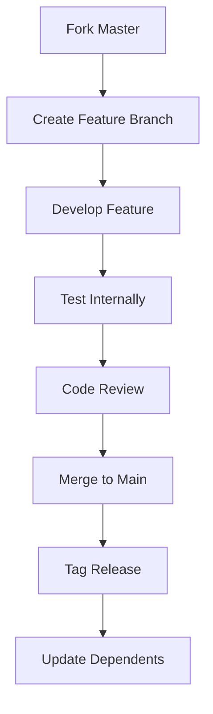
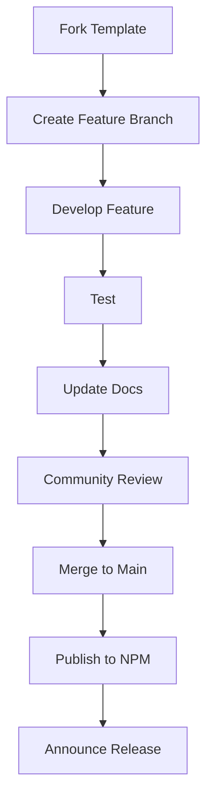
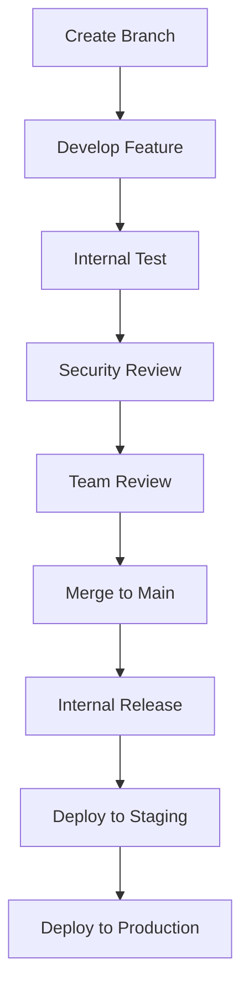

# uDosGo Framework Configuration Guide

## Universal Framework Master Configuration

This document defines the configuration for the universal master framework and child frameworks, including public templates vs. private user/wizard project configurations.

## Framework Hierarchy

```
┌─────────────────────────────────────────────────────────────────────────────┐
│                   uDosGo Framework Hierarchy                            │
├─────────────────┬─────────────────┬─────────────────┬─────────────────────────┐
│  Master         │  Child          │  Public         │    Private              │
│  Framework      │  Frameworks     │  Templates      │    User Projects        │
├─────────────────┼─────────────────┼─────────────────┼─────────────────────────┤
│ ~uDosGo/Home    │ ~Code/Apps/*    │ ~Templates/     │ ~Vault/Projects/        │
│ ~Code/Vendor/   │                 │ ~Examples/      │ ~Users/*/Projects/     │
│                 │                 │                 │                         │
└─────────────────┴─────────────────┴─────────────────┴─────────────────────────┘
```

## Master Framework Configuration

### 1. Core Framework (~uDosGo/Home)

**Location**: `~/uDosGo/Home/`
**Type**: Master Framework
**Access**: Private (internal development)
**Purpose**: Core home automation and rules engine

**Configuration**:
```json
{
  "framework": {
    "type": "master",
    "version": "1.0.0",
    "access": "private",
    "dependencies": [
      "~/Code/Vendor/AgentDigitalOK/Hivemind",
      "~/uDosGo/Connect",
      "~/uDosGo/Memory"
    ],
    "sharing": {
      "public": false,
      "template": false,
      "collaboration": "internal"
    }
  }
}
```

### 2. Hivemind Framework (~Code/Vendor/AgentDigitalOK/Hivemind)

**Location**: `~/Code/Vendor/AgentDigitalOK/Hivemind/`
**Type**: Master Framework
**Access**: Private (AgentDigitalOK internal)
**Purpose**: Multi-agent coordination system

**Configuration**:
```json
{
  "framework": {
    "type": "master",
    "version": "2.1.0",
    "access": "private",
    "dependencies": [
      "~/uDosGo/Connect",
      "~/uDosGo/Memory"
    ],
    "sharing": {
      "public": false,
      "template": false,
      "collaboration": "agents"
    }
  }
}
```

## Child Framework Configuration

### 1. Marksmith (~Code/Apps/Marksmith)

**Location**: `~/Code/Apps/Marksmith/`
**Type**: Child Framework
**Access**: Public Template
**Purpose**: Markdown processing application

**Configuration**:
```json
{
  "framework": {
    "type": "child",
    "version": "1.2.3",
    "access": "public",
    "template": true,
    "dependencies": [],
    "sharing": {
      "public": true,
      "template": true,
      "license": "MIT",
      "repository": "git@github.com:uDosGo/Marksmith.git",
      "collaboration": "community"
    }
  }
}
```

**Remote Sharing Configuration**:
```json
{
  "remote": {
    "public": true,
    "template": true,
    "distribution": "npm",
    "package": "@udosgo/marksmith",
    "registry": "https://registry.npmjs.org/",
    "documentation": "https://docs.udosgo.ai/marksmith",
    "examples": "https://github.com/uDosGo/marksmith-examples"
  }
}
```

### 2. McSnackbar (~Code/Apps/McSnackbar)

**Location**: `~/Code/Apps/McSnackbar/`
**Type**: Child Framework
**Access**: Public Template
**Purpose**: Notification system

**Configuration**:
```json
{
  "framework": {
    "type": "child",
    "version": "0.9.5",
    "access": "public",
    "template": true,
    "dependencies": [],
    "sharing": {
      "public": true,
      "template": true,
      "license": "Apache-2.0",
      "repository": "git@github.com:uDosGo/McSnackbar.git",
      "collaboration": "community"
    }
  }
}
```

**Remote Sharing Configuration**:
```json
{
  "remote": {
    "public": true,
    "template": true,
    "distribution": "npm",
    "package": "@udosgo/mcsnackbar",
    "registry": "https://registry.npmjs.org/",
    "documentation": "https://docs.udosgo.ai/mcsnackbar",
    "examples": "https://github.com/uDosGo/mcsnackbar-examples"
  }
}
```

## Public vs. Private Configuration

### Public Template Frameworks

**Characteristics**:
- Open source license (MIT, Apache, etc.)
- Community collaboration
- Public documentation
- Template repositories
- Example projects

**Configuration Pattern**:
```json
{
  "access": "public",
  "template": true,
  "license": "MIT",
  "collaboration": "community",
  "documentation": "public",
  "examples": "public"
}
```

### Private User/Wizard Projects

**Characteristics**:
- Internal use only
- Proprietary license
- Restricted access
- Internal documentation
- No public distribution

**Configuration Pattern**:
```json
{
  "access": "private",
  "template": false,
  "license": "proprietary",
  "collaboration": "internal",
  "documentation": "internal",
  "examples": "internal"
}
```

## Remote Sharing Configuration

### Public Template Distribution

**Marksmith Distribution**:
```json
{
  "distribution": {
    "npm": {
      "package": "@udosgo/marksmith",
      "version": "1.2.3",
      "registry": "https://registry.npmjs.org/",
      "access": "public",
      "tag": "latest"
    },
    "git": {
      "repository": "git@github.com:uDosGo/Marksmith.git",
      "branch": "main",
      "tag": "v1.2.3"
    },
    "docker": {
      "image": "udosgo/marksmith",
      "tag": "1.2.3",
      "registry": "ghcr.io"
    }
  }
}
```

**McSnackbar Distribution**:
```json
{
  "distribution": {
    "npm": {
      "package": "@udosgo/mcsnackbar",
      "version": "0.9.5",
      "registry": "https://registry.npmjs.org/",
      "access": "public",
      "tag": "latest"
    },
    "git": {
      "repository": "git@github.com:uDosGo/McSnackbar.git",
      "branch": "main",
      "tag": "v0.9.5"
    }
  }
}
```

### Private Project Distribution

**Internal Distribution**:
```json
{
  "distribution": {
    "internal": {
      "registry": "https://registry.udosgo.internal/",
      "access": "private",
      "requireAuth": true
    },
    "git": {
      "repository": "git@github.udosgo.internal:project/repo.git",
      "access": "private"
    }
  }
}
```

## Framework Configuration Files

### 1. Framework Configuration File Structure

**Location**: `framework.config.json`
**Format**: JSON
**Required**: Yes

**Example**:
```json
{
  "$schema": "https://udosgo.ai/schemas/framework/v1.json",
  "framework": {
    "name": "marksmith",
    "type": "child",
    "version": "1.2.3",
    "description": "Markdown processing framework",
    "author": "uDosGo Team",
    "license": "MIT",
    "homepage": "https://udosgo.ai/marksmith"
  },
  "configuration": {
    "access": "public",
    "template": true,
    "dependencies": [],
    "environment": {
      "node": ">=14.0.0",
      "npm": ">=7.0.0"
    }
  },
  "sharing": {
    "public": true,
    "template": true,
    "distribution": ["npm", "git"],
    "collaboration": "community"
  }
}
```

### 2. Remote Configuration File Structure

**Location**: `remote.config.json`
**Format**: JSON
**Required**: For public templates

**Example**:
```json
{
  "$schema": "https://udosgo.ai/schemas/remote/v1.json",
  "remote": {
    "npm": {
      "enabled": true,
      "package": "@udosgo/marksmith",
      "registry": "https://registry.npmjs.org/",
      "access": "public",
      "autopublish": true,
      "tag": "latest"
    },
    "git": {
      "enabled": true,
      "repository": "git@github.com:uDosGo/Marksmith.git",
      "branch": "main",
      "releases": true,
      "issues": true,
      "wiki": true
    },
    "docker": {
      "enabled": false,
      "image": "udosgo/marksmith",
      "registry": "ghcr.io",
      "autobuild": false
    }
  }
}
```

## Universal Framework Spine

### Spine Configuration

**Master Spine**:
```json
{
  "spine": {
    "version": "1.0",
    "components": [
      {
        "name": "Home",
        "path": "~/uDosGo/Home",
        "type": "master",
        "role": "core"
      },
      {
        "name": "Hivemind",
        "path": "~/Code/Vendor/AgentDigitalOK/Hivemind",
        "type": "master",
        "role": "coordination"
      }
    ],
    "dependencies": {
      "Home": ["Hivemind", "Connect", "Memory"],
      "Hivemind": ["Connect", "Memory"]
    }
  }
}
```

**Child Spine**:
```json
{
  "spine": {
    "version": "1.0",
    "components": [
      {
        "name": "Marksmith",
        "path": "~/Code/Apps/Marksmith",
        "type": "child",
        "role": "application",
        "public": true
      },
      {
        "name": "McSnackbar",
        "path": "~/Code/Apps/McSnackbar",
        "type": "child",
        "role": "application",
        "public": true
      }
    ],
    "dependencies": {
      "Marksmith": [],
      "McSnackbar": []
    }
  }
}
```

## Configuration Management

### 1. Environment Variables

**Universal Variables**:
```bash
# Core paths
export UDOSGO_ROOT="~/uDosGo"
export CODE_ROOT="~/Code"
export VAULT_ROOT="~/Vault"

# Framework paths
export MASTER_FRAMEWORK="~/uDosGo/Home"
export HIVEMIND_FRAMEWORK="~/Code/Vendor/AgentDigitalOK/Hivemind"
export CHILD_FRAMEWORKS="~/Code/Apps"

# Public/Private flags
export PUBLIC_TEMPLATES="~/Code/Apps"
export PRIVATE_PROJECTS="~/Vault/Projects"
```

### 2. Configuration Files

**File Locations**:
- Master: `~/uDosGo/Home/framework.config.json`
- Hivemind: `~/Code/Vendor/AgentDigitalOK/Hivemind/framework.config.json`
- Marksmith: `~/Code/Apps/Marksmith/framework.config.json`
- McSnackbar: `~/Code/Apps/McSnackbar/framework.config.json`

### 3. Version Management

**Versioning Strategy**:
- Master frameworks: `MAJOR.MINOR.PATCH`
- Child frameworks: `MAJOR.MINOR.PATCH`
- Public templates: `MAJOR.MINOR.PATCH`
- Private projects: `MAJOR.MINOR.PATCH-internal`

## Remote Sharing Setup

### 1. GitHub Configuration

**Public Template Setup**:
```bash
# Marksmith
git remote add origin git@github.com:uDosGo/Marksmith.git
git branch -M main
git push -u origin main

# McSnackbar
git remote add origin git@github.com:uDosGo/McSnackbar.git
git branch -M main
git push -u origin main
```

**Private Project Setup**:
```bash
# Internal repository
git remote add origin git@github.udosgo.internal:project/repo.git
git branch -M main
git push -u origin main
```

### 2. NPM Configuration

**Public Package Setup**:
```bash
# In package.json
{
  "name": "@udosgo/marksmith",
  "version": "1.2.3",
  "description": "Markdown processing framework",
  "main": "dist/index.js",
  "types": "dist/index.d.ts",
  "scripts": {
    "build": "tsc && rollup -c",
    "test": "jest",
    "lint": "eslint .",
    "prepublish": "npm run build",
    "prepare": "npm run build"
  },
  "keywords": ["markdown", "processing", "framework"],
  "author": "uDosGo Team",
  "license": "MIT",
  "repository": {
    "type": "git",
    "url": "git+https://github.com/uDosGo/Marksmith.git"
  },
  "bugs": {
    "url": "https://github.com/uDosGo/Marksmith/issues"
  },
  "homepage": "https://udosgo.ai/marksmith#readme"
}
```

### 3. CI/CD Configuration

**GitHub Actions**:
```yaml
# .github/workflows/release.yml
name: Release

on:
  push:
    tags:
      - 'v*'

jobs:
  publish:
    runs-on: ubuntu-latest
    steps:
      - uses: actions/checkout@v3
      - uses: actions/setup-node@v3
        with:
          node-version: 16
      - run: npm ci
      - run: npm test
      - run: npm run build
      - run: npm publish
        env:
          NODE_AUTH_TOKEN: ${{ secrets.NPM_TOKEN }}
```

## Framework Development Workflow

### 1. Master Framework Development

**Workflow**:


### 2. Child Framework Development

**Public Template Workflow**:


### 3. Private Project Development

**Internal Workflow**:


## Configuration Checklist

### Master Framework Setup
- [ ] Create `framework.config.json`
- [ ] Define dependencies
- [ ] Set access to private
- [ ] Configure internal sharing
- [ ] Set up CI/CD

### Child Framework Setup
- [ ] Create `framework.config.json`
- [ ] Define public/private status
- [ ] Configure remote sharing
- [ ] Set up package.json
- [ ] Configure CI/CD
- [ ] Create documentation

### Public Template Setup
- [ ] Create `framework.config.json`
- [ ] Set access to public
- [ ] Configure npm distribution
- [ ] Set up GitHub repository
- [ ] Create examples
- [ ] Write documentation
- [ ] Configure CI/CD

### Private Project Setup
- [ ] Create `framework.config.json`
- [ ] Set access to private
- [ ] Configure internal registry
- [ ] Set up internal repository
- [ ] Configure CI/CD
- [ ] Set up security scans

## Best Practices

### 1. Configuration Management
- Use JSON schema validation
- Version all configurations
- Document all settings
- Use environment variables
- Keep secrets out of config

### 2. Remote Sharing
- Use semantic versioning
- Sign releases
- Document changes
- Maintain changelog
- Test before release

### 3. Security
- Never commit secrets
- Use .gitignore properly
- Scan dependencies
- Review permissions
- Rotate credentials

### 4. Collaboration
- Use pull requests
- Require reviews
- Document changes
- Update documentation
- Communicate releases

## Troubleshooting

### Common Issues

#### 1. Configuration Errors
```bash
# Validate configuration
node -e "const config = require('./framework.config.json'); console.log('Valid');"
```

#### 2. Remote Sync Issues
```bash
# Check remote
git remote -v

# Fix remote
git remote set-url origin git@github.com:user/repo.git
```

#### 3. Dependency Conflicts
```bash
# Check dependencies
npm ls

# Update dependencies
npm update
```

#### 4. Permission Issues
```bash
# Check permissions
ls -la

# Fix permissions
chmod 644 framework.config.json
```

## Framework Examples

### 1. Public Template Example (Marksmith)

**File**: `~/Code/Apps/Marksmith/framework.config.json`
```json
{
  "$schema": "https://udosgo.ai/schemas/framework/v1.json",
  "framework": {
    "name": "marksmith",
    "type": "child",
    "version": "1.2.3",
    "description": "Markdown processing framework for uDosGo ecosystem",
    "author": "uDosGo Team <team@udosgo.ai>",
    "license": "MIT",
    "homepage": "https://udosgo.ai/marksmith",
    "repository": "https://github.com/uDosGo/Marksmith",
    "keywords": ["markdown", "processing", "framework", "udosgo"]
  },
  "configuration": {
    "access": "public",
    "template": true,
    "dependencies": [],
    "environment": {
      "node": ">=14.0.0",
      "npm": ">=7.0.0"
    },
    "quality": {
      "testCoverage": ">=90%",
      "linting": "eslint",
      "formatting": "prettier"
    }
  },
  "sharing": {
    "public": true,
    "template": true,
    "distribution": ["npm", "git"],
    "collaboration": "community",
    "support": "community",
    "license": "MIT"
  },
  "remote": {
    "npm": {
      "package": "@udosgo/marksmith",
      "registry": "https://registry.npmjs.org/",
      "autopublish": true
    },
    "git": {
      "repository": "git@github.com:uDosGo/Marksmith.git",
      "branch": "main",
      "releases": true
    }
  }
}
```

### 2. Private Project Example

**File**: `~/Vault/Projects/InternalProject/framework.config.json`
```json
{
  "$schema": "https://udosgo.ai/schemas/framework/v1.json",
  "framework": {
    "name": "internal-project",
    "type": "private",
    "version": "0.1.0-internal",
    "description": "Internal project for uDosGo ecosystem",
    "author": "uDosGo Team <team@udosgo.ai>",
    "license": "Proprietary",
    "homepage": "https://internal.udosgo.ai/projects/internal-project"
  },
  "configuration": {
    "access": "private",
    "template": false,
    "dependencies": [
      "~/uDosGo/Home",
      "~/Code/Vendor/AgentDigitalOK/Hivemind"
    ],
    "environment": {
      "node": ">=14.0.0",
      "python": ">=3.8.0"
    },
    "quality": {
      "testCoverage": ">=95%",
      "security": "required",
      "review": "required"
    }
  },
  "sharing": {
    "public": false,
    "template": false,
    "distribution": ["internal"],
    "collaboration": "internal",
    "support": "internal",
    "license": "Proprietary"
  },
  "remote": {
    "internal": {
      "registry": "https://registry.udosgo.internal/",
      "repository": "git@github.udosgo.internal:projects/internal-project.git"
    }
  }
}
```

## Conclusion

This document provides comprehensive configuration guidelines for the uDosGo framework ecosystem. Following these configurations ensures:

- **Consistent framework structure** across all components
- **Clear separation** between public templates and private projects
- **Proper remote sharing** configuration
- **Secure development** practices
- **Scalable growth** with well-defined patterns

**Status**: Complete ✅
**Date**: April 23, 2024
**Version**: 1.0
**Maintainer**: Framework Architecture Team
