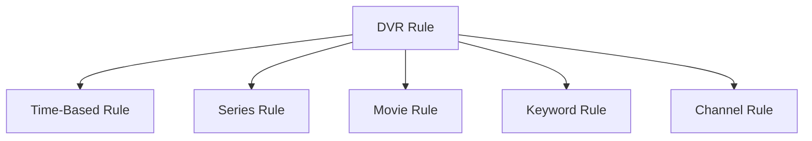
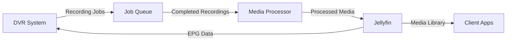

# DVR System Design for uHomeNest

**Status**: Draft
**Version**: 1.0
**Date**: 2024-04-17

This document outlines the design for the Digital Video Recorder (DVR) system in uHomeNest, including rule models, scheduling backend, and integration with the media processing pipeline.

## Overview

The DVR system enables uHomeNest to record television programs, movies, and other video content according to user-defined rules. It integrates with Jellyfin for media management and provides a robust scheduling and processing backend.

## System Components

### 1. DVR Rule Model

The core of the DVR system is the rule model that defines what to record and when.

#### Rule Types



**Time-Based Rule**: Record at specific times/dates
**Series Rule**: Record all episodes of a series
**Movie Rule**: Record specific movies when available
**Keyword Rule**: Record content matching keywords
**Channel Rule**: Record everything on a specific channel

#### Rule Data Model

```python
class DVRRule(BaseModel):
    """Base DVR Rule Model"""
    rule_id: UUID4
    rule_name: str
    rule_type: DVRRuleType  # time-based, series, movie, keyword, channel
    created_at: datetime
    updated_at: datetime
    enabled: bool = True
    priority: int = 1  # 1-5, 1 being highest
    max_episodes: Optional[int] = None
    min_disk_space: int = 1024  # MB
    keep_until: Optional[datetime] = None
    quality_profile: str = "hd"  # sd, hd, 4k
    
class TimeBasedRule(DVRRule):
    """Time-based recording rule"""
    start_time: datetime
    end_time: datetime
    recurrence: Optional[RecurrencePattern] = None
    channel_id: str
    program_title: Optional[str] = None
    
class SeriesRule(DVRRule):
    """Series recording rule"""
    series_id: str  # TMDB or TVDB ID
    series_title: str
    season_numbers: Optional[List[int]] = None
    include_specials: bool = False
    avoid_duplicates: bool = True
    
class MovieRule(DVRRule):
    """Movie recording rule"""
    movie_id: str  # TMDB ID
    movie_title: str
    year: Optional[int] = None
    
class KeywordRule(DVRRule):
    """Keyword-based recording rule"""
    keywords: List[str]
    require_all_keywords: bool = False
    channels: Optional[List[str]] = None
    time_ranges: Optional[List[TimeRange]] = None
    
class ChannelRule(DVRRule):
    """Channel-based recording rule"""
    channel_id: str
    channel_name: str
    time_ranges: Optional[List[TimeRange]] = None
```

### 2. Schedule Backend

The schedule backend is responsible for managing recording schedules and coordinating with the job queue.

#### Schedule Manager

```python
class ScheduleManager:
    def __init__(self, rule_store: RuleStore, job_queue: JobQueue):
        self.rule_store = rule_store
        self.job_queue = job_queue
        self.scheduler = BackgroundScheduler()
        
    def add_rule(self, rule: DVRRule) -> bool:
        """Add a new DVR rule to the system"""
        # Validate rule
        if not self._validate_rule(rule):
            return False
            
        # Store rule
        self.rule_store.save(rule)
        
        # Schedule rule
        self._schedule_rule(rule)
        
        return True
    
    def _schedule_rule(self, rule: DVRRule):
        """Schedule a rule based on its type"""
        if rule.rule_type == DVRRuleType.TIME_BASED:
            self._schedule_time_based_rule(rule)
        elif rule.rule_type == DVRRuleType.SERIES:
            self._schedule_series_rule(rule)
        # ... other rule types
    
    def _schedule_time_based_rule(self, rule: TimeBasedRule):
        """Schedule a time-based rule"""
        if rule.recurrence:
            # Handle recurring schedule
            self.scheduler.add_job(
                self._create_recording_job,
                rule.recurrence.to_cron_trigger(),
                args=[rule.rule_id],
                id=str(rule.rule_id)
            )
        else:
            # One-time schedule
            self.scheduler.add_job(
                self._create_recording_job,
                'date',
                run_date=rule.start_time,
                args=[rule.rule_id],
                id=str(rule.rule_id)
            )
    
    def _create_recording_job(self, rule_id: UUID):
        """Create a recording job for the given rule"""
        rule = self.rule_store.get(rule_id)
        if rule and rule.enabled:
            job = RecordingJob(
                rule_id=rule_id,
                priority=rule.priority,
                quality_profile=rule.quality_profile
            )
            self.job_queue.add_job(job)
```

### 3. Job Queue System

The job queue handles the actual recording and processing tasks.

#### Job Types

```mermaid
classDiagram
    class Job
    Job : +job_id: UUID
    Job : +job_type: JobType
    Job : +status: JobStatus
    Job : +created_at: datetime
    Job : +updated_at: datetime
    Job : +priority: int
    
    class RecordingJob
    RecordingJob --|> Job
    RecordingJob : +rule_id: UUID
    RecordingJob : +channel_id: str
    RecordingJob : +start_time: datetime
    RecordingJob : +end_time: datetime
    RecordingJob : +quality_profile: str
    
    class PostProcessingJob
    PostProcessingJob --|> Job
    PostProcessingJob : +recording_id: UUID
    PostProcessingJob : +tasks: List[PostProcessingTask]
    
    class CleanupJob
    CleanupJob --|> Job
    CleanupJob : +recording_id: UUID
    CleanupJob : +keep_until: datetime
```

#### Job Queue Implementation

```python
class JobQueue:
    def __init__(self, max_workers: int = 4):
        self.queue = PriorityQueue()
        self.workers = max_workers
        self.active_jobs = {}
        self.completed_jobs = []
        self.failed_jobs = []
        
    def add_job(self, job: Job):
        """Add a job to the queue"""
        # Assign priority (lower number = higher priority)
        priority = job.priority
        self.queue.put((priority, job.job_id, job))
        
    def process_jobs(self):
        """Process jobs in the queue"""
        while not self.queue.empty() and len(self.active_jobs) < self.workers:
            priority, job_id, job = self.queue.get()
            
            if job_id not in self.active_jobs:
                self.active_jobs[job_id] = job
                self._execute_job(job)
    
    def _execute_job(self, job: Job):
        """Execute a job based on its type"""
        try:
            job.status = JobStatus.RUNNING
            job.updated_at = datetime.now()
            
            if job.job_type == JobType.RECORDING:
                self._execute_recording_job(job)
            elif job.job_type == JobType.POST_PROCESSING:
                self._execute_post_processing_job(job)
            elif job.job_type == JobType.CLEANUP:
                self._execute_cleanup_job(job)
            
            job.status = JobStatus.COMPLETED
            self.completed_jobs.append(job)
            
        except Exception as e:
            job.status = JobStatus.FAILED
            job.error_message = str(e)
            self.failed_jobs.append(job)
        
        finally:
            del self.active_jobs[job.job_id]
    
    def _execute_recording_job(self, job: RecordingJob):
        """Execute a recording job"""
        # Get channel information
        channel = self._get_channel_info(job.channel_id)
        
        # Set up recording
        recorder = self._create_recorder(channel)
        
        # Start recording
        recording_id = recorder.start_recording(
            start_time=job.start_time,
            end_time=job.end_time,
            quality_profile=job.quality_profile
        )
        
        # Create recording metadata
        recording = Recording(
            recording_id=recording_id,
            rule_id=job.rule_id,
            channel_id=job.channel_id,
            start_time=job.start_time,
            end_time=job.end_time,
            status=RecordingStatus.RECORDING
        )
        
        # Store recording metadata
        self._store_recording(recording)
        
        # Schedule post-processing
        self._schedule_post_processing(recording_id)
```

### 4. Integration with Jellyfin

The DVR system integrates with Jellyfin for media management and EPG (Electronic Program Guide) data.

#### Jellyfin Integration Architecture



#### Jellyfin Client

```python
class JellyfinClient:
    def __init__(self, base_url: str, api_key: str):
        self.base_url = base_url
        self.api_key = api_key
        self.session = requests.Session()
        self.session.headers.update({
            'X-Emby-Token': self.api_key,
            'Content-Type': 'application/json'
        })
    
    def get_epg_data(self, start_date: datetime, end_date: datetime) -> List[Program]:
        """Get Electronic Program Guide data"""
        params = {
            'startDate': start_date.isoformat(),
            'endDate': end_date.isoformat()
        }
        response = self.session.get(f"{self.base_url}/LiveTv/Programs", params=params)
        response.raise_for_status()
        return [Program(**program) for program in response.json()]
    
    def add_recording(self, recording: Recording) -> bool:
        """Add a recording to Jellyfin"""
        data = {
            'ChannelId': recording.channel_id,
            'ProgramId': recording.program_id,
            'StartDate': recording.start_time.isoformat(),
            'EndDate': recording.end_time.isoformat(),
            'Name': recording.title,
            'Overview': recording.description
        }
        response = self.session.post(f"{self.base_url}/LiveTv/Recordings", json=data)
        return response.status_code == 200
    
    def update_recording_status(self, recording_id: str, status: str) -> bool:
        """Update recording status in Jellyfin"""
        data = {'Status': status}
        response = self.session.post(
            f"{self.base_url}/LiveTv/Recordings/{recording_id}/Status",
            json=data
        )
        return response.status_code == 200
```

### 5. Database Schema

#### SQL Schema for DVR System

```sql
-- DVR Rules Table
CREATE TABLE dvr_rules (
    rule_id UUID PRIMARY KEY,
    rule_name VARCHAR(255) NOT NULL,
    rule_type VARCHAR(50) NOT NULL,
    created_at TIMESTAMP NOT NULL,
    updated_at TIMESTAMP NOT NULL,
    enabled BOOLEAN DEFAULT TRUE,
    priority INTEGER DEFAULT 1,
    max_episodes INTEGER,
    min_disk_space INTEGER DEFAULT 1024,
    keep_until TIMESTAMP,
    quality_profile VARCHAR(20) DEFAULT 'hd',
    
    -- Type-specific fields (JSON for flexibility)
    rule_data JSONB NOT NULL,
    
    CONSTRAINT chk_priority CHECK (priority BETWEEN 1 AND 5),
    CONSTRAINT chk_quality CHECK (quality_profile IN ('sd', 'hd', '4k'))
);

-- Recordings Table
CREATE TABLE recordings (
    recording_id UUID PRIMARY KEY,
    rule_id UUID REFERENCES dvr_rules(rule_id),
    channel_id VARCHAR(100) NOT NULL,
    program_id VARCHAR(100),
    title VARCHAR(255) NOT NULL,
    description TEXT,
    start_time TIMESTAMP NOT NULL,
    end_time TIMESTAMP NOT NULL,
    status VARCHAR(50) NOT NULL,
    file_path VARCHAR(512),
    file_size BIGINT,
    created_at TIMESTAMP NOT NULL,
    updated_at TIMESTAMP NOT NULL,
    
    CONSTRAINT chk_status CHECK (status IN ('scheduled', 'recording', 'completed', 'failed', 'cancelled'))
);

-- Recording Files Table
CREATE TABLE recording_files (
    file_id UUID PRIMARY KEY,
    recording_id UUID REFERENCES recordings(recording_id),
    file_path VARCHAR(512) NOT NULL,
    file_size BIGINT NOT NULL,
    file_hash VARCHAR(128),
    format VARCHAR(50),
    duration INTEGER,
    width INTEGER,
    height INTEGER,
    bitrate INTEGER,
    created_at TIMESTAMP NOT NULL
);

-- Job Queue Table
CREATE TABLE job_queue (
    job_id UUID PRIMARY KEY,
    job_type VARCHAR(50) NOT NULL,
    status VARCHAR(50) NOT NULL,
    priority INTEGER NOT NULL,
    created_at TIMESTAMP NOT NULL,
    updated_at TIMESTAMP,
    started_at TIMESTAMP,
    completed_at TIMESTAMP,
    error_message TEXT,
    
    -- Job-specific data
    job_data JSONB NOT NULL,
    
    CONSTRAINT chk_job_status CHECK (status IN ('queued', 'running', 'completed', 'failed', 'cancelled'))
);

-- Create indexes for performance
CREATE INDEX idx_dvr_rules_enabled ON dvr_rules(enabled);
CREATE INDEX idx_dvr_rules_priority ON dvr_rules(priority);
CREATE INDEX idx_recordings_rule_id ON recordings(rule_id);
CREATE INDEX idx_recordings_status ON recordings(status);
CREATE INDEX idx_recordings_start_time ON recordings(start_time);
CREATE INDEX idx_job_queue_status ON job_queue(status);
CREATE INDEX idx_job_queue_priority ON job_queue(priority);
```

### 6. API Endpoints

#### REST API for DVR System

```http
# DVR Rules
POST   /api/dvr/rules              # Create a new DVR rule
GET    /api/dvr/rules              # List all DVR rules
GET    /api/dvr/rules/{rule_id}    # Get specific rule
PUT    /api/dvr/rules/{rule_id}    # Update rule
DELETE /api/dvr/rules/{rule_id}    # Delete rule

# Recordings
GET    /api/dvr/recordings         # List all recordings
GET    /api/dvr/recordings/{recording_id}  # Get specific recording
DELETE /api/dvr/recordings/{recording_id}  # Delete recording

# Schedule
GET    /api/dvr/schedule           # Get current schedule
POST   /api/dvr/schedule/refresh   # Refresh schedule

# Jobs
GET    /api/dvr/jobs               # List all jobs
GET    /api/dvr/jobs/{job_id}      # Get specific job
POST   /api/dvr/jobs/{job_id}/cancel  # Cancel job
```

### 7. Error Handling and Recovery

#### Error Scenarios and Recovery Strategies

| Error Scenario | Detection | Recovery Strategy |
|---------------|-----------|-------------------|
| Disk full | Monitor free space before recording | Cancel low-priority recordings, notify user |
| Tuner unavailable | Check tuner status before recording | Retry with different tuner, reschedule |
| Network failure | Connection timeout | Retry with exponential backoff |
| Jellyfin unavailable | API connection failure | Queue recordings locally, sync when available |
| Rule conflict | Schedule overlap detection | Notify user, suggest resolution |
| Post-processing failure | Job status monitoring | Retry processing, notify user |

#### Error Handling Implementation

```python
class DVRErrorHandler:
    def __init__(self, notification_service: NotificationService):
        self.notification_service = notification_service
        self.max_retries = 3
    
    def handle_error(self, error: DVRError):
        """Handle DVR errors with appropriate recovery"""
        
        # Log the error
        self._log_error(error)
        
        # Notify user if critical
        if error.severity >= ErrorSeverity.HIGH:
            self._notify_user(error)
        
        # Apply recovery strategy
        self._apply_recovery(error)
    
    def _apply_recovery(self, error: DVRError):
        """Apply appropriate recovery strategy"""
        
        if error.error_type == DVRErrorType.DISK_FULL:
            self._handle_disk_full(error)
        
        elif error.error_type == DVRErrorType.TUNER_UNAVAILABLE:
            self._handle_tuner_unavailable(error)
        
        elif error.error_type == DVRErrorType.NETWORK_FAILURE:
            self._handle_network_failure(error)
        
        # ... other error types
    
    def _handle_disk_full(self, error: DVRError):
        """Handle disk full error"""
        # Cancel low-priority recordings
        low_priority_recordings = self._get_low_priority_recordings()
        for recording in low_priority_recordings:
            recording.cancel()
        
        # Notify user
        self.notification_service.send(
            "Disk Full - DVR Actions Taken",
            f"Cancelled {len(low_priority_recordings)} low-priority recordings"
        )
        
        # Retry the failed operation
        if error.retry_count < self.max_retries:
            error.retry()
```

## Implementation Plan

### Phase 1: Core Infrastructure (4-6 weeks)
- [ ] Implement DVR rule data model and storage
- [ ] Build schedule manager with basic scheduling capabilities
- [ ] Create job queue system with worker management
- [ ] Implement Jellyfin integration layer
- [ ] Set up database schema and migrations

### Phase 2: Advanced Features (3-4 weeks)
- [ ] Add conflict detection and resolution
- [ ] Implement priority-based scheduling
- [ ] Add disk space management
- [ ] Implement error handling and recovery
- [ ] Add notification system

### Phase 3: Integration and Testing (2-3 weeks)
- [ ] Integrate with existing uHomeNest media system
- [ ] Implement REST API endpoints
- [ ] Write comprehensive tests
- [ ] Perform performance testing
- [ ] User acceptance testing

## Success Metrics

### Functional Requirements
- ✅ Support all rule types (time-based, series, movie, keyword, channel)
- ✅ Reliable scheduling with conflict detection
- ✅ Integration with Jellyfin for media management
- ✅ Robust error handling and recovery
- ✅ Priority-based job processing

### Performance Requirements
- 📊 Schedule calculation: <1 second for 100 rules
- 📊 Job processing: 95% of jobs completed within expected time
- 📊 API response time: <200ms for 95% of requests
- 📊 Database queries: <50ms for 95% of queries

### Quality Requirements
- 🔍 Test coverage: 90%+ for core components
- 🐛 Critical bug rate: <1 per 1000 recordings
- 📦 Successful recording rate: 99%+ for valid schedules
- 💾 Disk space utilization: <90% of available space

## Future Enhancements

### Potential Future Features
1. **Machine Learning Recommendations**: Suggest recordings based on viewing habits
2. **Automatic Commercial Detection**: Skip commercials in recordings
3. **Cloud Backup**: Optional cloud storage for important recordings
4. **Multi-Device Sync**: Synchronize recordings across multiple uHomeNest instances
5. **Advanced Conflict Resolution**: AI-based scheduling optimization

## Conclusion

This DVR system design provides a comprehensive foundation for recording functionality in uHomeNest. The modular architecture allows for flexible rule types, robust scheduling, and integration with the existing media ecosystem. The phased implementation plan ensures steady progress while maintaining system stability.

**Next Steps**:
1. Implement core data models and storage
2. Build schedule manager with basic functionality
3. Create job queue system
4. Integrate with Jellyfin
5. Develop REST API endpoints