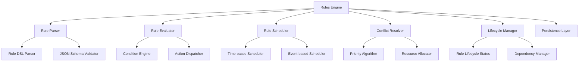
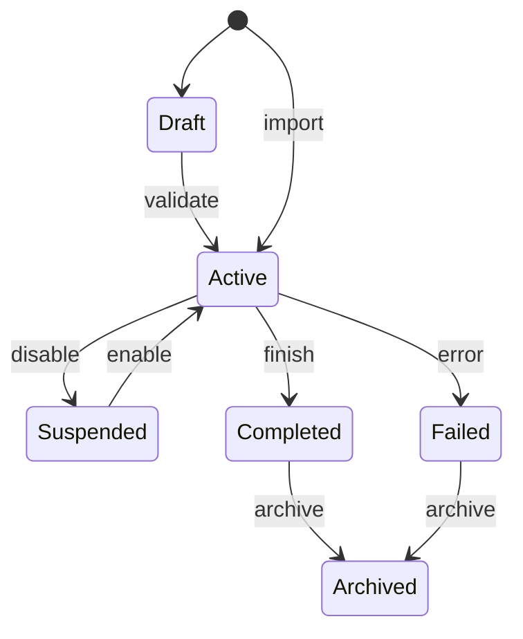
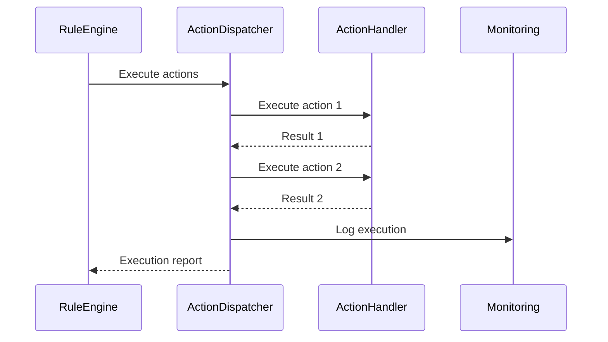
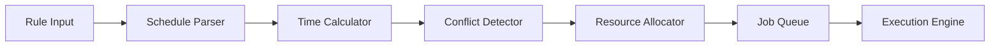

# uHOME Rules Engine Specification

## Overview

The uHOME Rules Engine is a powerful, extensible system for managing recording rules, automation rules, and lifecycle management within the uHOME ecosystem. This specification defines the architecture, components, and behavior of the enhanced rules engine.

## 1. Architecture

### 1.1 Core Components



### 1.2 Data Flow

1. **Rule Creation**: Rules are created via API or GUI
2. **Validation**: Rules are parsed and validated
3. **Storage**: Valid rules are persisted
4. **Evaluation**: Rules are evaluated against current conditions
5. **Scheduling**: Valid rules are scheduled for execution
6. **Execution**: Rules trigger actions at scheduled times
7. **Monitoring**: Rule execution is monitored and logged
8. **Lifecycle**: Rules transition through lifecycle states

## 2. Rule Types

### 2.1 DVR Recording Rules

#### 2.1.1 Time-Based Rules
- Record specific time slots on specific channels
- Support for recurrence patterns (daily, weekly, monthly, custom)
- Time zone awareness

#### 2.1.2 Series Rules
- Record all episodes of a series
- Season and episode filtering
- Special episode handling
- Duplicate detection

#### 2.1.3 Movie Rules
- Record specific movies
- Year and title matching
- Quality profile selection

#### 2.1.4 Keyword Rules
- Record programs matching keywords
- Boolean keyword logic (AND/OR)
- Channel filtering
- Time range restrictions

#### 2.1.5 Channel Rules
- Record all content from specific channels
- Time range filtering
- Quality profile selection

### 2.2 Automation Rules

#### 2.2.1 Event-Based Rules
- Trigger actions based on system events
- Support for complex event patterns
- Event filtering and transformation

#### 2.2.2 Conditional Rules
- IF-THEN-ELSE logic
- Complex condition evaluation
- Multiple action support

#### 2.2.3 Lifecycle Rules
- Manage rule lifecycle transitions
- Dependency-based activation
- Time-based expiration

## 3. Rule Structure

### 3.1 Core Rule Model

```json
{
  "rule_id": "string",
  "rule_name": "string",
  "rule_type": "enum",
  "description": "string",
  "priority": "integer",
  "enabled": "boolean",
  "created_at": "datetime",
  "updated_at": "datetime",
  "created_by": "string",
  "updated_by": "string",
  "tags": ["string"],
  "metadata": {},
  "lifecycle_state": "enum",
  "dependencies": ["string"],
  "conditions": [],
  "actions": [],
  "schedule": {},
  "conflict_resolution": {},
  "quality_profile": {},
  "retention_policy": {},
  "notification_settings": {}
}
```

### 3.2 Rule Lifecycle States



## 4. Rule Evaluation Engine

### 4.1 Condition Evaluation

#### 4.1.1 Supported Operators
- Comparison: `=`, `!=`, `>`, `<`, `>=`, `<=`
- Logical: `AND`, `OR`, `NOT`
- Membership: `IN`, `NOT IN`
- Pattern matching: `MATCHES`, `CONTAINS`
- Temporal: `BEFORE`, `AFTER`, `DURING`

#### 4.1.2 Context Variables
- System state variables
- Environmental variables
- Rule metadata
- External data sources

### 4.2 Action Dispatch

#### 4.2.1 Action Types
- Recording actions
- Notification actions
- System actions
- External API calls
- Script execution

#### 4.2.2 Action Execution Model


## 5. Scheduling System

### 5.1 Scheduling Architecture



### 5.2 Scheduling Algorithms

#### 5.2.1 Time-Based Scheduling
- Cron-like expressions
- Recurrence patterns
- Time zone handling
- Daylight saving time awareness

#### 5.2.2 Event-Based Scheduling
- Event pattern matching
- Event filtering
- Event transformation
- Event correlation

### 5.3 Conflict Resolution

#### 5.3.1 Conflict Detection
- Time overlap detection
- Resource contention detection
- Priority-based conflict identification

#### 5.3.2 Resolution Strategies
1. **Priority-based**: Higher priority rules win
2. **Manual override**: User-specified resolution
3. **Resource allocation**: Dynamic resource assignment
4. **Time shifting**: Adjust recording times
5. **Quality adjustment**: Reduce quality to fit multiple recordings

## 6. Performance Optimization

### 6.1 Indexing Strategies
- Rule type indexing
- Time-based indexing
- Channel-based indexing
- Priority-based indexing

### 6.2 Caching Strategies
- Rule evaluation caching
- Schedule computation caching
- Conflict resolution caching
- External data caching

### 6.3 Parallel Processing
- Parallel rule evaluation
- Concurrent action execution
- Distributed scheduling
- Load balancing

## 7. Persistence Layer

### 7.1 Storage Requirements
- Rule definitions
- Rule execution history
- Schedule data
- Conflict resolution logs
- Performance metrics

### 7.2 Data Model

```sql
CREATE TABLE rules (
    rule_id VARCHAR(64) PRIMARY KEY,
    rule_name VARCHAR(255) NOT NULL,
    rule_type VARCHAR(50) NOT NULL,
    description TEXT,
    priority INT DEFAULT 3,
    enabled BOOLEAN DEFAULT TRUE,
    created_at TIMESTAMP NOT NULL,
    updated_at TIMESTAMP NOT NULL,
    created_by VARCHAR(64),
    updated_by VARCHAR(64),
    lifecycle_state VARCHAR(20) DEFAULT 'draft',
    rule_data JSONB NOT NULL,
    metadata JSONB,
    tags VARCHAR(255)[]
);

CREATE TABLE rule_execution_history (
    execution_id VARCHAR(64) PRIMARY KEY,
    rule_id VARCHAR(64) NOT NULL,
    execution_time TIMESTAMP NOT NULL,
    status VARCHAR(20) NOT NULL,
    result JSONB,
    error_message TEXT,
    duration_ms INT,
    FOREIGN KEY (rule_id) REFERENCES rules(rule_id)
);

CREATE TABLE schedule_entries (
    entry_id VARCHAR(64) PRIMARY KEY,
    rule_id VARCHAR(64) NOT NULL,
    scheduled_time TIMESTAMP NOT NULL,
    actual_time TIMESTAMP,
    status VARCHAR(20) NOT NULL,
    channel_id VARCHAR(64),
    program_id VARCHAR(64),
    conflict_id VARCHAR(64),
    FOREIGN KEY (rule_id) REFERENCES rules(rule_id)
);

CREATE TABLE conflicts (
    conflict_id VARCHAR(64) PRIMARY KEY,
    detection_time TIMESTAMP NOT NULL,
    resolution_time TIMESTAMP,
    status VARCHAR(20) NOT NULL,
    resolution_type VARCHAR(20),
    affected_rules VARCHAR(64)[],
    resolution_data JSONB
);
```

## 8. API Design

### 8.1 REST API Endpoints

#### 8.1.1 Rule Management
- `POST /api/rules` - Create new rule
- `GET /api/rules` - List all rules
- `GET /api/rules/{id}` - Get specific rule
- `PUT /api/rules/{id}` - Update rule
- `DELETE /api/rules/{id}` - Delete rule
- `POST /api/rules/{id}/enable` - Enable rule
- `POST /api/rules/{id}/disable` - Disable rule
- `POST /api/rules/{id}/execute` - Manual execution

#### 8.1.2 Schedule Management
- `GET /api/schedule` - Get current schedule
- `POST /api/schedule/refresh` - Refresh schedule
- `GET /api/schedule/conflicts` - Get conflicts
- `POST /api/schedule/conflicts/{id}/resolve` - Resolve conflict

#### 8.1.3 Rule Evaluation
- `POST /api/rules/evaluate` - Evaluate rule conditions
- `GET /api/rules/{id}/history` - Get execution history
- `GET /api/rules/{id}/status` - Get rule status

### 8.2 WebSocket API
- Real-time rule execution notifications
- Schedule change events
- Conflict detection alerts
- Rule lifecycle transitions

## 9. Security Considerations

### 9.1 Authentication & Authorization
- Role-based access control
- Rule ownership verification
- Action permission validation
- Audit logging

### 9.2 Data Protection
- Rule data encryption
- Secure storage of sensitive rules
- Access control for rule execution
- Input validation and sanitization

## 10. Monitoring and Observability

### 10.1 Metrics
- Rule evaluation rate
- Schedule computation time
- Conflict detection rate
- Execution success rate
- Resource utilization

### 10.2 Logging
- Rule creation/modification
- Schedule changes
- Conflict resolution
- Execution events
- Error conditions

### 10.3 Alerting
- Rule evaluation failures
- Schedule computation errors
- Unresolved conflicts
- Resource exhaustion
- Performance degradation

## 11. Implementation Plan

### 11.1 Phase 1: Core Engine
- Rule parser implementation
- Basic evaluation engine
- Simple scheduler
- In-memory storage

### 11.2 Phase 2: Advanced Features
- Conflict resolution system
- Lifecycle management
- Persistence layer
- Performance optimization

### 11.3 Phase 3: Integration
- API implementation
- GUI integration
- Monitoring setup
- Security hardening

### 11.4 Phase 4: Testing & Deployment
- Unit testing
- Integration testing
- Performance testing
- User acceptance testing
- Production deployment

## 12. Future Enhancements

### 12.1 Machine Learning Integration
- Predictive scheduling
- Intelligent conflict resolution
- Rule recommendation engine
- Anomaly detection

### 12.2 Distributed Architecture
- Clustered rule evaluation
- Distributed scheduling
- Horizontal scaling
- Fault tolerance

### 12.3 Advanced Features
- Rule versioning and rollback
- Rule templates and inheritance
- Rule testing sandbox
- Rule import/export
- Rule marketplace

## Appendix A: Rule DSL Specification

### A.1 Basic Syntax
```
rule "rule_name" {
    type: "time-based"
    priority: 3
    enabled: true
    
    conditions {
        time: "18:30-19:00"
        channel: "News HD"
        days: ["mon", "tue", "wed", "thu", "fri"]
    }
    
    actions {
        record {
            quality: "hd"
            keep_until: "30d"
        }
        notify {
            method: "email"
            template: "recording_started"
        }
    }
}
```

### A.2 Advanced Syntax
```
rule "complex_rule" {
    type: "conditional"
    priority: 1
    
    conditions {
        and {
            time: "20:00-22:00"
            or {
                channel: "Movie Channel"
                channel: "Premium Movies"
            }
            not {
                title: contains("News")
            }
        }
    }
    
    actions {
        sequence {
            record {
                quality: "uhd"
                keep_until: "90d"
            }
            transcode {
                format: "h265"
                resolution: "1080p"
            }
            notify {
                method: "push"
                devices: ["phone", "tablet"]
            }
        }
    }
    
    conflict_resolution {
        strategy: "priority"
        fallback: "quality_reduction"
    }
}
```

## Appendix B: Performance Benchmarks

### B.1 Target Performance Metrics
- Rule evaluation: < 10ms per rule
- Schedule computation: < 100ms for 1000 rules
- Conflict detection: < 50ms for 100 rules
- API response time: < 200ms for 95% of requests

### B.2 Scalability Targets
- Support 10,000+ active rules
- Handle 100+ concurrent rule evaluations
- Process 1,000+ schedule entries per minute
- Manage 50+ simultaneous recordings

## Appendix C: Error Codes

### C.1 Rule Processing Errors
- `RULE_PARSE_ERROR`: Invalid rule syntax
- `RULE_VALIDATION_ERROR`: Rule validation failed
- `RULE_CONFLICT_ERROR`: Unresolvable rule conflict
- `RULE_EXECUTION_ERROR`: Rule execution failed
- `RULE_LIFECYCLE_ERROR`: Invalid lifecycle transition

### C.2 Scheduling Errors
- `SCHEDULE_COMPUTATION_ERROR`: Schedule computation failed
- `SCHEDULE_CONFLICT_ERROR`: Schedule conflict detected
- `SCHEDULE_RESOURCE_ERROR`: Insufficient resources
- `SCHEDULE_TIME_ERROR`: Invalid time specification

## Appendix D: Configuration Options

### D.1 Engine Configuration
```yaml
rules_engine:
  max_rules: 10000
  max_priority: 10
  default_priority: 3
  evaluation_timeout: 5000
  schedule_horizon: 30
  conflict_resolution_strategy: "priority"
  persistence:
    enabled: true
    path: "/var/lib/uhome/rules.db"
    backup_interval: 3600
```

### D.2 Performance Tuning
```yaml
performance:
  evaluation_threads: 4
  schedule_threads: 2
  cache_size: 1000
  cache_ttl: 300
  batch_size: 100
  max_concurrent_executions: 10
```

## Appendix E: Migration Plan

### E.1 From Current Implementation
1. **Data Migration**: Export existing rules
2. **Schema Update**: Apply new database schema
3. **Rule Conversion**: Convert old rule format to new format
4. **Testing**: Validate migrated rules
5. **Cutover**: Switch to new engine

### E.2 Backward Compatibility
- Support legacy rule formats
- Provide conversion utilities
- Maintain old API endpoints
- Gradual deprecation plan

## Appendix F: Testing Strategy

### F.1 Test Coverage
- Unit tests: 90% code coverage
- Integration tests: Critical path coverage
- Performance tests: Benchmark validation
- Stress tests: Load testing
- Regression tests: Backward compatibility

### F.2 Test Environments
- Development: Local testing
- Staging: Integration testing
- Production-like: Performance testing
- Production: Canary testing

## Appendix G: Documentation Requirements

### G.1 User Documentation
- Rule creation guide
- Rule management guide
- Conflict resolution guide
- Best practices
- Troubleshooting

### G.2 Developer Documentation
- API reference
- Integration guide
- Extension points
- Contribution guide
- Architecture overview

### G.3 Administrator Documentation
- Installation guide
- Configuration guide
- Monitoring guide
- Performance tuning
- Security hardening

## Appendix H: Support and Maintenance

### H.1 Support Levels
- **Level 1**: Basic rule creation and management
- **Level 2**: Advanced rule features
- **Level 3**: Custom rule development
- **Level 4**: System integration

### H.2 Maintenance Windows
- Regular updates: Monthly
- Security patches: As needed
- Major upgrades: Quarterly
- Deprecation cycle: 12 months

## Appendix I: Glossary

- **Rule**: A definition of conditions and actions
- **Schedule**: Planned execution times for rules
- **Conflict**: Overlapping or competing rule executions
- **Priority**: Relative importance of rules
- **Lifecycle**: States a rule transitions through
- **Condition**: Criteria for rule evaluation
- **Action**: Operation performed when rule triggers
- **Evaluation**: Process of checking rule conditions
- **Execution**: Process of performing rule actions
- **Persistence**: Storage of rule definitions and history

## Appendix J: References

- uHOME Architecture Specification
- DVR System Design
- Job Queue Specification
- API Design Guidelines
- Security Policy
- Monitoring Standards
