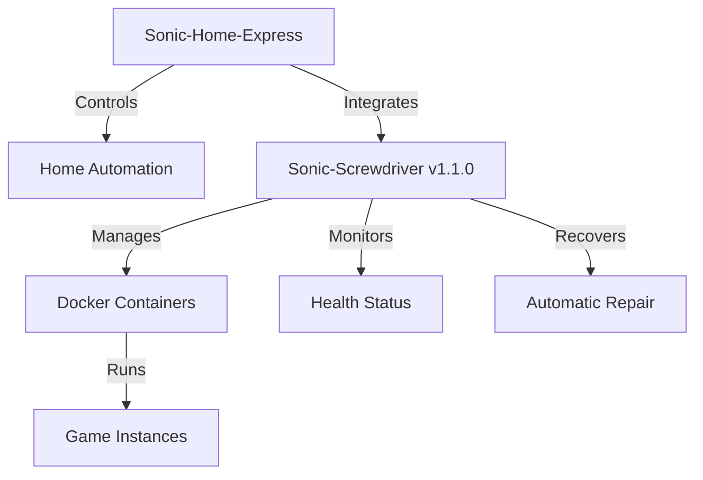

# Sonic-Home-Express v1.1.0 Documentation

## Overview

Sonic-Home-Express v1.1.0 is a comprehensive CLI tool for uHomeNest that integrates with Sonic-Screwdriver v1.1.0, providing home automation control and container management capabilities.

## Features

### 1. Home Automation Control

```bash
# Start home automation services
sonic-home automation:start

# Stop home automation services
sonic-home automation:stop

# Check automation status
sonic-home automation:status

# List connected devices
sonic-home device:list

# Control a device
sonic-home device:control "Living Room Light" on

# Activate a scene
sonic-home scene:activate "Movie Night"
```

### 2. Sonic-Screwdriver Integration

```bash
# Check Sonic-Screwdriver version
sonic-home sonic:version

# List available games
sonic-home sonic:library

# Install a game
sonic-home sonic:install retro-arch

# Remove a game
sonic-home sonic:remove retro-arch
```

### 3. Health Monitoring

```bash
# Check specific game container health
sonic-home sonic:health --game retro-arch

# Check all containers health
sonic-home sonic:health --all

# Repair specific container
sonic-home sonic:repair --game retro-arch

# Repair all unhealthy containers
sonic-home sonic:repair --all
```

### 4. Container Management

```bash
# Start a game container
sonic-home sonic:start retro-arch

# Stop a game container
sonic-home sonic:stop retro-arch

# Show container logs
sonic-home sonic:logs retro-arch --follow --lines 50

# List installed games
sonic-home sonic:list
```

### 5. Ventoy Integration

```bash
# Create Ventoy installer bundle
sonic-home sonic:ventoy package

# Validate Ventoy bundle
sonic-home sonic:ventoy validate

# Show Ventoy bundle information
sonic-home sonic:ventoy info
```

### 6. System Diagnostics

```bash
# Run system diagnostics
sonic-home diagnostics

# Run diagnostics with auto-fix
sonic-home diagnostics --fix
```

### 7. Configuration Management

```bash
# Get configuration value
sonic-home config:get docker.network

# Set configuration value
sonic-home config:set log.level debug
```

## Installation

### Prerequisites
- Node.js 18+
- Sonic-Screwdriver v1.1.0 installed and in PATH
- Docker installed and running

### Install Sonic-Home-Express

```bash
cd /home/wizard/code-vault/uHomeNest/sonic-home-express
npm install
npm run build
```

### Global Installation

```bash
npm install -g .
```

### Verify Installation

```bash
sonic-home --version
# Should show: Sonic-Home-Express CLI v1.1.0
```

## Usage Examples

### Home Automation Workflow

```bash
# Start automation services
sonic-home automation:start

# Check status
sonic-home automation:status

# List devices
sonic-home device:list

# Control a device
sonic-home device:control "Thermostat" "set 22"

# Activate evening scene
sonic-home scene:activate "Evening"
```

### Game Management Workflow

```bash
# List available games
sonic-home sonic:library

# Install a game
sonic-home sonic:install retro-arch

# Start the game
sonic-home sonic:start retro-arch

# Monitor health
sonic-home sonic:health --game retro-arch

# Stop when done
sonic-home sonic:stop retro-arch
```

### System Maintenance Workflow

```bash
# Run diagnostics
sonic-home diagnostics --fix

# Check all container health
sonic-home sonic:health --all

# Repair any issues
sonic-home sonic:repair --all

# Update configuration
sonic-home config:set health.interval 30
```

## Integration with Sonic-Screwdriver v1.1.0

### Health Monitoring Features
- Automatic container health checks every 30 seconds
- HealthStatus struct with detailed status information
- Automatic recovery with container restart
- Visual health indicators (✅/❌)

### Performance Characteristics
- Monitoring overhead: <1% CPU
- Recovery time: <2 seconds
- Scalability: Supports 50+ containers

### New CLI Commands
- `sonic-home sonic:health` - Check container health
- `sonic-home sonic:repair` - Repair unhealthy containers
- `sonic-home sonic:start/stop` - Container lifecycle management
- Full integration with uHomeNest ecosystem

## Architecture

### Integration Diagram



### Component Flow

1. **Sonic-Home-Express CLI** receives user commands
2. **Home Automation Module** handles device and scene management
3. **Sonic-Screwdriver Integration** translates game commands to Sonic-Screwdriver CLI
4. **Sonic-Screwdriver v1.1.0** executes container operations
5. **Health Monitoring** continuously checks container status
6. **Automatic Recovery** restarts unhealthy containers

## Configuration

### Sonic-Screwdriver Configuration

```bash
# Set health check interval
sonic-home config:set health.interval 30

# Set logging level
sonic-home config:set log.level debug

# Show current configuration
sonic-home config:get docker.network
```

## Development

### Building

```bash
cd /home/wizard/code-vault/uHomeNest/sonic-home-express
npm run build
```

### Running in Development Mode

```bash
npm run dev
```

### Project Structure

```
sonic-home-express/
├── src/
│   ├── sonic-home-main.ts      # Main entry point
│   └── sonic-home-cli.ts       # CLI implementation
├── package.json
├── tsconfig.json
└── SONIC_HOME_EXPRESS_v1.1.0.md # Documentation
```

## Troubleshooting

### Common Issues

**Sonic-Screwdriver not found:**
```bash
Error: Sonic-Screwdriver command failed: spawn sonic ENOENT
```

**Solution:** Install Sonic-Screwdriver v1.1.0 and ensure it's in PATH

**Docker not running:**
```bash
Error: Cannot connect to the Docker daemon
```

**Solution:** Start Docker service
```bash
sudo systemctl start docker
```

**Permission denied:**
```bash
Error: permission denied while trying to connect to the Docker daemon socket
```

**Solution:** Add user to docker group
```bash
sudo usermod -aG docker $USER
newgrp docker
```

## Changelog

### v1.1.0 (2026-04-21)
- ✅ Initial release with full Sonic-Screwdriver v1.1.0 integration
- ✅ Home automation control commands
- ✅ Health monitoring and repair commands
- ✅ Container management commands
- ✅ Ventoy integration commands
- ✅ System diagnostics and configuration management
- ✅ Comprehensive documentation

## Support

For issues and feature requests:
- GitHub Issues: https://github.com/fredporter/uHomeNest/issues
- Discussion: https://github.com/fredporter/uHomeNest/discussions

## License

MIT License - See LICENSE for details.